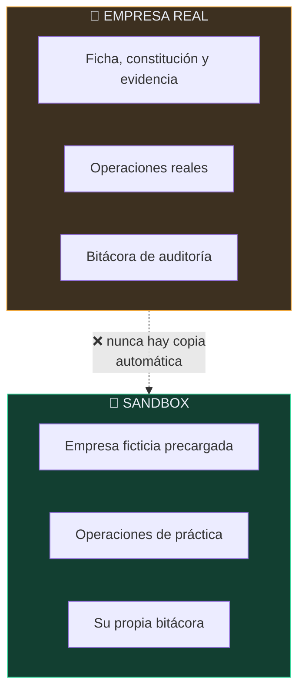
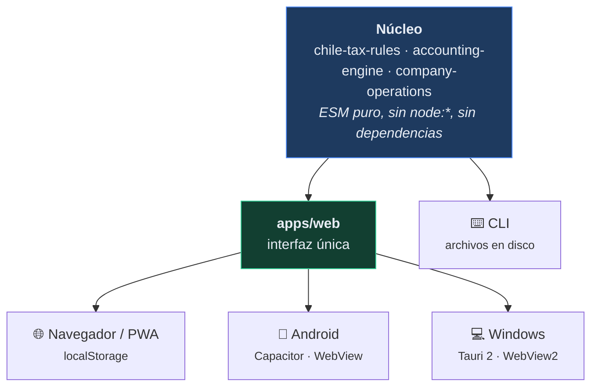
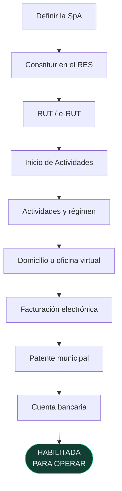
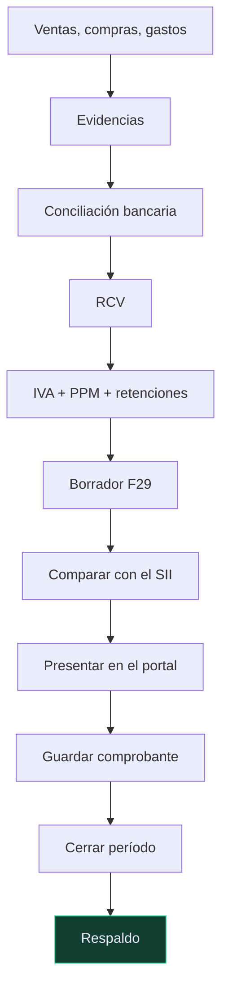

<div align="center">


[](https://github.com/vladimiracunadev-create/empresa-operativa-chile/actions/workflows/ci.yml)
[](https://github.com/vladimiracunadev-create/empresa-operativa-chile/actions/workflows/security.yml)
[](https://github.com/vladimiracunadev-create/empresa-operativa-chile/actions/workflows/pages.yml)
[](https://github.com/vladimiracunadev-create/empresa-operativa-chile/releases/latest)

[](LICENSE)
[](https://nodejs.org)
[](package.json)
[](#privacidad-que-se-puede-comprobar)
[](tests/)

**[▶ Probar en el navegador](https://vladimiracunadev-create.github.io/empresa-operativa-chile/)** ·
**[⬇ Descargar Android y Windows](https://github.com/vladimiracunadev-create/empresa-operativa-chile/releases/latest)** ·
**[📖 Documentación](docs/)**

</div>

---

Llevar una empresa pequeña en Chile no falla por no saber sumar. Falla por perder el hilo:
una factura que nunca se respaldó, un remanente de IVA que no se arrastró, un trámite que
se dio por hecho sin guardar el comprobante, un mes que se cerró sin conciliar.

**Empresa Operativa Chile** es una aplicación local-first que acompaña ese hilo desde antes
de que la empresa exista hasta el cierre de cada mes: calcula, explica por qué calcula así,
exige evidencia antes de dar algo por cumplido y deja registro de todo lo que cambió.

Los datos viven en tu dispositivo. No hay servidor, no hay cuentas y no hay telemetría.

## Descargas

| Plataforma | Archivo | Notas |
| --- | --- | --- |
| 🌐 **Navegador** | **[Abrir la aplicación](https://vladimiracunadev-create.github.io/empresa-operativa-chile/)** | Instalable como PWA. Funciona sin conexión. |
| 📱 **Android** | [`.apk`](https://github.com/vladimiracunadev-create/empresa-operativa-chile/releases/latest) | Android 6+. Hay que permitir orígenes desconocidos. |
| 💻 **Windows** | [`-setup.exe`](https://github.com/vladimiracunadev-create/empresa-operativa-chile/releases/latest) | Instalador recomendado (NSIS). |
| 💻 **Windows** | [`.msi`](https://github.com/vladimiracunadev-create/empresa-operativa-chile/releases/latest) | Instalación desatendida o corporativa. |
| 💻 **Windows** | [`-portable.exe`](https://github.com/vladimiracunadev-create/empresa-operativa-chile/releases/latest) | Sin instalar nada. |
| ⌨️ **Terminal** | `npm run cli -- ayuda` | Cálculo y operación desde scripts. |

Los binarios **no están firmados** con certificado de código: Windows SmartScreen y Android
mostrarán un aviso la primera vez. Verifica lo que descargues con el `SHA256SUMS.txt` del release.

## Qué hace, y qué no

<table>
<tr><th width="50%">✅ Lo que hace</th><th width="50%">🚫 Lo que no hace</th></tr>
<tr valign="top"><td>

- Guía la constitución de la SpA paso a paso y **guarda la evidencia** de cada trámite.
- Registra ventas, compras, gastos, honorarios, aportes, retiros y pagos de impuestos.
- Calcula IVA débito y crédito **con los montos reales de los documentos**.
- **Arrastra el remanente** de crédito fiscal de un mes al siguiente, automáticamente.
- Arma un borrador de F29 con PPM y retenciones, y dice qué NO cubre.
- Calcula los tres vencimientos del F29 y avisa cuando caen en fin de semana.
- Cierra el período y lo vuelve **inmutable**.
- Registra cada cambio en una bitácora **append-only**.
- Exporta y reimporta todo entre navegador, Android y Windows.

</td><td>

- **No presenta ni paga nada ante el SII.** No hay integración: eso ocurre en los portales oficiales.
- **No reemplaza la propuesta oficial del F29.** Es un borrador de control para comparar.
- No modela proporcionalidad de IVA, activo fijo, importaciones ni retenciones especiales.
- No reajusta el remanente de crédito fiscal.
- No conoce los feriados legales al calcular vencimientos (sí los fines de semana).
- No sincroniza con bancos ni descarga el RCV.
- No te dice que todo está en orden cuando faltan evidencias.

</td></tr>
</table>

## El principio que ordena todo el producto

Una aplicación de cumplimiento que se marca sola las tareas como hechas da tranquilidad,
no cumplimiento. Por eso el sistema distingue seis estados y **sólo puede llegar solo hasta el primero**:

```mermaid
flowchart LR
    A["1 · CALCULADO<br/><small>lo hace la app</small>"] --> B["2 · PREPARADO<br/><small>lo hace la app</small>"]
    B --> C["3 · CONCILIADO<br/><small>tú, contra el RCV</small>"]
    C --> D["4 · PRESENTADO<br/><small>tú, en el portal del SII</small>"]
    D --> E["5 · PAGADO<br/><small>tú</small>"]
    E --> F["6 · EVIDENCIADO<br/><small>registras el folio</small>"]
    F --> G(["OBLIGACIÓN<br/>CUMPLIDA"])

    style A fill:#1e3a5f,stroke:#4f8cff,color:#e8edf5
    style B fill:#1e3a5f,stroke:#4f8cff,color:#e8edf5
    style C fill:#3d3020,stroke:#f0a83c,color:#e8edf5
    style D fill:#3d3020,stroke:#f0a83c,color:#e8edf5
    style E fill:#3d3020,stroke:#f0a83c,color:#e8edf5
    style F fill:#3d3020,stroke:#f0a83c,color:#e8edf5
    style G fill:#123f31,stroke:#34d399,color:#e8edf5
```



En la práctica esto significa que la aplicación **se niega** a:

- marcar un trámite de constitución como realizado sin folio, certificado o comprobante;
- marcar una obligación como cumplida sin su comprobante;
- modificar o borrar cualquier cosa de un período cerrado;
- reabrir un período sin que escribas el motivo.

## Dos empresas que nunca se tocan



Cada entorno tiene su propio almacén. La separación no es una bandera en los datos que
alguien pueda olvidar de comprobar: son dos espacios distintos, y el motor recibe uno u otro.

El sandbox llega con dos meses de operaciones sembradas — precisamente para que se vea el
remanente de crédito fiscal viajando de julio a agosto, y un gasto con IVA no recuperable
quedando fuera del F29.

## La misma aplicación en las tres plataformas



No es "tres aplicaciones parecidas": es **una** interfaz y **un** motor de cálculo. Cuando la
web mejora, mejoran las tres. El `build` embebe las reglas tributarias y los iconos, y falla
si algún módulo que viaja al dispositivo importa `node:*` — el fallo que dejaría la pantalla
en blanco dentro del APK sin ningún error visible.

En Windows, Tauri añade lo único que una WebView no puede dar sola: los datos quedan además
como archivos JSON reales en el disco, que puedes copiar y respaldar.

## El ciclo que la aplicación acompaña

<table>
<tr><th width="50%">Crear la empresa</th><th width="50%">Operarla cada mes</th></tr>
<tr valign="top"><td>



</td><td>



</td></tr>
</table>

Cada paso de la constitución enlaza al portal oficial del organismo que corresponde y
exige su evidencia antes de darse por hecho.

## Reglas tributarias versionadas por año

Ninguna tasa está escrita en el código. Viven en `packages/chile-tax-rules/rules/<año>.json`,
y **cada una declara su fuente oficial y la fecha en que se verificó**:

```json
"honorarios": {
  "retentionRate": 0.1525,
  "source": "https://www.sii.cl/preguntas_frecuentes/renta/001_002_5310.htm",
  "lastVerified": "2026-08-09",
  "note": "Retención sobre boletas de honorarios según la gradualidad de la Ley 21.133."
}
```

Tres reglas de la casa, cada una respaldada por una prueba automatizada:

1. **Nunca se reescribe una regla histórica.** Un año nuevo es un archivo nuevo.
2. **Pedir un año sin reglas falla**, en vez de degradar silenciosamente a otro año.
   Un cálculo plausible con la tasa equivocada es el peor error posible de este sistema.
3. **El JSON y el módulo embebido no pueden desincronizarse.** CI compara ambos: sin eso,
   se podría editar una tasa y publicar un APK que sigue calculando con la anterior.

Ver [`docs/SOURCES-2026.md`](docs/SOURCES-2026.md) para el detalle de fuentes.

## Privacidad, que se puede comprobar

| Afirmación | Cómo comprobarla |
| --- | --- |
| No hay servidor propio | El servidor local sólo sirve archivos estáticos: [`server.mjs`](apps/empresa-operativa/server.mjs) |
| No hay telemetría | No existe ninguna llamada de red en `apps/web/`; la CSP declara `default-src 'self'` |
| Cero dependencias de producción | [`package.json`](package.json) — CI falla si aparece alguna |
| Los datos no salen del dispositivo | El almacén es `localStorage` (+ archivos locales en Windows) |
| No se sube contabilidad real por error | El workflow de seguridad busca respaldos, certificados y claves en cada push |

El servidor local escucha en `127.0.0.1` y no en `0.0.0.0`, a propósito: son datos contables
de una empresa real y no tienen por qué quedar expuestos a la red del café.

## Desarrollo

Requiere **Node 20+**. Nada más para la web y la CLI.

```bash
git clone https://github.com/vladimiracunadev-create/empresa-operativa-chile.git
cd empresa-operativa-chile
npm run start        # build + servidor en http://127.0.0.1:4180
```

| Comando | Qué hace |
| --- | --- |
| `npm run build` | Reglas embebidas → iconos → `apps/web/dist` |
| `npm run app` | Sirve la app ya construida |
| `npm test` | 50 pruebas con el runner nativo de Node |
| `npm run check` | Sincronía de reglas + validación + pruebas |
| `npm run cli -- ayuda` | Todos los comandos de la CLI |
| `npm run desktop:build` | Instaladores de Windows (necesita Rust) |
| `npm run android:prepare` | Deja `apps/android/www` listo para Capacitor |

Un par de ejemplos de la CLI:

```bash
npm run cli -- f29 --ventas-netas 1000000 --compras-netas 300000 --honorarios 250000
npm run cli -- registrar --fecha 2026-08-05 --tipo sale --descripcion "Servicio" --neto 800000
npm run cli -- resumen --periodo 2026-08
```

### Cómo se compilan las apps

| Plataforma | Herramienta | Requisitos |
| --- | --- | --- |
| Android | Capacitor 7 + Gradle | JDK 21, Android SDK |
| Windows | Tauri 2 + Rust | Rust estable, WebView2 |

Ambos builds corren en CI y **verifican el artefacto por dentro**: el APK se abre como ZIP y se
cuentan las vistas, los módulos del motor y las reglas que lleva; el ejecutable de Windows se
arranca y se comprueba que sigue vivo. Un build en verde no prueba que la app esté dentro.

## Pruebas

50 pruebas, sin framework externo. Las que importan no comprueban aritmética, sino las reglas
que hacen confiable al producto:

- un período cerrado es inmutable **en las dos direcciones** (no se agrega y no se borra);
- un trámite no puede marcarse hecho sin evidencia;
- el remanente de crédito fiscal viaja correctamente entre meses;
- real y sandbox no se contaminan aunque compartan el mismo origen;
- exportar e importar reproduce el espacio de trabajo completo;
- ningún módulo que viaja al dispositivo importa `node:*`;
- la versión coincide en `package.json`, Tauri, Cargo y la app.

## Academia

El repositorio conserva el material de aprendizaje, ahora integrado en la propia aplicación
(pestaña **Academia**), donde las explicaciones usan el mismo motor que opera tu empresa —
no textos escritos aparte que con el tiempo dejen de coincidir:

- [`curriculum/`](curriculum/) — 12 partes con clases
- [`labs/`](labs/) — 16 laboratorios
- [`cases/`](cases/) — casos integrales
- [`data/scenarios/`](data/scenarios/) — escenarios sintéticos para la CLI

## Documentación

| Documento | Contenido |
| --- | --- |
| [`docs/RUNBOOK-MENSUAL.md`](docs/RUNBOOK-MENSUAL.md) | Qué hacer cada mes, en orden |
| [`docs/RUNBOOK-ANUAL.md`](docs/RUNBOOK-ANUAL.md) | Ciclo anual y Operación Renta |
| [`docs/DECISION-TREE.md`](docs/DECISION-TREE.md) | Cuándo resolverlo solo y cuándo escalar a un especialista |
| [`docs/ACCOUNTING-POLICIES.md`](docs/ACCOUNTING-POLICIES.md) | Políticas contables del caso guía |
| [`docs/GLOSSARY.md`](docs/GLOSSARY.md) | Glosario mínimo |
| [`docs/SOURCES-2026.md`](docs/SOURCES-2026.md) | Fuentes oficiales verificadas |
| [`docs/ARCHITECTURE.md`](docs/ARCHITECTURE.md) | Cómo está construido y por qué |
| [`docs/product/`](docs/product/) | Visión, módulos y ciclo de vida |
| [`CHANGELOG.md`](CHANGELOG.md) | Historial de versiones |

## Fuentes oficiales

- [Servicio de Impuestos Internos](https://www.sii.cl/)
- [Registro de Empresas y Sociedades](https://www.registrodeempresasysociedades.cl/)
- [Inicio de Actividades](https://www.sii.cl/preguntas_frecuentes/rut_inicio_actividades/001_105_8697.htm)
- [Sistema de Facturación Gratuito del SII](https://www1.sii.cl/factura_sii/factura_sii.htm)
- [Regímenes tributarios](https://www.sii.cl/destacados/modernizacion/regimenes_mt.html)
- [Portal Emprendedor](https://www.sii.cl/portales/emprendedor/)

## Aviso

Este software **no es asesoría tributaria ni contable**. Automatiza lo repetible, explica lo que
hace y está diseñado para detectar cuándo un caso excede las reglas implementadas. Fiscalizaciones,
reorganizaciones, operaciones internacionales, remuneraciones complejas o cualquier escenario
ambiguo deben escalarse a revisión especializada.

Cuando esta aplicación y el SII no coincidan, **manda el SII**.

## Contribuir

Las reglas para tocar una tasa tributaria están en [`CONTRIBUTING.md`](CONTRIBUTING.md), y las
de seguridad y privacidad en [`SECURITY.md`](SECURITY.md). En resumen: toda regla nueva llega
con vigencia, fuente oficial, fecha de verificación y una prueba que demuestre el comportamiento.

## Licencia

[MIT](LICENSE) © Vladimir Acuña

<div align="center">
<sub>Hecho en Chile 🇨🇱 · <a href="https://vladimiracunadev-create.github.io/">Más proyectos</a></sub>
</div>
