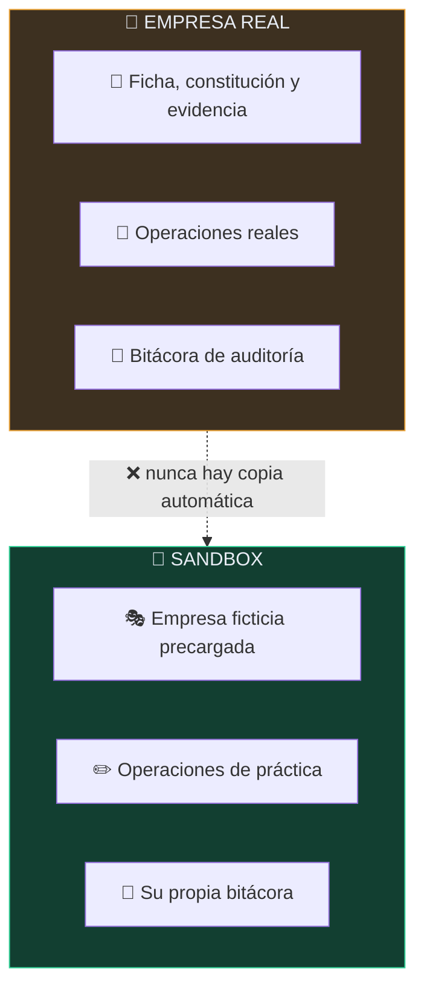
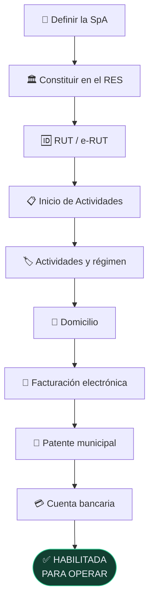
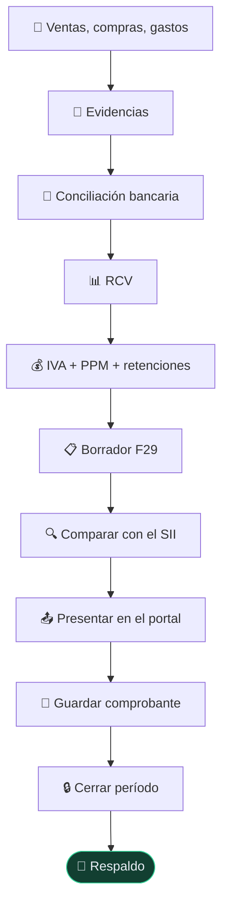

<div align="center">


# 🏢 Empresa Operativa Chile

## **Crear, operar y controlar una empresa chilena a través del tiempo**

**Aplicación local-first que acompaña a una SpA desde antes de existir hasta el cierre de cada
mes: constitución con evidencia obligatoria, operaciones, IVA con remanente arrastrado, borrador
de F29, obligaciones, cierre inmutable y bitácora de auditoría. La misma interfaz y el mismo
motor de cálculo en Android, Windows y navegador. Tus datos no salen del dispositivo.**

[](https://github.com/vladimiracunadev-create/empresa-operativa-chile/actions/workflows/ci.yml)
[](https://github.com/vladimiracunadev-create/empresa-operativa-chile/actions/workflows/security.yml)
[](https://github.com/vladimiracunadev-create/empresa-operativa-chile/actions/workflows/pages.yml)

[](CHANGELOG.md)
[](#-descargas)
[](tests/)
[](package.json)
[](#-privacidad-que-se-puede-comprobar)
[](docs/SOURCES-2026.md)
[](docs/MANUAL.md)
[](LICENSE)

[](https://github.com/vladimiracunadev-create/empresa-operativa-chile/releases/latest)
[](https://github.com/vladimiracunadev-create/empresa-operativa-chile/releases/latest)
[](https://vladimiracunadev-create.github.io/empresa-operativa-chile/)
[](packages/)
[](apps/contador-desktop/)
[](apps/contador-desktop/)
[](apps/android/)
[](package.json)

[🌐 **Abrir la app**](https://vladimiracunadev-create.github.io/empresa-operativa-chile/) ·
[📥 **Descargas**](https://github.com/vladimiracunadev-create/empresa-operativa-chile/releases/latest) ·
[📘 Manual de usuario](docs/MANUAL.md) ·
[📕 Manual en PDF](docs/MANUAL.pdf) ·
[📋 Runbook mensual](docs/RUNBOOK-MENSUAL.md) ·
[🏗️ Arquitectura](docs/ARCHITECTURE.md) ·
[🔗 Fuentes oficiales](docs/SOURCES-2026.md) ·
[📖 Glosario](docs/GLOSSARY.md) ·
[📓 Changelog](CHANGELOG.md) ·
[🗺️ Roadmap](docs/ROADMAP.md) ·
[🤝 Contribuir](CONTRIBUTING.md) ·
[🔐 Seguridad](SECURITY.md)

<br>

| 🖥️ Vistas | 🧮 Motor | ✅ Pruebas | 📦 Dependencias | 📱 Plataformas | 📄 Manual |
|:---:|:---:|:---:|:---:|:---:|:---:|
| **10** | **1** | **50** | **0** | **3** | **28 pág.** |

</div>

---

> [!IMPORTANT]
> Esta aplicación **no presenta ni paga nada ante el SII** y **no es asesoría tributaria**.
> Calcula, controla y guarda evidencia; la presentación ocurre en los sistemas oficiales.
> Cuando esta aplicación y el SII no coincidan, **manda el SII**.

Llevar una empresa pequeña en Chile no falla por no saber sumar. Falla por perder el hilo:
una factura que nunca se respaldó, un remanente de IVA que no se arrastró, un trámite que se
dio por hecho sin guardar el comprobante, un mes que se cerró sin conciliar.

**Empresa Operativa Chile** acompaña ese hilo. Calcula, explica por qué calcula así, **exige
evidencia** antes de dar algo por cumplido y deja registro de todo lo que cambió.

## 🖼️ Así se ve

<div align="center">


<sub>El panel en modo <b>SANDBOX</b>: indicadores del mes, diagnóstico y próximos vencimientos.</sub>

</div>

<table>
<tr>
<td width="50%"></td>
<td width="50%"></td>
</tr>
<tr>
<td align="center"><sub>💰 <b>Impuestos</b> — borrador F29 con el remanente arrastrado</sub></td>
<td align="center"><sub>🧾 <b>Operaciones</b> — con las señales de respaldo e IVA</sub></td>
</tr>
<tr>
<td width="50%"></td>
<td width="50%"></td>
</tr>
<tr>
<td align="center"><sub>📜 <b>Constitución</b> — nueve trámites, cada uno con su evidencia</sub></td>
<td align="center"><sub>🔒 <b>Cierre</b> — congela el mes y deja constancia de qué se revisó</sub></td>
</tr>
</table>

<div align="center">
<table>
<tr>
<td width="33%"></td>
<td width="33%"></td>
<td width="33%"></td>
</tr>
<tr><td colspan="3" align="center"><sub>📱 En Android la navegación pasa a una barra inferior. Es la misma app, no una versión recortada.</sub></td></tr>
</table>
</div>

## 📥 Descargas

| | Plataforma | Archivo | Notas |
|:---:|---|---|---|
| 🌐 | **Navegador** | **[Abrir la aplicación](https://vladimiracunadev-create.github.io/empresa-operativa-chile/)** | Instalable como PWA. Funciona sin conexión. |
| 📱 | **Android** | [`EmpresaOperativaChile-android.apk`](https://github.com/vladimiracunadev-create/empresa-operativa-chile/releases/latest) | Android 6+. Hay que permitir orígenes desconocidos. |
| 💻 | **Windows** | [`-setup.exe`](https://github.com/vladimiracunadev-create/empresa-operativa-chile/releases/latest) | Instalador recomendado (NSIS). |
| 💻 | **Windows** | [`.msi`](https://github.com/vladimiracunadev-create/empresa-operativa-chile/releases/latest) | Instalación desatendida o corporativa. |
| 💻 | **Windows** | [`-portable.exe`](https://github.com/vladimiracunadev-create/empresa-operativa-chile/releases/latest) | Sin instalar nada. |
| ⌨️ | **Terminal** | `npm run cli -- ayuda` | Cálculo y operación desde scripts. |

> [!NOTE]
> Los binarios **no están firmados** con certificado de código: Windows SmartScreen y Android
> avisarán la primera vez. Verifica lo que descargues con el `SHA256SUMS.txt` del release.

## ✅ Estado verificable

| Superficie | Estado |
|---|---|
| Motor tributario | ✅ IVA, PPM, honorarios, patente municipal, IDPC y asientos explicados |
| Remanente de crédito fiscal | ✅ arrastrado entre períodos · 🟡 **sin reajuste** (declarado como limitación) |
| Borrador F29 | 🟡 IVA, PPM y retenciones — **no cubre todos los códigos** del formulario |
| Vencimientos | ✅ los tres plazos, con traslado por fin de semana · ⚪ **feriados legales no modelados** |
| Reglas tributarias | ✅ año 2026 con fuente oficial y fecha de verificación por regla |
| Separación real / sandbox | ✅ almacenes distintos, verificada en pruebas |
| Inmutabilidad del cierre | ✅ ni altas ni bajas ni ediciones; reapertura con motivo obligatorio |
| Bitácora | ✅ append-only, sin operación de borrado ni edición |
| App de Android | ✅ APK **con el contenido contado dentro del binario** en CI |
| App de Windows | ✅ MSI, NSIS y portable; **arranca y se comprueba vivo** en CI |
| Web / PWA | ✅ publicada en Pages, instalable y sin conexión |
| Pruebas | ✅ 50 en Ubuntu y Windows, Node 20 y 22 |
| Seguridad | ✅ CodeQL + detección de contabilidad real commiteada + acciones fijadas a SHA |
| Integración con el SII | ⚪ **no existe** — por diseño, no por falta de tiempo |
| Cifrado de datos locales | ⚪ pendiente ([roadmap](docs/ROADMAP.md)) |
| Firma de binarios | ⚪ pendiente ([roadmap](docs/ROADMAP.md)) |

## 🌟 Qué lo hace distinto

- **Se niega a mentir.** No marca un trámite como hecho sin evidencia, no toca un período cerrado
  y no dice "todo en orden" cuando faltan respaldos. El objetivo es detectar el hueco, no tranquilizar.
- **Un motor, tres plataformas.** No son tres apps parecidas: es **una** interfaz y **un** motor.
  Cuando la web mejora, mejoran las tres.
- **Las tasas son datos, no código.** Viven en `rules/<año>.json`, cada una con su fuente oficial
  y su fecha de verificación. Pedir un año sin reglas **falla** en vez de degradar en silencio.
- **Se verifica el artefacto, no el build.** Un APK vacío compila perfectamente; por eso CI lo abre
  y **cuenta** lo que lleva dentro.
- **Cero dependencias de producción.** El motor, la CLI y la interfaz no importan nada de terceros,
  y CI falla si eso cambia.
- **Explica con tus propios números.** La academia usa el motor real: si cambia una tasa, la
  explicación cambia sola.

## 🔐 El principio que ordena todo el producto

Una aplicación de cumplimiento que se marca sola las tareas como hechas da tranquilidad, no
cumplimiento. Por eso el sistema distingue seis estados, y **sólo llega solo hasta el segundo**:


## 🏢 Dos empresas que nunca se tocan



Cada entorno tiene su propio almacén. La separación no es una bandera en los datos que alguien
pueda olvidar de comprobar: son dos espacios distintos, y el motor recibe uno u otro.

El sandbox llega con **dos meses** sembrados — justamente para que se vea el remanente viajando
de julio a agosto y un gasto con IVA no recuperable quedando fuera del F29.

## 🧬 La misma aplicación en las tres plataformas


El `build` embebe las reglas y los iconos, y **falla** si algún módulo que viaja al dispositivo
importa `node:*` — el fallo que dejaría la pantalla en blanco dentro del APK sin ningún error visible.

En Windows, Tauri añade lo único que una WebView no da sola: los datos quedan además como
archivos JSON reales en el disco, que puedes copiar y respaldar.

## 🔄 El ciclo que la aplicación acompaña

<table>
<tr><th width="50%">🏛️ Crear la empresa</th><th width="50%">📅 Operarla cada mes</th></tr>
<tr valign="top"><td>



</td><td>



</td></tr>
</table>

La rutina completa, con capturas, está en el **[manual de usuario](docs/MANUAL.md)**.

## 🏛️ Reglas tributarias versionadas por año

Ninguna tasa está escrita en el código. Viven en `packages/chile-tax-rules/rules/<año>.json`,
y **cada una declara su fuente oficial y la fecha en que se verificó**:

```json
"honorarios": {
  "retentionRate": 0.1525,
  "source": "https://www.sii.cl/preguntas_frecuentes/renta/001_002_5310.htm",
  "lastVerified": "2026-08-09",
  "note": "Retención sobre boletas de honorarios según la gradualidad de la Ley 21.133."
}
```

Tres reglas de la casa, cada una respaldada por una prueba automatizada:

| | Regla | Por qué |
|:---:|---|---|
| 1️⃣ | **Nunca se reescribe una regla histórica** | Un año nuevo es un archivo nuevo: así se puede recalcular un período antiguo y obtener lo que se declaró entonces |
| 2️⃣ | **Pedir un año sin reglas falla** | Un cálculo plausible con la tasa equivocada es el peor error posible: no se ve y no avisa |
| 3️⃣ | **El JSON y el módulo embebido no pueden desincronizarse** | Sin esto se podría editar una tasa y publicar un APK que sigue calculando con la anterior |

Detalle en [`docs/SOURCES-2026.md`](docs/SOURCES-2026.md).

## 🛡️ Privacidad, que se puede comprobar

| | Afirmación | Cómo comprobarla |
|:---:|---|---|
| 🚫 | No hay servidor propio | El servidor local sólo sirve archivos estáticos: [`server.mjs`](apps/empresa-operativa/server.mjs) |
| 📡 | No hay telemetría | Ninguna llamada de red en `apps/web/`; la CSP declara `default-src 'self'` |
| 📦 | Cero dependencias de producción | [`package.json`](package.json) — CI falla si aparece alguna |
| 💾 | Los datos no salen del dispositivo | El almacén es `localStorage` (+ archivos locales en Windows) |
| 🔒 | El servidor local no queda expuesto | Escucha en `127.0.0.1`, no en `0.0.0.0` |
| 🕵️ | No se sube contabilidad real por error | CI busca respaldos, certificados y claves en cada push |

## 🛠️ Desarrollo

Requiere **Node 20+**. Nada más para la web y la CLI.

```bash
git clone https://github.com/vladimiracunadev-create/empresa-operativa-chile.git
cd empresa-operativa-chile
npm run start        # build + servidor en http://127.0.0.1:4180
```

| Comando | Qué hace |
|---|---|
| `npm run build` | Reglas embebidas → iconos → `apps/web/dist` |
| `npm run app` | Sirve la app ya construida |
| `npm test` | 50 pruebas con el runner nativo de Node |
| `npm run check` | Sincronía de reglas + validación + pruebas |
| `npm run cli -- ayuda` | Todos los comandos de la CLI |
| `npm run desktop:build` | Instaladores de Windows (necesita Rust) |
| `npm run android:prepare` | Deja `apps/android/www` listo para Capacitor |
| `npm run capturas` | Regenera las capturas del manual |
| `npm run manual` | Regenera `docs/MANUAL.pdf` |

Ejemplos de la CLI:

```bash
npm run cli -- f29 --ventas-netas 1000000 --compras-netas 300000 --honorarios 250000
npm run cli -- registrar --fecha 2026-08-05 --tipo sale --descripcion "Servicio" --neto 800000
npm run cli -- resumen --periodo 2026-08
```

### 📦 Cómo se compilan las apps

| Plataforma | Herramienta | Requisitos |
|---|---|---|
| 📱 Android | Capacitor 7 + Gradle | JDK 21, Android SDK |
| 💻 Windows | Tauri 2 + Rust | Rust estable, WebView2 |

Ambos builds corren en CI y **verifican el artefacto por dentro**: el APK se abre como ZIP y se
cuentan las vistas, los módulos del motor y las reglas que lleva; el ejecutable de Windows se
arranca y se comprueba que sigue vivo. Un build en verde no prueba que la app esté dentro.

## 🧪 Pruebas

50 pruebas, sin framework externo. Las que importan no comprueban aritmética, sino las reglas que
hacen confiable al producto:

- un período cerrado es inmutable **en las dos direcciones** (no se agrega y no se borra);
- un trámite no puede marcarse hecho sin evidencia;
- el remanente de crédito fiscal viaja correctamente entre meses;
- real y sandbox no se contaminan aunque compartan el mismo origen;
- exportar e importar reproduce el espacio de trabajo completo;
- ningún módulo que viaja al dispositivo importa `node:*`;
- la versión coincide en `package.json`, Tauri, Cargo y la app.

## 🎓 Academia

El material de aprendizaje está integrado en la propia aplicación (pestaña **Academia**), donde
las explicaciones usan el mismo motor que opera tu empresa — no textos escritos aparte que con el
tiempo dejen de coincidir:

- 📚 [`curriculum/`](curriculum/) — 12 partes con clases
- 🧪 [`labs/`](labs/) — 16 laboratorios
- 📁 [`cases/`](cases/) — casos integrales
- 🎲 [`data/scenarios/`](data/scenarios/) — escenarios sintéticos para la CLI

## 📚 Documentación

| | Documento | Contenido |
|:---:|---|---|
| 📘 | [**Manual de usuario**](docs/MANUAL.md) · [**PDF**](docs/MANUAL.pdf) | 17 capítulos con las pantallas reales del producto |
| 📋 | [Runbook mensual](docs/RUNBOOK-MENSUAL.md) | Qué hacer cada mes, en orden |
| 📆 | [Runbook anual](docs/RUNBOOK-ANUAL.md) | Ciclo anual y Operación Renta |
| 🌳 | [Árbol de decisión](docs/DECISION-TREE.md) | Cuándo resolverlo solo y cuándo escalar |
| 📗 | [Políticas contables](docs/ACCOUNTING-POLICIES.md) | Criterios del caso guía |
| 📖 | [Glosario](docs/GLOSSARY.md) | Términos mínimos |
| 🔗 | [Fuentes oficiales](docs/SOURCES-2026.md) | Verificación de cada tasa y plazo |
| 🏗️ | [Arquitectura](docs/ARCHITECTURE.md) | Cómo está construido y **por qué** |
| 🗺️ | [Roadmap](docs/ROADMAP.md) | Qué viene y qué nunca se hará |
| 📓 | [Changelog](CHANGELOG.md) | Historial de versiones |

## 🔗 Fuentes oficiales

[Servicio de Impuestos Internos](https://www.sii.cl/) ·
[Registro de Empresas y Sociedades](https://www.registrodeempresasysociedades.cl/) ·
[Inicio de Actividades](https://www.sii.cl/preguntas_frecuentes/rut_inicio_actividades/001_105_8697.htm) ·
[Facturación gratuita del SII](https://www1.sii.cl/factura_sii/factura_sii.htm) ·
[Regímenes tributarios](https://www.sii.cl/destacados/modernizacion/regimenes_mt.html) ·
[Portal Emprendedor](https://www.sii.cl/portales/emprendedor/)

## ⚠️ Aviso

Este software **no es asesoría tributaria ni contable**. Automatiza lo repetible, explica lo que
hace y está diseñado para detectar cuándo un caso excede las reglas implementadas. Fiscalizaciones,
reorganizaciones, operaciones internacionales, remuneraciones complejas o cualquier escenario
ambiguo deben escalarse a revisión especializada.

## 🤝 Contribuir

Las reglas para tocar una tasa tributaria están en [`CONTRIBUTING.md`](CONTRIBUTING.md), y las de
seguridad y privacidad en [`SECURITY.md`](SECURITY.md). En resumen: toda regla nueva llega con
vigencia, fuente oficial, fecha de verificación y una prueba que demuestre el comportamiento.

## 📄 Licencia

[MIT](LICENSE) © Vladimir Acuña

<div align="center">
<sub>Hecho en Chile 🇨🇱 · <a href="https://vladimiracunadev-create.github.io/">Más proyectos</a></sub>
</div>
