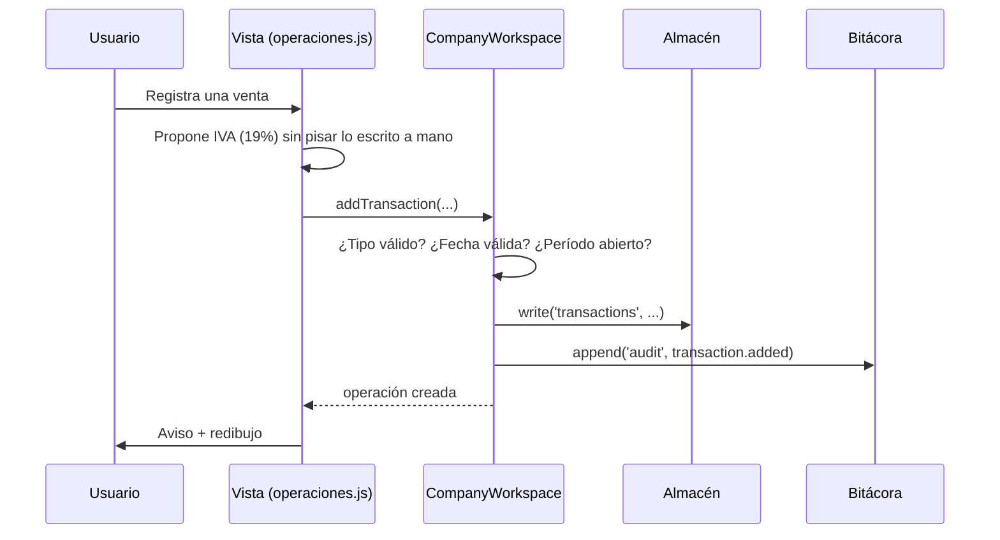

# Arquitectura

Documento de decisiones. Explica **por qué** el proyecto está construido así, no sólo cómo.

## El mapa

```text
empresa-operativa-chile/
│
├── packages/                       Núcleo. ESM puro, cero dependencias.
│   ├── chile-tax-rules/            Reglas versionadas por año comercial
│   │   ├── rules/2026.json         ← fuente de verdad (revisable, citable)
│   │   ├── rules.generated.mjs     ← generado: lo mismo, embebible en navegador
│   │   └── index.mjs
│   ├── accounting-engine/          IVA, PPM, honorarios, patente, IDPC, F29, asientos
│   └── company-operations/
│       ├── workspace.mjs           ← motor operativo (sin node:*)
│       ├── store.mjs               ← almacenes de memoria y navegador
│       ├── node-store.mjs          ← almacén de disco (sólo Node)
│       ├── rut.mjs                 ← RUT y dígito verificador
│       └── index.mjs               ← entrada de Node
│
├── apps/
│   ├── web/src/                    ÚNICA interfaz del producto
│   │   ├── app.js                  router y shell
│   │   ├── lib/                    dom, estado, plataforma
│   │   └── views/                  10 vistas
│   ├── empresa-operativa/          servidor local estático
│   ├── contador-desktop/           shell Tauri 2 (Windows)
│   ├── android/                    envoltorio Capacitor
│   └── contador-cli/               CLI
│
├── scripts/                        build-rules · build-icons · build-web ·
│                                   build-all · verify-apk · validate-rules
├── tests/                          50 pruebas (runner nativo de Node)
├── docs/                           documentación y runbooks
└── curriculum/ labs/ cases/        material de aprendizaje
```

## Decisión 1 — Un motor, tres plataformas

**Problema.** Un producto que existe en web, Android y Windows tiende a convertirse en tres
productos parecidos que se separan con el tiempo. En una aplicación contable eso significa que
el IVA de agosto puede dar distinto en el teléfono y en el escritorio.

**Decisión.** El núcleo es ESM puro sin `node:*`, y la interfaz es una sola: `apps/web/dist`.
Android la empaqueta con Capacitor; Windows la embebe con Tauri; el navegador la sirve tal cual.

**Consecuencia comprobada.** `scripts/build-web.mjs` **falla el build** si algún archivo que
viaja al dispositivo importa `node:*`, y una prueba lo verifica también sobre el código fuente.
Ese fallo, sin la comprobación, produce una pantalla en blanco dentro del APK sin ningún error
visible ni ninguna señal roja en CI.

## Decisión 2 — Almacenamiento conectable

**Problema.** El motor operativo necesita persistir, pero cada plataforma persiste distinto:
archivos en Node, `localStorage` en el navegador, memoria en las pruebas.

**Decisión.** `CompanyWorkspace` no sabe dónde escribe. Habla un contrato de seis métodos
(`read`, `write`, `append`, `readAll`, `saveSnapshot`, `listSnapshots`) y recibe el almacén ya
construido.

**Consecuencia.** No hay una sola rama `if (isBrowser)` dentro de la lógica de negocio, las
pruebas corren en memoria sin tocar disco, y la separación real/sandbox se consigue simplemente
dando a cada modo su propio almacén — no con una bandera que alguien pueda olvidar de comprobar.

## Decisión 3 — Las reglas son datos, no código

**Problema.** Una tasa escrita como constante en el código es una bomba de relojería: sigue
calculando con toda confianza el año en que deja de ser cierta.

**Decisión.** Las tasas viven en `rules/<año>.json`, cada una con `source` y `lastVerified`.
`scripts/build-rules.mjs` las embebe en un módulo ESM para el navegador; CI compara ambos con
`--check`.

**Consecuencia.** Pedir un año sin reglas **lanza un error** en vez de degradar a otro año.
Un cálculo plausible con la tasa equivocada es el peor fallo posible de este sistema: no se ve,
no avisa, y aparece meses después como una diferencia con el SII.

## Decisión 4 — Sin bundler

**Problema.** Un bundler añade dependencias, configuración y una diferencia entre el código que
se escribe y el que se ejecuta.

**Decisión.** El build es una copia de módulos ES. El navegador, la WebView de Android y WebView2
los cargan de forma nativa.

**Consecuencia.** El código que se depura en producción es exactamente el del repositorio; el
`dist` completo pesa unos 260 KB; y `npm install` no hace falta para desarrollar la web ni la CLI.
El coste es que no hay minificación ni tree-shaking — irrelevante a esta escala.

## Decisión 5 — Re-render completo

**Problema.** Mantener sincronizados vista y datos a mano es la fuente clásica de errores de UI.

**Decisión.** Cada mutación redibuja el shell y la vista entera.

**Consecuencia.** A esta escala (decenas de filas por período) es instantáneo y elimina una clase
completa de errores. Los dos sitios donde sí se nota —los campos de búsqueda— restauran foco y
posición del cursor explícitamente.

## Decisión 6 — Se verifica el artefacto, no el build

**Problema.** Un APK sin contenido compila perfectamente. La WebView arranca, muestra una pantalla
en blanco, y todas las señales del build quedan en verde.

**Decisión.** `scripts/verify-apk.mjs` abre el APK como ZIP —leyendo el directorio central a mano,
sin `unzip` ni librerías— y **cuenta** las vistas, los módulos del núcleo, los iconos y las reglas
tributarias. En Windows, donde Tauri comprime los recursos y ya no se pueden contar, se verifica
la interfaz **antes** de sellarla y se comprueba que el ejecutable arranca y sigue vivo.

## Decisión 7 — La integridad por encima de la comodidad

El producto se niega a hacer cosas que serían más cómodas:

| Se niega a | Por qué |
| --- | --- |
| Marcar un trámite hecho sin evidencia | "Calculado" no es "presentado". Un check sin comprobante es una mentira útil. |
| Tocar un período cerrado | Si un cierre admite cambios, cerrar el mes no significa nada. |
| Reabrir sin motivo escrito | La trazabilidad importa más que la inmutabilidad absoluta. |
| Borrar una línea de la bitácora | No existe la operación. Una bitácora editable no es evidencia. |
| Decir "todo en orden" con evidencias faltantes | El objetivo es detectar el hueco, no tranquilizar. |

## Flujo de datos de una operación



Si cualquier validación falla, el motor lanza un error con un mensaje escrito para una persona
—no un código— y la vista lo muestra tal cual. El mensaje **es** la explicación de la regla.

## Qué NO está resuelto

Documentado aquí para que nadie lo descubra en producción:

- el remanente de crédito fiscal se arrastra pero **no se reajusta**;
- los vencimientos consideran fines de semana pero **no feriados legales**;
- no hay proporcionalidad de IVA, activo fijo, importaciones ni retenciones especiales;
- el espejo de Windows y los respaldos **no están cifrados**;
- los binarios **no están firmados**;
- el APK es de **depuración**, firmado con la clave de debug de Android.
