<div align="center">

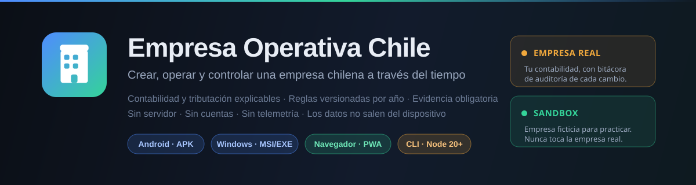

# 📘 Manual de usuario

### **Empresa Operativa Chile · versión 1.0.0**

**Cómo crear, operar y controlar una empresa chilena con esta aplicación —
de la instalación al cierre del mes, con las pantallas reales del producto.**

[](../CHANGELOG.md)
[](MANUAL.pdf)
[](SOURCES-2026.md)

</div>

---

## 🧭 Contenido

| | Capítulo | De qué trata |
|:---:|---|---|
| 1 | [Qué es y qué no es](#cap-1) | Lo que puedes esperar antes de empezar |
| 2 | [Instalación](#cap-2) | Android, Windows y navegador |
| 3 | [Los dos entornos](#cap-3) | EMPRESA REAL y SANDBOX |
| 4 | [Anatomía de la pantalla](#cap-4) | Dónde está cada cosa |
| 5 | [Ficha de la empresa](#cap-5) | Los datos que usan las demás pantallas |
| 5b | [Capital y patrimonio](#cap-5b) | Capital social, enterado, CPT y patente municipal |
| 6 | [Constitución](#cap-6) | Los nueve trámites, con su evidencia |
| 7 | [Operaciones](#cap-7) | Registrar ventas, compras, gastos y más |
| 8 | [Impuestos y F29](#cap-8) | El borrador de control del mes |
| 9 | [Obligaciones](#cap-9) | Qué debes y cuándo vence |
| 10 | [Cierre mensual](#cap-10) | Congelar el mes |
| 11 | [Auditoría](#cap-11) | Qué cambió y cuándo |
| 12 | [Datos y respaldos](#cap-12) | Sacar tus datos del dispositivo |
| 13 | [Academia](#cap-13) | Entender lo que estás haciendo |
| 13b | [Glosario](#cap-13b) | Qué significa cada término, y con qué no confundirlo |
| 14 | [La rutina mensual](#cap-14) | El resumen práctico |
| 15 | [Preguntas frecuentes](#cap-15) | Lo que se pregunta al empezar |
| 16 | [Si algo va mal](#cap-16) | Solución de problemas |
| 17 | [Límites y advertencias](#cap-17) | Lo que esta app no hace |

---

<a id="cap-1"></a>

## 1 · 🎯 Qué es y qué no es

Llevar una empresa pequeña en Chile no falla por no saber sumar. Falla por perder el hilo:
una factura que nunca se respaldó, un remanente de IVA que no se arrastró, un trámite que se
dio por hecho sin guardar el comprobante, un mes que se cerró sin conciliar.

Esta aplicación acompaña ese hilo. Calcula, explica por qué calcula así, **exige evidencia**
antes de dar algo por cumplido y deja registro de todo lo que cambió.

### ✅ Lo que hace

| | |
|---|---|
| 🏛️ | Guía la constitución de la SpA y **guarda la evidencia** de cada trámite |
| 🧾 | Registra ventas, compras, gastos, honorarios, aportes, retiros y pagos de impuestos |
| 💰 | Calcula IVA débito y crédito **con los montos reales de tus documentos** |
| 🔁 | **Arrastra el remanente** de crédito fiscal de un mes al siguiente, solo |
| 📋 | Arma un borrador de F29 con PPM y retenciones, y te dice qué NO cubre |
| 📅 | Calcula los tres vencimientos del F29 y avisa cuando caen en fin de semana |
| 🔒 | Cierra el período y lo vuelve **inmutable** |
| 📖 | Registra cada cambio en una bitácora que no se puede editar |
| 💾 | Exporta y reimporta todo entre navegador, Android y Windows |

### 🚫 Lo que no hace

| | |
|---|---|
| ❌ | **No presenta ni paga nada ante el SII.** Eso ocurre en los portales oficiales |
| ❌ | **No reemplaza la propuesta oficial del F29.** Es un borrador para comparar |
| ❌ | No modela proporcionalidad de IVA, activo fijo, importaciones ni retenciones especiales |
| ❌ | No reajusta el remanente de crédito fiscal |
| ❌ | No conoce los feriados legales (sí los fines de semana) |
| ❌ | No sincroniza con bancos ni descarga el RCV |
| ❌ | No te dice que todo está en orden cuando faltan evidencias |

> [!IMPORTANT]
> Cuando esta aplicación y el SII no coincidan, **manda el SII**. Este manual no es asesoría
> tributaria ni contable.

### 🔐 El principio que ordena todo

Una aplicación de cumplimiento que se marca sola las tareas como hechas da tranquilidad, no
cumplimiento. Por eso el sistema distingue seis estados, y **sólo puede llegar solo hasta el segundo**:

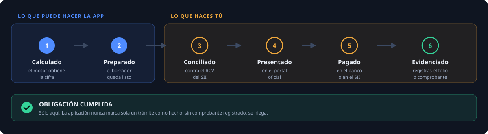

En la práctica, la aplicación **se niega** a marcar un trámite como realizado sin folio,
certificado o comprobante; a modificar algo de un período cerrado; y a reabrir un período sin
que escribas el motivo.

---

<a id="cap-2"></a>

## 2 · 📥 Instalación

Elige una. Puedes usar varias a la vez y mover tus datos entre ellas con un respaldo
(capítulo [12](#cap-12)).

| Plataforma | Archivo | Cuándo conviene |
|---|---|---|
| 🌐 **Navegador** | [Abrir la app](https://vladimiracunadev-create.github.io/empresa-operativa-chile/) | Probarla en 5 segundos, sin instalar |
| 📱 **Android** | `EmpresaOperativaChile-android.apk` | Registrar operaciones el día que ocurren |
| 💻 **Windows** | `EmpresaOperativaChile-windows-setup.exe` | El trabajo mensual serio |
| 💻 **Windows** | `EmpresaOperativaChile-windows.msi` | Instalación desatendida o corporativa |
| 💻 **Windows** | `EmpresaOperativaChile-windows-portable.exe` | Sin instalar nada, desde un pendrive |

Todas se descargan desde **[Releases](https://github.com/vladimiracunadev-create/empresa-operativa-chile/releases/latest)**.

### 🌐 Navegador

Abre el enlace y ya está. Para tenerla como aplicación, usa **Instalar** en la barra de
direcciones (Chrome y Edge) o **Compartir → Añadir a pantalla de inicio** (Safari). Una vez
instalada funciona **sin conexión**.

### 📱 Android

1. Descarga el `.apk` desde Releases.
2. Ábrelo. Android pedirá permiso para **instalar desde orígenes desconocidos**: es normal en
   una app que no viene de Google Play. Concédelo sólo para tu navegador o gestor de archivos.
3. Instala y abre.

> [!NOTE]
> El APK está firmado con la clave de depuración de Android. Sirve para instalar y usar; no es
> una publicación de Google Play. Verifica la descarga con el `SHA256SUMS.txt` del release.

### 💻 Windows

1. Descarga el instalador `-setup.exe`.
2. Windows SmartScreen mostrará un aviso porque el instalador **no está firmado** con
   certificado de código. Pulsa **Más información → Ejecutar de todas formas** si confías en el
   origen, después de comprobar el hash.
3. Sigue el asistente.

En Windows, además del almacenamiento de la aplicación, tus datos quedan como **archivos JSON
reales** en `%APPDATA%`, que puedes copiar y respaldar.

### 🔎 Verificar lo que descargaste

```bash
sha256sum -c SHA256SUMS.txt
```

En PowerShell:

```powershell
Get-FileHash .\EmpresaOperativaChile-windows-setup.exe -Algorithm SHA256
```

---

<a id="cap-3"></a>

## 3 · 🏢 Los dos entornos

La aplicación tiene **dos espacios de trabajo completamente separados**. No comparten datos,
no comparten bitácora, y no existe ninguna función que copie algo de uno al otro.

| | 🏢 EMPRESA REAL | 🧪 SANDBOX |
|---|---|---|
| **Para qué** | Tu contabilidad de verdad | Practicar y equivocarse |
| **Color** | Ámbar | Verde |
| **Datos iniciales** | Vacío | Empresa ficticia con dos meses cargados |
| **Bitácora** | La suya | La suya |
| **Se puede borrar sin miedo** | No | Sí |

El entorno activo se ve **siempre**, en dos sitios: el selector de arriba y una franja de color
bajo la barra superior. Ese color no es decorativo: equivocarse de entorno es el error caro que
este producto existe para evitar.

<table>
<tr><th width="50%">🧪 En SANDBOX</th><th width="50%">🏢 En EMPRESA REAL</th></tr>
<tr>
<td>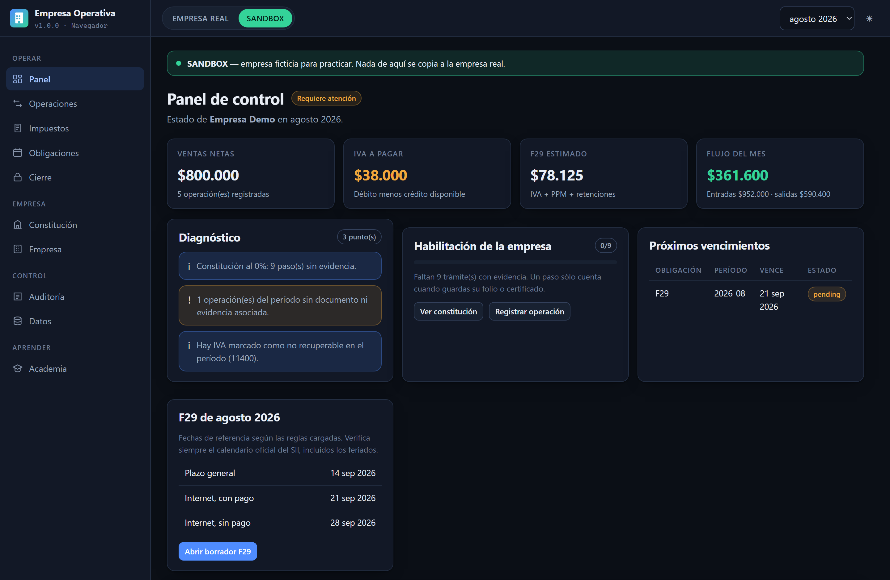</td>
<td>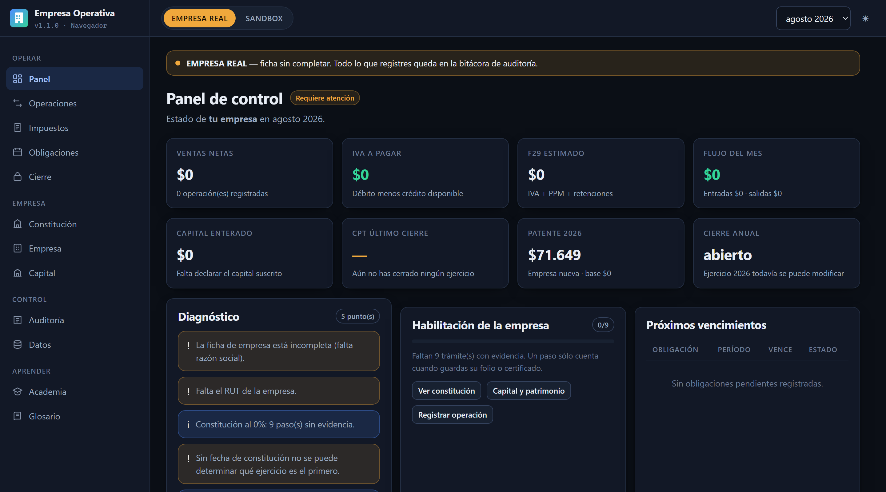</td>
</tr>
</table>

> [!TIP]
> Si es tu primera vez, **quédate en SANDBOX un rato**. Viene con dos meses de operaciones
> preparados justamente para que veas el remanente de IVA viajando de julio a agosto y un gasto
> con IVA no recuperable quedando fuera del F29.

---

<a id="cap-4"></a>

## 4 · 🧩 Anatomía de la pantalla

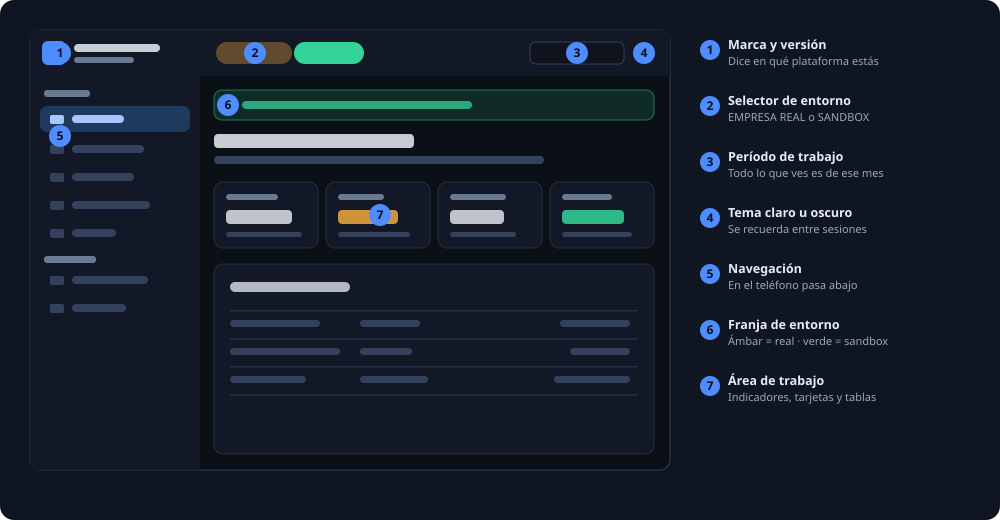

### ⌨️ Atajos

| Atajo | Qué hace |
|---|---|
| `Alt` + `1` … `Alt` + `9` | Salta a la sección número N del menú |
| `Esc` | Cierra el diálogo abierto |
| `Ctrl` + `P` | Imprime la pantalla actual o la guarda como PDF |

### 📱 En el teléfono

La navegación pasa a una **barra inferior deslizable**, donde el pulgar la alcanza. Todo lo
demás es idéntico: es la misma aplicación, no una versión recortada.

<table>
<tr>
<td width="33%">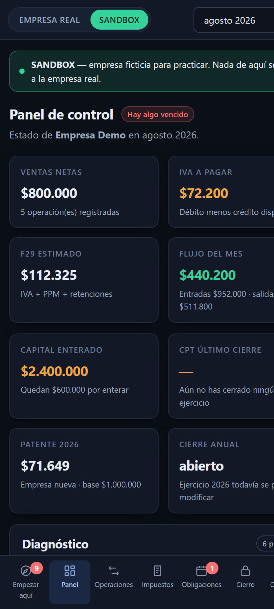</td>
<td width="33%">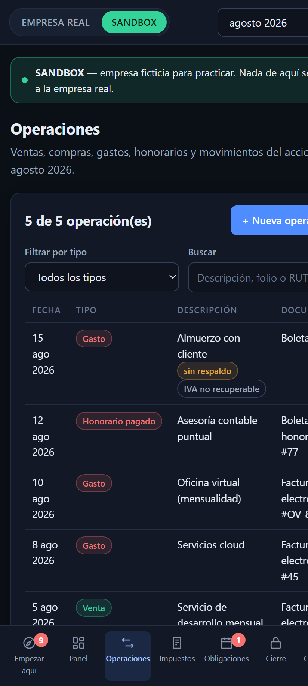</td>
<td width="33%">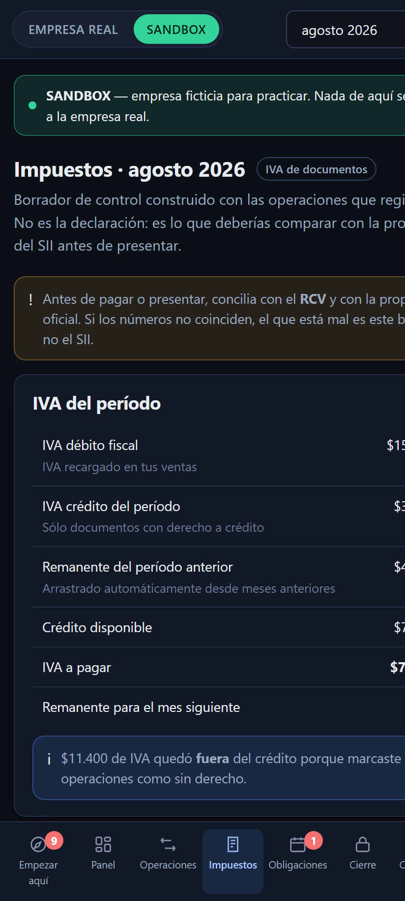</td>
</tr>
<tr>
<td align="center"><sub>Panel</sub></td>
<td align="center"><sub>Operaciones</sub></td>
<td align="center"><sub>Impuestos</sub></td>
</tr>
</table>

### 🌗 Tema claro

El botón de la esquina superior derecha alterna claro y oscuro, y recuerda tu elección.

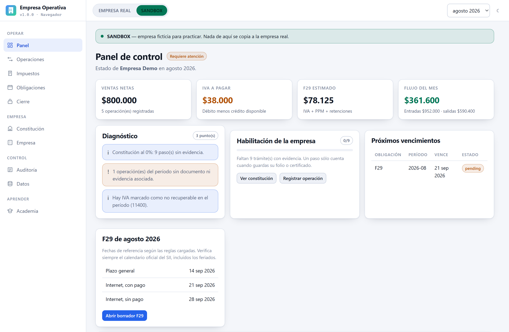

---

<a id="cap-5"></a>

## 5 · 🏛️ Ficha de la empresa

**Empresa** es el primer sitio al que ir. Sus datos alimentan al resto de las pantallas.

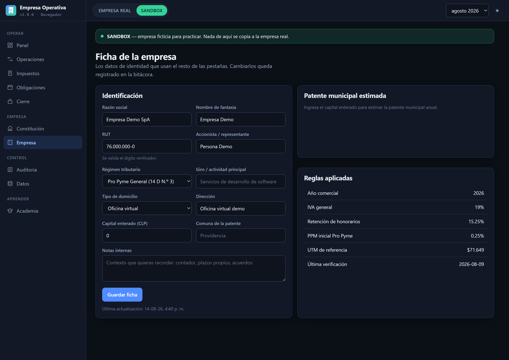

| Campo | Para qué sirve | Obligatorio |
|---|---|:---:|
| Razón social | Identifica la empresa en toda la app | ✅ |
| Nombre de fantasía | Lo que aparece en el panel | — |
| RUT | Se **valida el dígito verificador** al guardar | ✅ |
| Accionista / representante | Referencia interna | — |
| Régimen tributario | Contexto para las explicaciones | ✅ |
| Giro o actividad | Ayuda a decidir si un gasto es del giro | — |
| Tipo de domicilio y dirección | Oficina virtual, propia, arrendada o coworking | — |
| Comuna | Determina la municipalidad competente para la patente | — |
| Tipo de sociedad | SpA, Ltda., EIRL… | — |
| Notas internas | Lo que quieras recordar | — |

> [!IMPORTANT]
> **El capital ya no se edita aquí.** Hasta la versión 1.0.0 esta pantalla tenía un único campo
> “Capital enterado” que además se usaba para estimar la patente municipal de cualquier año. Eso
> trataba como sinónimos seis magnitudes distintas. Ahora el capital vive en su propia pantalla
> —**[Capital y patrimonio](#cap-5b)**— con un campo por magnitud. Esta ficha muestra el resumen
> y la patente calculada, y enlaza allí.

> [!NOTE]
> El RUT se valida de verdad, con módulo 11. Un RUT mal tipeado no falla el día que se escribe:
> se propaga a documentos y conciliaciones, y reaparece meses después como un descuadre cuyo
> origen ya nadie recuerda.

La tarjeta **Patente municipal estimada** muestra la cifra que produce el motor, indicando si la
calculó como empresa nueva o como empresa en funcionamiento. Es una referencia: cada municipalidad
fija su tasa dentro del rango legal y puede pedir requisitos propios.

---

<a id="cap-5b"></a>

## 5b · 💰 Capital y patrimonio

La pantalla que existe porque **capital no es una sola cosa**.

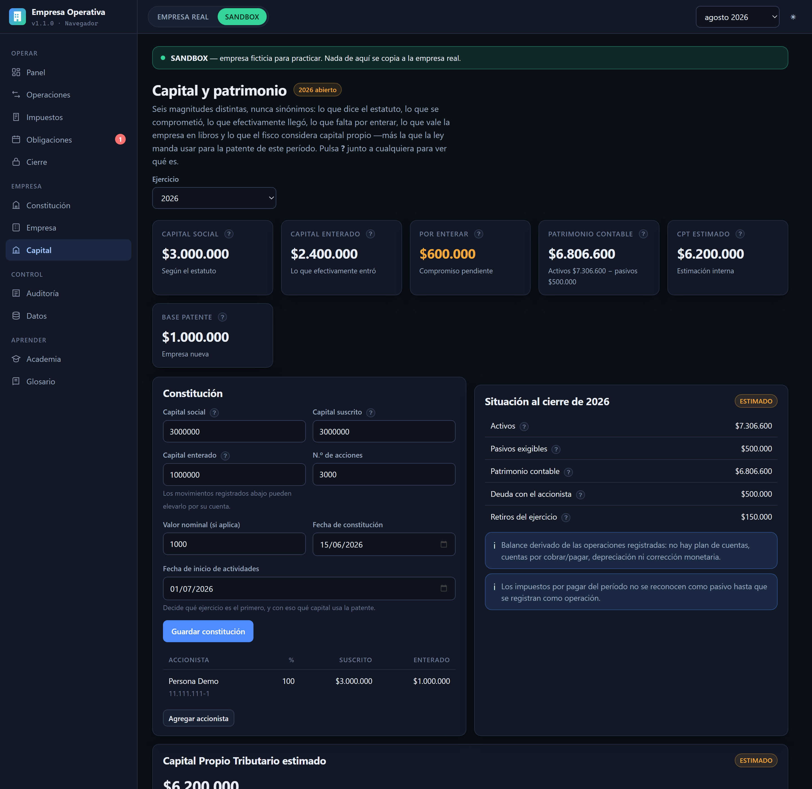

### Las seis magnitudes

| Magnitud | Qué es | Cuándo cambia |
|---|---|---|
| **Capital social** | Lo que dice el estatuto | Sólo con un acto societario |
| **Capital suscrito** | Lo que el accionista se comprometió a aportar | Al suscribir o modificar |
| **Capital enterado** | Lo que efectivamente entró (dinero o bienes) | Con cada aporte |
| **Capital por enterar** | Suscrito menos enterado | Al enterar lo pendiente |
| **Patrimonio contable** | Activos menos pasivos, en libros | Con cada utilidad y cada pérdida |
| **Capital Propio Tributario** | Activo menos pasivo exigible, a valores tributarios | Una vez al año, al cerrar |

Y una séptima, derivada de las anteriores pero distinta de todas: el **capital base de patente**,
que es el capital propio que la ley manda usar **para ese período concreto**.

Junto a cada rótulo hay un botón **?**: abre la definición del glosario, con qué es, con qué **no**
hay que confundirlo y su base legal.

### Movimientos de capital

Al pulsar **Registrar movimiento**, la aplicación pregunta primero **qué fue** el dinero:

| Naturaleza | Efecto |
|---|---|
| **Aporte de capital** | Aumenta el patrimonio y el capital enterado |
| **Préstamo del accionista** | Aumenta el pasivo exigible. **No es capital**, y baja el CPT |
| **Ingreso operacional** | Es una venta: aumenta el resultado y puede llevar IVA |
| **Otro** | Hay que definirlo antes de registrarlo |

> [!WARNING]
> En la cartola bancaria las cuatro se ven exactamente igual: un depósito. En el balance, en el
> capital propio tributario y en la patente municipal, no. Por eso la aplicación pregunta en vez de
> suponer que todo lo que pone el dueño es capital.

También se registran aportes **en bienes** (un notebook, un servidor, mobiliario), con su valor de
aporte, su valor contable y su valor tributario **por separado** — porque no tienen por qué coincidir.

### Capital Propio Tributario

La tarjeta muestra la cifra y, debajo, **¿Cómo llegamos a este valor?**: el desglose partida a
partida, el método aplicado (art. 41 de la LIR o CPT simplificado Pro Pyme), la base legal y la
fecha en que se verificó la regla. Y **¿Está confirmado?**, que dice sin rodeos si es una estimación
interna o una cifra que quedó guardada en un cierre anual.

> [!NOTE]
> El CPT simplificado sólo aplica al régimen **Pro Pyme General (14 D N.º 3)**. Si tu empresa está
> en otro régimen, la aplicación usa el método general y lo dice, en vez de aplicar una fórmula que
> no te corresponde.

### Municipalidad

Aquí se registra la comuna y —esto es lo importante— **la tasa de tu municipalidad con su fuente y
la fecha en que la verificaste**. Mientras no lo hagas, la aplicación usa el mínimo legal como
supuesto y muestra:

> *Tasa municipal no verificada. La cifra es una simulación y debe contrastarse con la
> municipalidad correspondiente.*

Esto no es pereza del programa: el D.L. 3.063 fija un **rango** (2,5‰ a 5‰) y cada municipalidad
elige su tasa dentro de él. No existe una tasa nacional, y publicar una inventada sería peor que no
tener ninguna.

### Cierre anual

Cerrar el ejercicio produce una **fotografía inmutable**: activos, pasivos, patrimonio, CPT y su
método, movimientos de capital, la base municipal del período siguiente y **la versión de las reglas
legales con que se calculó**. Ese último punto importa: dentro de tres años el archivo de reglas
puede haber cambiado, y el cierre tiene que seguir explicando con qué normas se calculó ese día.

Desde ahí se exporta el **expediente anual**, un JSON con todo lo que explica el ejercicio.

### Por qué la patente del año 2 no usa el capital de constitución

Porque la ley cambia la base (art. 24, inciso tercero del D.L. 3.063):

| Ejercicio | Base legal |
|---|---|
| **Actividades nuevas** | El capital propio **inicial declarado** |
| **Ejercicios posteriores** | El capital propio del **balance terminado el 31 de diciembre anterior** |

El historial de la pantalla muestra ambos años uno debajo del otro, con su base, su tasa, su UTM y
su patente. Un ejercicio cerrado nunca se recalcula: se muestra lo que quedó guardado.

Detalle completo en [`docs/accounting/CAPITAL-PATRIMONIO.md`](accounting/CAPITAL-PATRIMONIO.md),
[`docs/tax/CAPITAL-PROPIO-TRIBUTARIO.md`](tax/CAPITAL-PROPIO-TRIBUTARIO.md) y
[`docs/municipal/PATENTE-MUNICIPAL.md`](municipal/PATENTE-MUNICIPAL.md).

---

<a id="cap-6"></a>

## 6 · 📜 Constitución

Nueve trámites, en orden, desde definir la SpA hasta abrir la cuenta bancaria.

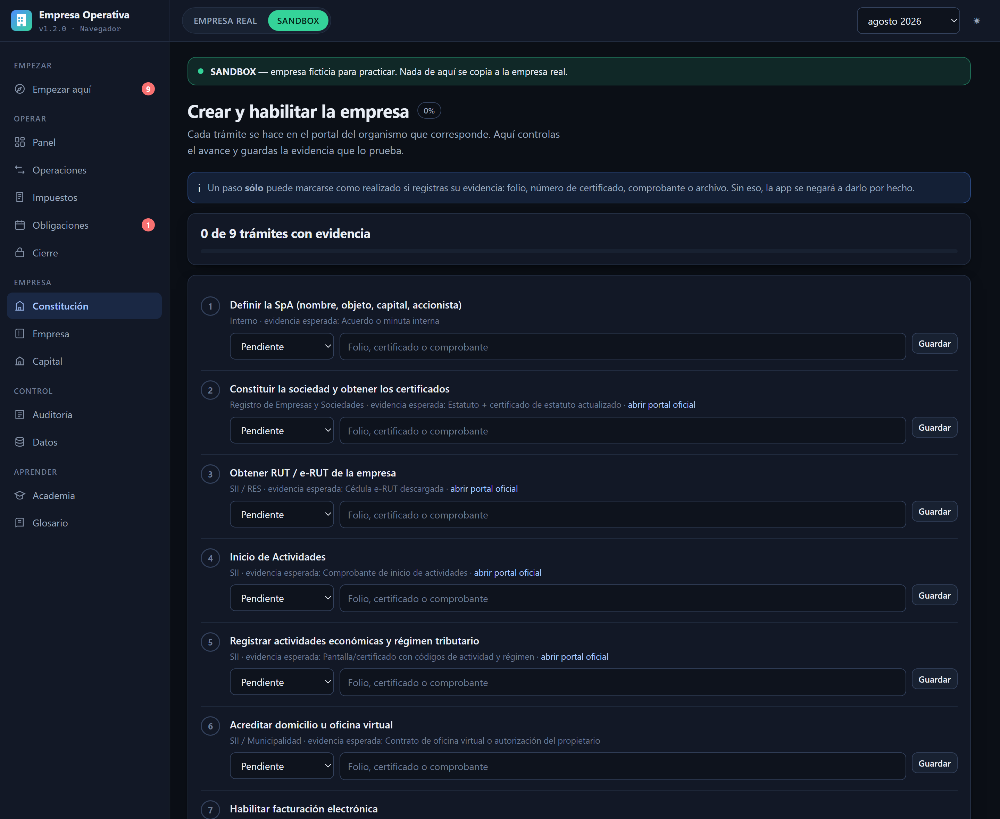

Cada paso tiene tres controles:

| Control | Qué es |
|---|---|
| **Estado** | Pendiente · En trámite · Realizado · Bloqueado |
| **Evidencia** | Folio, número de certificado o comprobante |
| **Guardar** | Escribe el cambio y lo deja en la bitácora |

> [!IMPORTANT]
> **Un paso no puede marcarse como «Realizado» sin evidencia.** Si lo intentas, la aplicación se
> niega y te dice por qué. No es una molestia: es la diferencia entre creer que hiciste un
> trámite y poder demostrarlo.

Los pasos que se hacen en un portal externo incluyen el enlace oficial. La barra de progreso del
panel cuenta **sólo** los pasos con evidencia registrada.

### 🗺️ El orden y por qué importa

```
Definir la SpA → Constituir en el RES → RUT / e-RUT → Inicio de Actividades
→ Actividades y régimen → Domicilio → Facturación electrónica
→ Patente municipal → Cuenta bancaria
```

No es arbitrario: cada trámite necesita el resultado del anterior. Sin RUT no hay Inicio de
Actividades; sin Inicio de Actividades no hay facturación electrónica.

---

<a id="cap-7"></a>

## 7 · 🧾 Operaciones

El corazón del uso diario. Muestra las operaciones **del período seleccionado arriba**.

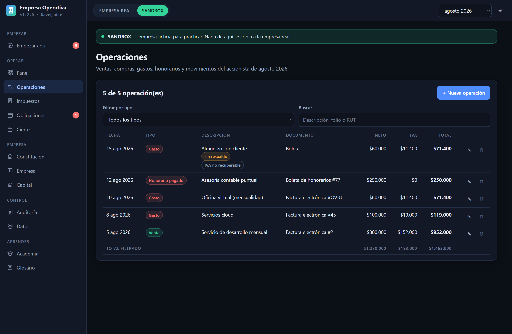

### ➕ Registrar una operación

Pulsa **+ Nueva operación**. El formulario propone el IVA al 19 % sobre el neto, pero **nunca
pisa un valor que escribiste a mano**: el documento manda sobre la fórmula.

| Campo | Detalle |
|---|---|
| **Fecha** | Determina a qué período pertenece |
| **Tipo** | Venta · Compra del giro · Gasto · Honorario · Aporte · Retiro · Pago de impuesto |
| **Descripción** | Lo que te permita reconocerla dentro de seis meses |
| **Neto / IVA / Total** | El IVA se propone; el total se calcula |
| **Documento y folio** | Sin esto, la operación se marca «sin respaldo» |
| **RUT de la contraparte** | Facilita la conciliación con el RCV |

### ☑️ Las dos casillas que más importan

| Casilla | Qué decide |
|---|---|
| **El IVA da derecho a crédito fiscal** | Si su IVA entra o no en el F29 |
| **El gasto es tributariamente deducible** | Si el neto cuenta como gasto |

Son independientes. Un almuerzo personal pagado con la cuenta de la empresa saca plata igual,
pero su IVA no es recuperable **y** su neto no es gasto deducible: desmarca las dos.

### 🏷️ Las señales de la tabla

| Señal | Significado |
|---|---|
| 🟢 Etiqueta verde | Entra dinero (venta, aporte) |
| 🔴 Etiqueta roja | Sale dinero (compra, gasto, honorario, retiro, impuesto) |
| 🟠 `sin respaldo` | No tiene documento ni evidencia asociada |
| ⚪ `IVA no recuperable` | Su IVA quedó fuera del crédito fiscal |

### 🔎 Filtrar

Por tipo, o buscando en descripción, folio y RUT. El pie de la tabla suma **lo filtrado**, no
todo el mes: sirve para responder «¿cuánto llevo en gastos de cloud?» sin sacar la calculadora.

---

<a id="cap-8"></a>

## 8 · 💰 Impuestos y F29

El borrador de control del mes. **No es la declaración**: es lo que deberías comparar con la
propuesta oficial del SII antes de presentar.

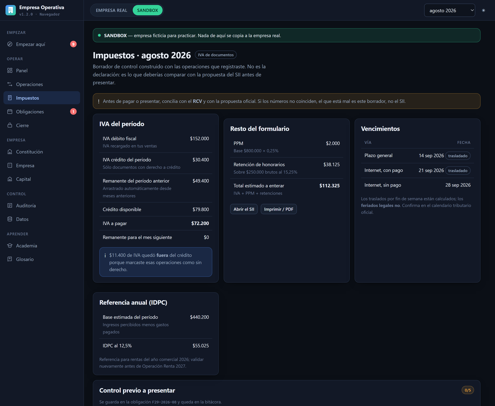

### 🧮 IVA del período

| Línea | De dónde sale |
|---|---|
| **IVA débito fiscal** | Suma del IVA de tus ventas |
| **IVA crédito del período** | IVA de compras y gastos **marcados con derecho a crédito** |
| **Remanente del período anterior** | Arrastrado solo, recorriendo tus meses anteriores |
| **Crédito disponible** | Crédito del período + remanente |
| **IVA a pagar** | Débito − crédito disponible, nunca negativo |
| **Remanente para el mes siguiente** | Lo que sobró del crédito |

La etiqueta junto al título dice **`IVA de documentos`** cuando los importes vienen de lo que
registraste, y `IVA derivado` cuando se dedujeron aplicando el 19 % al neto.

> [!TIP]
> Si ves un remanente y no lo esperabas, mira el mes anterior. Es normal al empezar: se compra
> equipamiento antes de facturar, y ese crédito no se pierde — se arrastra.

### 📄 Resto del formulario

**PPM** (anticipo sobre los ingresos brutos, se paga aunque el mes cierre con pérdida),
**retención de honorarios** (lo que la empresa debe enterar por las boletas que recibió) y el
**total estimado a enterar**.

### 📅 Vencimientos

Las tres fechas que el SII distingue. La etiqueta `trasladado` indica que la fecha caía en fin
de semana y se movió al siguiente día hábil.

> [!WARNING]
> Los **feriados legales no están modelados**. Confirma siempre en el calendario tributario
> oficial antes de apurar un pago.

### ☑️ Control previo a presentar

Cinco casillas que se guardan **en el período** y quedan en la bitácora. Sirven para responder,
meses después, «¿revisé el RCV antes de declarar agosto?». Una casilla que se borra al recargar
no responde nada.

### 🖨️ Imprimir

**Imprimir / PDF** genera una versión limpia sin menús ni botones, útil para archivar el
borrador junto al comprobante oficial.

---

<a id="cap-9"></a>

## 9 · 📅 Obligaciones

El calendario de lo que la empresa debe presentar y pagar.

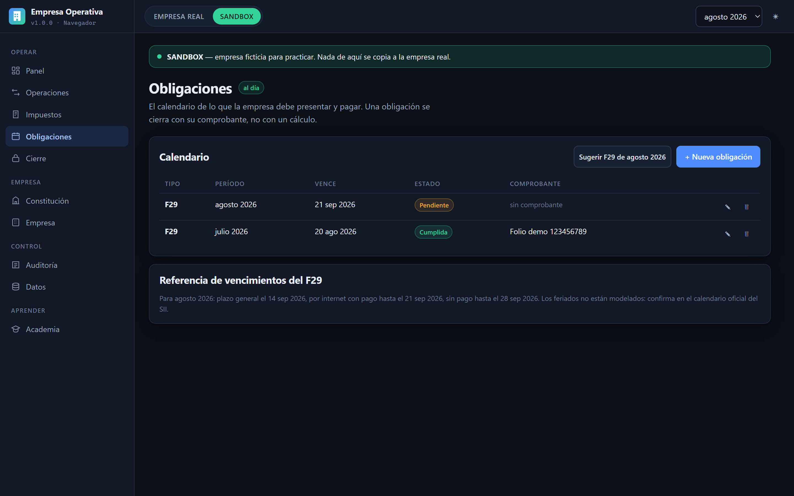

| Estado | Significa |
|---|---|
| **Pendiente** | Aún no se ha trabajado |
| **Preparada** | Calculada y revisada, sin presentar |
| **Cumplida** | Presentada, pagada **y con comprobante registrado** |
| **Bloqueada** | Falta algo externo |
| 🔴 **Vencida** | Pasó su fecha sin comprobante — aparece en rojo en el panel y en el menú |

> [!IMPORTANT]
> **Una obligación no puede marcarse como cumplida sin comprobante.** Sin él no está cumplida:
> está calculada.

El botón **Sugerir F29** crea la obligación del período en curso con la fecha de vencimiento por
internet con pago, que es el escenario habitual de una SpA que declara en línea.

---

<a id="cap-10"></a>

## 10 · 🔒 Cierre mensual

Cerrar un período lo **congela**: no se puede agregar, editar ni eliminar nada de ese mes.

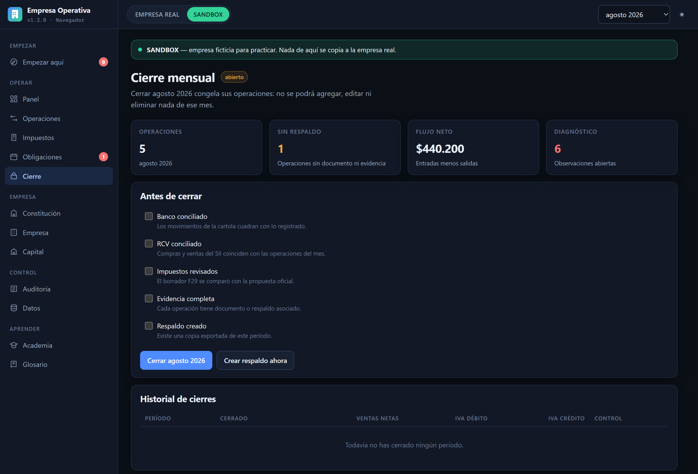

### Antes de cerrar

Cinco puntos de control: banco conciliado, RCV conciliado, impuestos revisados, evidencia
completa y respaldo creado.

**Puedes cerrar aunque falten casillas.** La aplicación no bloquea a quien sabe lo que hace,
pero deja constancia exacta de qué declaraste revisado y qué no. Meses después, esa constancia
es la diferencia entre «creo que lo revisé» y saberlo.

### 🔓 Reabrir un período

A veces hay que hacerlo: llega una factura de proveedor con fecha de un mes ya cerrado.

La aplicación **exige un motivo escrito**, que queda permanentemente en la bitácora. La
trazabilidad importa más que la inmutabilidad absoluta: lo grave no es reabrir, es reabrir sin
que quede rastro.

---

<a id="cap-11"></a>

## 11 · 📖 Auditoría

Todo lo que cambió en este entorno, en orden.

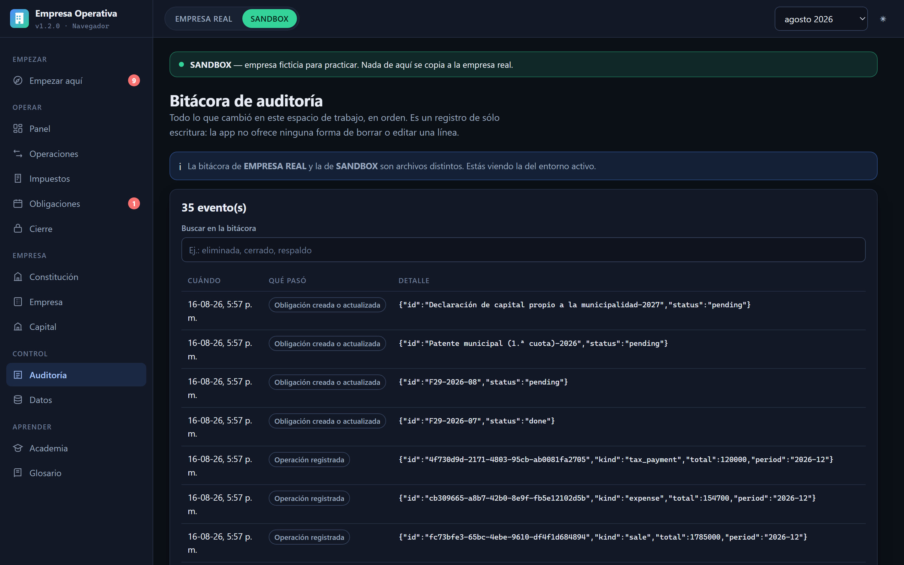

Es un registro **de sólo escritura**: la aplicación no ofrece ninguna forma de borrar o editar
una línea. Se registra cada guardado de ficha, cada operación creada, modificada o eliminada,
cada trámite actualizado, cada cierre, cada reapertura con su motivo y cada respaldo.

Las eliminaciones aparecen en rojo. Que borres una operación no borra el hecho de que existió.

---

<a id="cap-12"></a>

## 12 · 💾 Datos y respaldos

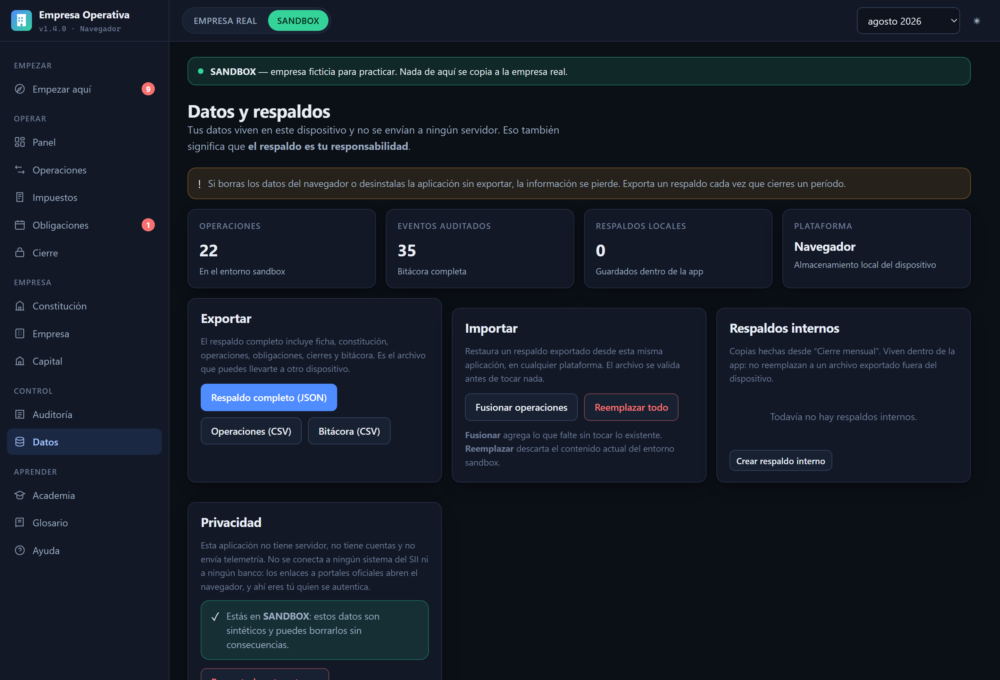

> [!WARNING]
> Tus datos viven **sólo en este dispositivo**. No hay servidor que respalde por ti. Si borras
> los datos del navegador o desinstalas la aplicación sin exportar, se pierden.

### 📤 Exportar

| Formato | Contiene | Para qué |
|---|---|---|
| **Respaldo completo (JSON)** | Todo: ficha, constitución, operaciones, obligaciones, cierres y bitácora | Mover o restaurar |
| **Operaciones (CSV)** | El detalle de cada operación | Abrirlo en Excel |
| **Bitácora (CSV)** | Todos los eventos | Revisión o auditoría |

Los CSV usan `;` como separador, que es lo que Excel espera en configuración regional chilena.

### 📥 Importar

| Modo | Qué hace |
|---|---|
| **Fusionar operaciones** | Agrega lo que falte sin tocar lo existente |
| **Reemplazar todo** | Descarta el contenido actual del entorno |

El archivo se valida antes de tocar nada: un respaldo de otra aplicación se rechaza.

### 🔄 Llevar los datos de un dispositivo a otro

```
Windows  →  Exportar respaldo completo  →  archivo .json
                                              ↓
Android  →  Datos → Reemplazar todo  →  elegir ese archivo
```

Funciona en cualquier dirección. El formato es el mismo en las tres plataformas.

> [!TIP]
> **Exporta cada vez que cierres un período** y guarda el archivo fuera del dispositivo.
> Es la única copia que sobrevive a un teléfono perdido.

---

<a id="cap-13"></a>

## 13 · 🎓 Academia

Las mismas reglas y el mismo motor que operan tu empresa, explicados.

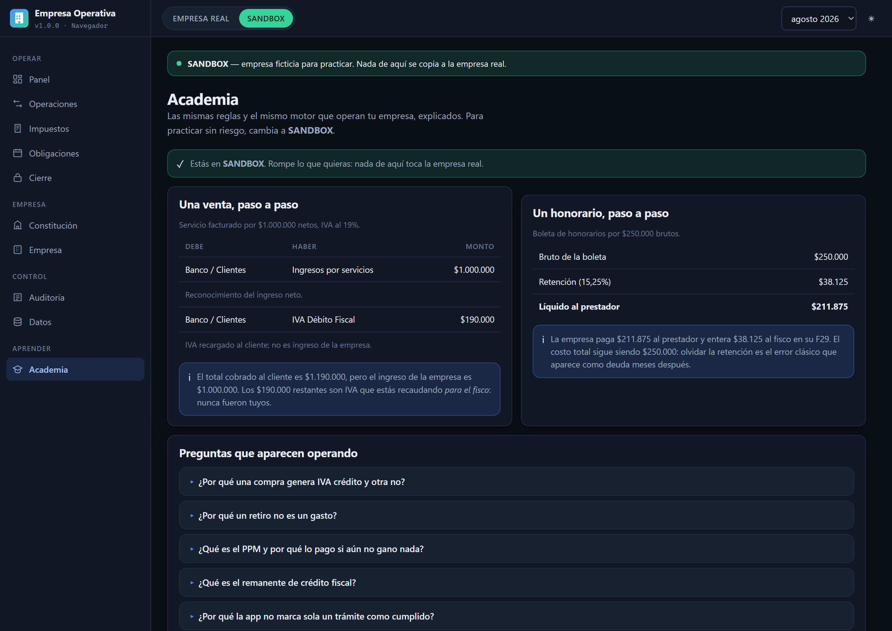

Incluye una venta y un honorario desglosados paso a paso con sus asientos contables, y las
preguntas que aparecen operando: por qué una compra genera IVA crédito y otra no, por qué un
retiro no es un gasto, qué es el PPM y por qué se paga aunque no haya utilidad, qué es el
remanente, por qué la app no marca sola un trámite como cumplido y qué evidencia guardar.

Incluye además el **ciclo temporal completo** de una empresa —de la constitución a la patente del
ejercicio siguiente— y una tabla con las cinco magnitudes de capital una al lado de la otra,
calculadas sobre la empresa demo con el mismo motor que opera la tuya.

Las explicaciones usan el **motor real**: si cambia una tasa en las reglas, la academia lo dice
sola. No son textos escritos aparte que con el tiempo dejen de coincidir con lo que calcula.

---

<a id="cap-13b"></a>

## 13b · 📖 Glosario

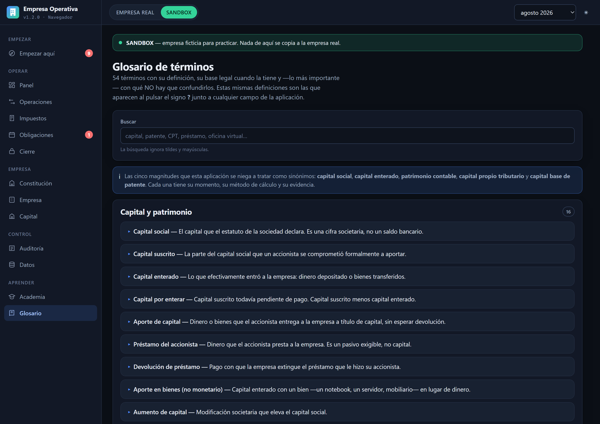

54 términos, buscables (la búsqueda ignora tildes y mayúsculas). Cada uno tiene:

- un **resumen** de una línea;
- una **definición** escrita para que la entienda alguien que no es contador;
- **con qué no hay que confundirlo** — que en este dominio es lo que evita el error caro;
- su **base legal**, cuando la tiene, con la fecha en que se verificó.

Estas mismas definiciones son las que aparecen al pulsar **?** junto a cualquier campo de la
aplicación, y las que forman [`docs/GLOSSARY.md`](GLOSSARY.md). Hay **una sola copia** de cada
texto, en `packages/glossary/index.mjs`, y la integración continua comprueba que el documento no se
desvíe de ella. Un glosario escrito en tres sitios se contradice en dos semanas; éste no puede.

---

<a id="cap-14"></a>

## 14 · 🔄 La rutina mensual

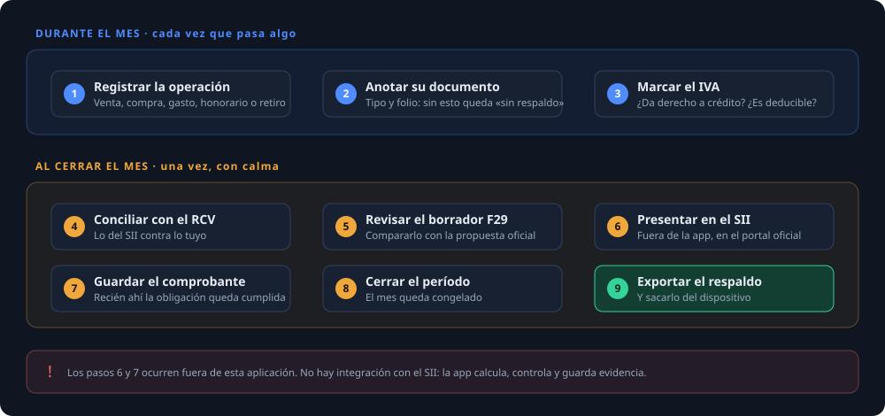

### ✅ Lista rápida

**Durante el mes** — cada vez que pasa algo:

- [ ] Registrar la operación el día que ocurre, no a fin de mes
- [ ] Anotar el tipo de documento y su folio
- [ ] Marcar si el IVA da derecho a crédito y si el gasto es deducible

**Los primeros días del mes siguiente:**

- [ ] Revisar el panel: ¿hay operaciones sin respaldo?
- [ ] Conciliar el RCV del SII con lo registrado
- [ ] Abrir **Impuestos** y revisar el borrador del F29
- [ ] Comparar con la propuesta oficial del SII
- [ ] Presentar y pagar **en el portal del SII**
- [ ] Registrar el folio en la obligación → queda **Cumplida**
- [ ] Marcar los cinco puntos de control y **cerrar el período**
- [ ] **Exportar el respaldo** y sacarlo del dispositivo

---

<a id="cap-15"></a>

## 15 · ❓ Preguntas frecuentes

### Sobre el capital y la patente

<details>
<summary><b>¿Cuánto capital puse al crear mi empresa, y cuánto me queda por enterar?</b></summary>

En **Capital y patrimonio** están las cuatro cifras separadas: capital social (lo que dice el
estatuto), capital suscrito (lo que te comprometiste a aportar), capital enterado (lo que
efectivamente entró) y capital por enterar (la diferencia). Si migraste desde una versión anterior,
el social y el suscrito aparecerán marcados como pendientes de confirmar: la aplicación no los
inventa, porque no puede deducirlos del capital enterado.
</details>

<details>
<summary><b>¿Cuál es mi Capital Propio Tributario y cómo se calculó?</b></summary>

En **Capital y patrimonio**, tarjeta *Capital Propio Tributario estimado*. Debajo de la cifra,
**¿Cómo llegamos a este valor?** despliega el desglose partida a partida, el método aplicado y su
base legal. Y **¿Está confirmado?** dice si es una estimación interna o quedó guardado en un cierre
anual. La aplicación **nunca** presenta un cálculo propio como cifra acreditada.
</details>

<details>
<summary><b>¿Qué cifra usa la municipalidad para mi patente, y por qué no es el capital con que constituí la SpA?</b></summary>

Porque la ley cambia la base. El art. 24 del D.L. 3.063 manda usar el capital propio **inicial
declarado** cuando se trata de actividades nuevas, y el capital propio del **balance terminado el
31 de diciembre inmediatamente anterior** en los ejercicios posteriores. Así que el primer año sí
parte de lo que declaraste al iniciar, y desde el segundo la base es tu capital propio tributario —
que incluye lo que ganaste y no retiraste, y descuenta pérdidas y retiros.

El historial de la pantalla muestra, año por año, qué base se usó, con qué tasa y con qué UTM.
</details>

<details>
<summary><b>Si el dueño deposita plata en la empresa, ¿es aporte de capital?</b></summary>

**No necesariamente, y la diferencia importa.** Puede ser un aporte de capital (sube el patrimonio),
un préstamo del accionista (sube el pasivo y **baja** el capital propio tributario) o el pago de un
servicio que la empresa le prestó (es una venta). En la cartola las tres se ven igual. Por eso la
aplicación pregunta la naturaleza al registrar el movimiento, en vez de suponer que todo es capital.
</details>

<details>
<summary><b>Tengo oficina virtual. ¿Eso cambia mi capital o mi patente?</b></summary>

No. Una oficina virtual acredita domicilio ante el SII y determina qué municipalidad es la
competente. No es capital, no hace que el capital sea cero y no hace que la patente sea cero: la
base sigue siendo el capital propio. Con capitales pequeños la patente no baja indefinidamente —
choca contra el mínimo de 1 UTM. Detalle en [`docs/guides/OFICINA-VIRTUAL.md`](guides/OFICINA-VIRTUAL.md).
</details>

<details>
<summary><b>¿Por qué la app dice que mi tasa municipal “no está verificada”?</b></summary>

Porque no existe una tasa nacional: el D.L. 3.063 fija un rango de 2,5‰ a 5‰ y cada municipalidad
elige la suya por ordenanza. El repositorio no publica ninguna tasa por comuna, porque serían
decenas de cifras que nadie comprobó. Registra la de tu comuna en **Capital y patrimonio →
Municipalidad**, junto con su fuente y la fecha en que la verificaste, y el aviso desaparece.
</details>

<details>
<summary><b>¿Qué documento respalda cada cifra?</b></summary>

Cada movimiento de capital tiene su campo de evidencia (escritura, cartola, contrato de mutuo, acta
de aporte) y aparece marcado *sin evidencia* mientras no lo registres. El cierre anual guarda las
evidencias del ejercicio, y el expediente anual exportable las reúne con las reglas y las fuentes
legales usadas.
</details>

### Sobre la aplicación

<details>
<summary><b>¿Necesito internet?</b></summary>

No. Toda la aplicación funciona sin conexión: el cálculo ocurre en tu dispositivo. Sólo
necesitas internet para los enlaces a los portales oficiales, que abren tu navegador.
</details>

<details>
<summary><b>¿Mis datos se van a algún servidor?</b></summary>

No. No hay servidor, no hay cuentas y no hay telemetría. La política de seguridad de la
aplicación bloquea cualquier origen externo, y en el repositorio hay una comprobación automática
que falla si aparece una dependencia externa.
</details>

<details>
<summary><b>¿Puedo usarla en el teléfono y en el computador a la vez?</b></summary>

Sí, pero **no se sincronizan solos**. Cada dispositivo tiene sus datos. Para moverlos, exporta un
respaldo y auméntalo en el otro (capítulo [12](#cap-12)).
</details>

<details>
<summary><b>¿Puedo llevar más de una empresa?</b></summary>

En la versión 1.0.0, un entorno real por dispositivo. Como alternativa, exporta el respaldo de
una empresa, reemplaza con el de la otra, y ve alternando. Multi-empresa está en el roadmap.
</details>

<details>
<summary><b>El IVA que calcula no coincide con el del SII</b></summary>

Revisa, en este orden:

1. ¿Todas las operaciones del mes están registradas?
2. ¿Alguna compra quedó marcada como **sin derecho a crédito** por error?
3. ¿El IVA que escribiste coincide con el del documento? Notas de crédito, operaciones exentas y
   redondeos del emisor hacen que no sea exactamente el 19 % del neto.
4. ¿Hay un remanente del mes anterior que el SII cuenta y tú no, o al revés?

Si aun así no cuadra, **el que está mal es este borrador, no el SII**.
</details>

<details>
<summary><b>Me equivoqué y ya cerré el mes</b></summary>

Ve a **Cierre mensual** y pulsa **Reabrir período**. Tendrás que escribir el motivo, que quedará
en la bitácora. Corrige, y vuelve a cerrar.
</details>

<details>
<summary><b>Registré algo en SANDBOX que era real</b></summary>

No hay forma automática de moverlo, y es a propósito. Regístralo de nuevo en EMPRESA REAL con su
evidencia real. Una operación que llega a la contabilidad real sin pasar por su documento es
exactamente lo que este diseño evita.
</details>

<details>
<summary><b>¿Por qué me pide evidencia para todo?</b></summary>

Porque calcular no es presentar. Una app que se marca sola las tareas como hechas da
tranquilidad, no cumplimiento. El día que alguien pregunte si presentaste el F29 de agosto, la
respuesta útil es un folio, no una casilla marcada.
</details>

<details>
<summary><b>¿Puedo usarla si no soy contador?</b></summary>

Está pensada exactamente para eso. La pestaña **Academia** explica lo que estás haciendo con tus
propios números. Dicho esto: la app automatiza lo repetible y detecta cuándo un caso excede sus
reglas. Fiscalizaciones, reorganizaciones, operaciones internacionales o remuneraciones
complejas se escalan a un especialista.
</details>

---

<a id="cap-16"></a>

## 16 · 🛠️ Si algo va mal

| Síntoma | Qué hacer |
|---|---|
| **Pantalla en blanco al abrir** | Recarga. Si persiste, verifica que el navegador esté actualizado |
| **Windows: SmartScreen bloquea el instalador** | Es porque no está firmado. Verifica el hash y usa *Más información → Ejecutar de todas formas* |
| **Android: no deja instalar el APK** | Permite «instalar apps desconocidas» para tu gestor de archivos |
| **No aparecen mis operaciones** | Comprueba el **período** y el **entorno** de la barra superior |
| **No puedo agregar una operación** | El período está cerrado. Reábrelo desde *Cierre mensual* |
| **No me deja marcar un trámite como realizado** | Falta la evidencia. Escribe el folio o certificado |
| **Perdí mis datos** | Importa tu último respaldo desde *Datos*. Si no hay respaldo, no hay recuperación |
| **Un cálculo parece equivocado** | Contrástalo con la fuente oficial ([SOURCES-2026](SOURCES-2026.md)) y [abre una incidencia](https://github.com/vladimiracunadev-create/empresa-operativa-chile/issues/new/choose) |

### 🧯 Antes de pedir ayuda

Ten a mano la **versión** (arriba a la izquierda, junto al nombre), la **plataforma** y los pasos
para reproducirlo. Y **no pegues datos reales** en una incidencia pública: reproduce el problema
en SANDBOX.

---

<a id="cap-17"></a>

## 17 · ⚠️ Límites y advertencias

Documentado aquí para que nadie lo descubra en producción.

### Del cálculo

| Límite | Qué implica |
|---|---|
| El remanente se arrastra pero **no se reajusta** | La cifra puede diferir de la oficial en períodos largos |
| Los vencimientos ignoran **feriados legales** | Confirma en el calendario tributario oficial |
| Sin proporcionalidad de IVA, activo fijo ni importaciones | Esos casos exceden lo que el motor modela |
| El F29 no cubre todos los códigos | Es un borrador de control, no la declaración |
| El IDPC es una **referencia**, no una liquidación | Validar antes de la Operación Renta |

### De la seguridad

| Límite | Qué implica |
|---|---|
| Los datos **no están cifrados** | Quien tenga el dispositivo desbloqueado los ve |
| Los binarios **no están firmados** | SmartScreen y Android avisarán |
| El APK es de **depuración** | No es una publicación de Google Play |
| **No hay PIN ni contraseña** | La app no pide autenticación |
| Los respaldos **no están cifrados** | Un respaldo exportado es un JSON legible |

Todo esto está en el [roadmap](ROADMAP.md).

### Lo esencial

> Esta aplicación **no es asesoría tributaria ni contable**. Automatiza lo repetible, explica lo
> que hace y está diseñada para detectar cuándo un caso excede sus reglas.
>
> **No presenta ni paga nada ante el SII.**
>
> Cuando esta aplicación y el SII no coincidan, **manda el SII**.

---

<div align="center">

### 📚 Seguir leyendo

[📋 Runbook mensual](RUNBOOK-MENSUAL.md) ·
[📆 Runbook anual](RUNBOOK-ANUAL.md) ·
[🌳 Árbol de decisión](DECISION-TREE.md) ·
[📖 Glosario](GLOSSARY.md) ·
[🔗 Fuentes oficiales](SOURCES-2026.md) ·
[🏗️ Arquitectura](ARCHITECTURE.md)

<sub>Empresa Operativa Chile · v1.0.0 · Reglas del año comercial 2026 verificadas el 2026-08-09<br>
MIT © Vladimir Acuña · Hecho en Chile 🇨🇱</sub>

</div>
