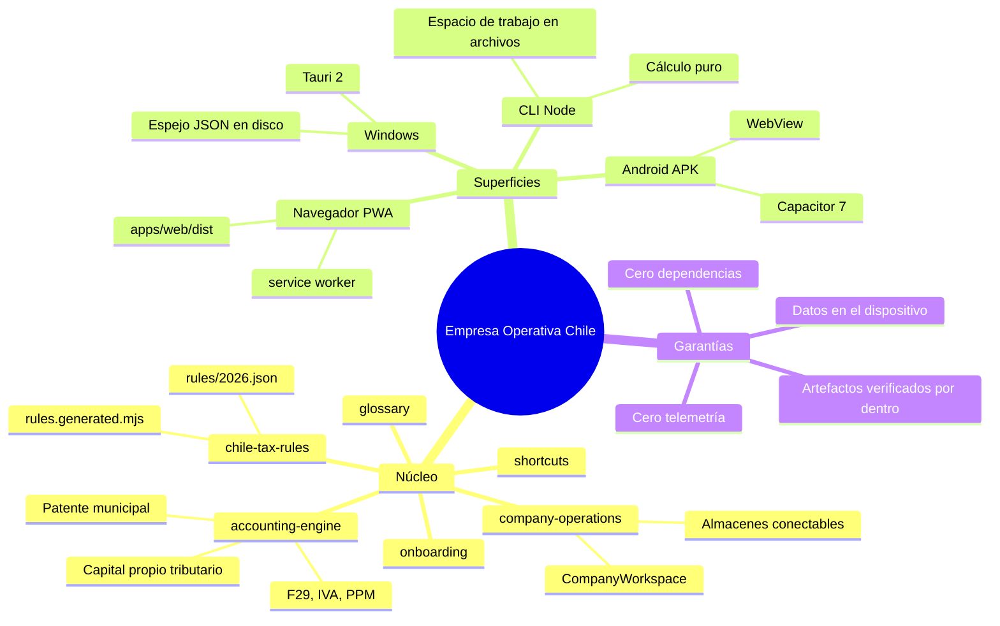

# 01 · Visión general del sistema

[⬅ Índice](README.md) · [Siguiente: Instalación ➡](02-installation-and-execution.md)

---

## En una frase

Una aplicación que se instala en tu propio dispositivo y lleva la vida completa de una SpA chilena
—desde la decisión de crearla hasta el cierre de cada año— calculando IVA, PPM, honorarios, capital
propio tributario y patente municipal, **exigiendo evidencia antes de dar algo por cumplido** y
dejando registro de todo lo que cambió.

## La conclusión, antes del recorrido

Cinco cosas que conviene saber antes de abrir un solo archivo:

1. **No hay servidor y no hay red.** Ni una llamada HTTP saliente en toda la aplicación. Lo que
   parece un servidor (`apps/empresa-operativa/server.mjs`) sólo sirve archivos estáticos en
   `127.0.0.1`. Los datos viven en `localStorage` y, en Windows, además en archivos JSON del disco.
2. **Hay un solo motor de cálculo, y viaja completo a las tres plataformas.** No existe una versión
   Android del F29 y otra de escritorio: es el mismo `packages/accounting-engine/index.mjs`. La
   regla que lo sostiene —nada que viaje al dispositivo puede importar `node:*`— la hace cumplir el
   build, que **aborta**, y una prueba.
3. **Las tasas no están en el código.** Viven en `packages/chile-tax-rules/rules/2026.json`, cada
   una con su `source` oficial y su `lastVerified`. Pedir un año sin archivo **lanza un error** en
   vez de calcular con la tasa del año anterior.
4. **El producto se niega a mentir.** No marca un trámite como hecho sin evidencia, no modifica un
   período cerrado, no borra líneas de la bitácora, no dice «todo en orden» si faltan respaldos, y
   no publica tasas municipales que nadie verificó.
5. **Cero dependencias de producción.** El `package.json` raíz no declara ninguna, y un workflow
   falla si alguien añade una. No hay bundler, no hay framework de UI y no hay ORM.

## Qué problema resuelve

Llevar una empresa pequeña en Chile no falla por no saber sumar. Falla por perder el hilo: una
factura sin respaldo, un remanente de IVA que no se arrastró, un trámite que se dio por hecho sin
guardar el comprobante, un mes cerrado sin conciliar. El sistema ataca ese hilo, no la aritmética.

Su diferenciador real está en **distinguir magnitudes que otras herramientas funden en una sola**:

| Magnitud | Qué es | Dónde se calcula |
| --- | --- | --- |
| Capital social | Lo que dice el estatuto | `capital.mjs` → `capitalSocial` |
| Capital suscrito | Lo que el accionista se comprometió a aportar | `capital.mjs` → `capitalSuscrito` |
| Capital enterado | Lo que efectivamente entró | `workspace.mjs` → `capitalPosition()` |
| Patrimonio contable | Activos − pasivos, según la contabilidad | `workspace.mjs` → `estimatedBalance()` |
| Capital propio tributario (CPT) | Activo − pasivo exigible a valores tributarios | `accounting-engine/tax-equity.mjs` |
| Capital base de patente | El capital que el D.L. 3.063 manda usar ese año | `accounting-engine/municipal-patent.mjs` |

Confundir dos de estas cambia la cifra que se paga. El sistema las trata como seis números
distintos, cada uno con su momento, su fuente legal y su evidencia.

## Qué hace, funcionalidad por funcionalidad

| Área | Qué resuelve | Vista |
| --- | --- | --- |
| **Empezar aquí** | La ruta ordenada por *tiempo* (14 etapas, 5 fases) para quien nunca creó una empresa | `empezar.js` |
| **Panel** | Indicadores del mes, diagnóstico de salud y próximos vencimientos | `panel.js` |
| **Operaciones** | Ventas, compras, gastos, honorarios, aportes, préstamos, retiros, pagos de impuestos | `operaciones.js` |
| **Impuestos** | Borrador del F29 con el remanente arrastrado y los tres vencimientos del SII | `impuestos.js` |
| **Obligaciones** | Calendario de cumplimiento; una obligación sólo se cierra con comprobante | `obligaciones.js` |
| **Cierre** | Cierre mensual inmutable con lista de control declarada | `cierre.js` |
| **Constitución** | Los 9 trámites, cada uno con su autoridad, su evidencia y su enlace oficial | `constitucion.js` |
| **Empresa** | Ficha: razón social, RUT validado, régimen, giro, domicilio, comuna | `empresa.js` |
| **Capital** | Las seis magnitudes, el ledger patrimonial y el cierre anual | `capital.js` |
| **Auditoría** | Bitácora *append-only* de todo lo que cambió | `auditoria.js` |
| **Datos** | Exportación, importación, respaldos y CSV | `datos.js` |
| **Academia** | Explicaciones ancladas al mismo motor que calcula | `academia.js` |
| **Glosario** | 54 términos, con «no confundir con» | `glosario.js` |
| **Ayuda** | Los manuales dentro de la app, sin conexión, más los 12 atajos | `ayuda.js` |

Catorce vistas en total. Todas se registran en `NAV`, dentro de `apps/web/src/app.js`, y una prueba
falla si alguna queda fuera del router.

## Las cuatro superficies

**Qué muestra el mapa mental y qué no.** Muestra que hay un solo núcleo del que cuelgan cuatro
superficies, y qué compone cada una. **No muestra** dirección de dependencia ni orden de ejecución:
las cuatro superficies *importan* del núcleo y nunca al revés, y ese sentido único es precisamente
lo que hace posible que el APK y el instalador de Windows calculen igual. Tampoco muestra los
scripts de build, que son quienes copian el núcleo a cada superficie; eso está en
[03 · Arquitectura](03-architecture.md).

| Superficie | Cómo se construye | Dónde guarda |
| --- | --- | --- |
| Navegador / PWA | `apps/web/dist` servido por Pages o por `server.mjs` | `localStorage` del navegador |
| Android | Capacitor 7 empaqueta `apps/web/dist` en `assets/public/` del APK | `localStorage` de la WebView (sandbox de la app) |
| Windows | Tauri 2 embebe `apps/web/dist` en el ejecutable | `localStorage` **+ espejo JSON** en `app_data_dir` |
| CLI | Importa `packages/` directamente desde Node | Archivos JSON/NDJSON en `--datos` (por defecto `./.local-data`) |

## Qué NO hace (declarado por el propio sistema)

`packages/onboarding/index.mjs` expone `COVERAGE.notCovered`, con **diez** áreas explícitamente
fuera de alcance. No es una lista escrita para esta documentación: la aplicación la muestra en
pantalla y `docs/EMPEZAR-AQUI.md` se genera desde ella.

- Trabajadores y remuneraciones (sin liquidaciones, cotizaciones ni Libro de Remuneraciones)
- Comercio exterior (importaciones, exportaciones y sus regímenes de IVA)
- Existencias e inventario (la app está pensada para servicios)
- Activo fijo y depreciación
- Corrección monetaria del art. 41 de la LIR — **el CPT que calcula es nominal**
- Reorganizaciones empresariales (división, fusión, transformación, conversión)
- Registros empresariales completos (RAI, DDAN, REX, SAC) del Régimen General
- Término de giro
- Conexión con el SII o con municipalidades — **no existe y no se simula**
- Tasas de patente por comuna — no se publican porque no hay una tasa nacional

Y tres límites técnicos que `docs/ARCHITECTURE.md` declara y esta documentación confirma leyendo el
código:

- el remanente de crédito fiscal se arrastra pero **no se reajusta** (art. 27 del D.L. 825);
- los vencimientos consideran sábado y domingo pero **no feriados legales** — el propio resultado
  devuelve `checkHolidays: true`;
- el espejo de Windows y los respaldos **no están cifrados**.

## Lo que está sólido y conviene no romper

Un informe que sólo enumera problemas da una imagen falsa. Estas propiedades son buenas y son
frágiles: alguien las romperá si nadie dijo que importaban.

| Propiedad | Cómo está protegida hoy |
| --- | --- |
| Un año sin reglas falla en vez de degradar | `loadRules()` lanza · prueba en `tests/rules.test.mjs` |
| Nada que viaje al dispositivo importa `node:*` | `build-web.mjs` aborta el build · prueba en `tests/webapp.test.mjs` |
| El módulo embebido de reglas nunca se desfasa del JSON | `build-rules.mjs --check` en CI · `deepEqual` en `tests/rules.test.mjs` |
| El glosario, la guía y los atajos no pueden contradecir al código | Se **generan** desde `packages/` y CI compara con `--check` |
| Un período cerrado es inmutable en las dos direcciones | `addTransaction`, `updateTransaction` y `deleteTransaction` lo comprueban · prueba dedicada |
| La bitácora no se puede borrar | No existe ninguna operación de borrado sobre `KEY.audit` |
| Real y sandbox no se pisan | Almacenes distintos con *namespace* distinto, no una bandera |
| El build es reproducible | CI construye dos veces y compara `build-info.json` |
| Un APK vacío no se publica | `verify-apk.mjs` abre el ZIP y **cuenta** lo que hay dentro |
| Toda acción de las acciones de CI está fijada a un SHA | Paso `workflows` de `ci.yml` |

---

## 🧑‍🤝‍🧑 Para una persona no técnica

*Sin jerga. Si algo de aquí no se entiende, es un defecto de este texto, no de quien lee.*

### Qué es, con una comparación

Imagina una **carpeta muy ordenada** para tu empresa. No una carpeta de cartón: una que además sabe
sumar, que te avisa cuando falta un papel y que apunta en una libreta todo lo que has ido metiendo
y sacando, con fecha y hora.

Eso es esta aplicación. Se instala en tu teléfono o en tu computador y hace tres cosas:

1. **Calcula.** Cuánto IVA debes este mes, cuánto retienes de una boleta de honorarios, cuánto te
   toca de patente municipal. Y cuando calcula, te enseña de dónde salió cada número.
2. **Exige el papel.** No te deja marcar «ya hice el inicio de actividades» si no anotas el número
   del comprobante. Parece una molestia; es el punto entero. La mayoría de los problemas con el SII
   no vienen de calcular mal, vienen de no encontrar el papel meses después.
3. **Recuerda.** Cada cambio queda apuntado en una libreta que la aplicación **no permite borrar**.
   Si dentro de un año te preguntas «¿por qué agosto quedó así?», la respuesta está ahí.

### Lo importante: tus datos son tuyos

No hay ninguna cuenta que crear, ninguna contraseña, ningún «iniciar sesión». La aplicación **no
manda tus números a ninguna parte**: se quedan en el aparato donde la instalaste, igual que las
fotos de tu teléfono.

Eso tiene una cara buena y una mala, y las dos son importantes:

- **Buena:** nadie más los ve. Ni el autor de la aplicación, ni una empresa, ni un servidor.
- **Mala:** **nadie los respalda por ti**. Si borras la aplicación o cambias de teléfono sin
  exportar una copia, los datos se van y no hay forma de recuperarlos. La aplicación tiene un botón
  para exportar; conviene usarlo cada mes.

### Los dos modos: practica antes de tocar lo real

La aplicación tiene dos espacios completamente separados:

- **SANDBOX** — una empresa inventada, con datos de mentira, para practicar. Ya viene llena.
- **EMPRESA REAL** — la tuya.

No hay ninguna forma de que algo pase de uno al otro. Están guardados en sitios distintos, no
separados por una casilla que alguien pueda olvidar de marcar. Si estás aprendiendo, quédate en
SANDBOX hasta que te sientas cómodo.

### Lo que NO hace, dicho claro

Esto es lo más importante de esta sección, así que va en negrita:

- **No presenta ni paga nada ante el SII.** Prepara el borrador y te dice cuándo vence. Ir al SII,
  presentar y pagar sigue siendo cosa tuya, en la página del SII.
- **No es un contador y no es asesoría tributaria.** Es una calculadora que explica sus cuentas.
  Cuando la aplicación y el SII digan cosas distintas, **manda el SII, siempre**.
- **No sabe cuánto cobra tu municipalidad.** Cada municipalidad de Chile elige su propia tarifa de
  patente dentro de un rango que fija la ley. La aplicación no se inventa la de tu comuna: te avisa
  de que está usando el mínimo legal como *suposición* y te pide que averigües la tuya.
- **No sirve si tienes trabajadores contratados.** No calcula sueldos ni cotizaciones. Para eso
  necesitarás otra herramienta.
- **No sirve si vendes productos físicos con inventario.** Está pensada para servicios.

### Cuándo te ayuda de verdad

Si eres una persona que creó (o va a crear) una SpA para prestar servicios —desarrollo, diseño,
consultoría, asesoría—, sin empleados, y estás llevando las cuentas tú, esta aplicación está hecha
exactamente para esa situación. Fuera de ahí, ayuda menos, y prefiere decírtelo a fingir que sí.

---

[⬅ Índice](README.md) · [Siguiente: Instalación ➡](02-installation-and-execution.md)
