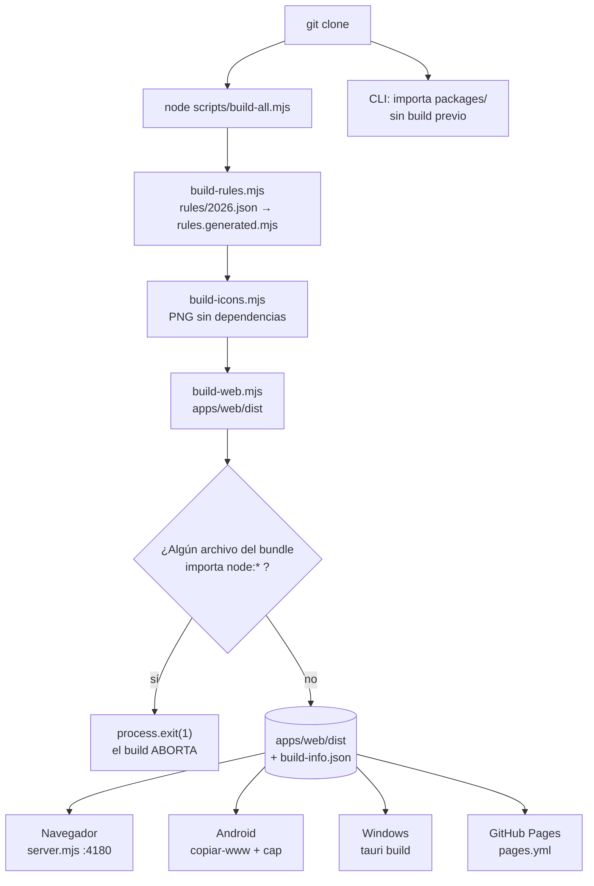

# 02 · Instalación y ejecución

[⬅ Anterior: Visión general](01-system-overview.md) · [Índice](README.md) · [Siguiente: Arquitectura ➡](03-architecture.md)

---

## La conclusión, primero

Para trabajar en el motor, la web y la CLI **no hace falta instalar nada**: no hay dependencias de
producción y no hay bundler. Basta Node ≥ 20 y `node scripts/build-all.mjs`.

`pnpm install` sólo es necesario para dos cosas: empaquetar el **APK de Android** (Capacitor) y
compilar los **instaladores de Windows** (Tauri). Ambas tienen su propio `package.json` y su propio
lockfile dentro de `apps/`.

> **El gestor de paquetes de este repositorio es `pnpm`.** Está declarado en `package.json` como
> `"packageManager": "pnpm@11.2.2"` y los workflows instalan esa versión exacta con
> `pnpm/action-setup`. Escribir `npm` es un error: `pnpm-lock.yaml` es el lockfile válido y
> `npm install` lo ignoraría.

---

## Requisitos

| Requisito | Versión | Para qué | Obligatorio |
| --- | --- | --- | --- |
| **Node.js** | ≥ 20 (`engines.node` en `package.json`) | Todo: build, pruebas, CLI, servidor | ✅ Sí |
| **pnpm** | 11.2.2 (`packageManager`) | Sólo Android y Windows | Sólo para empaquetar |
| **Git** | cualquiera reciente | Clonar; el generador de PDF lee el commit | ✅ Sí |
| **Chrome o Edge** | cualquiera | Capturas, manual, guía, presentación y los PDF de esta documentación | Sólo para regenerar documentos |
| **JDK** | 21 (Temurin en CI) | Compilar el APK | Sólo Android |
| **SDK de Android + Gradle** | el que traiga `cap add android` | Compilar el APK | Sólo Android |
| **Rust** | estable, `rust-version = "1.77"` mínimo declarado en `Cargo.toml` | Compilar la app de Windows | Sólo Windows |
| **`@mermaid-js/mermaid-cli` (`mmdc`)** | global | Rasterizar los diagramas de esta documentación al PDF | Opcional — degrada con aviso |

CI ejecuta la matriz en **Ubuntu con Node 20 y 22** y en **Windows con Node 22**
(`ci.yml`, `matrix.exclude` descarta Windows + Node 20).

---

## Instalación mínima

```bash
git clone https://github.com/vladimiracunadev-create/empresa-operativa-chile.git
cd empresa-operativa-chile
node scripts/build-all.mjs
```

Eso es todo. `build-all.mjs` ejecuta tres pasos **en orden**, y el orden importa:

```text
1. build-rules.mjs   → packages/chile-tax-rules/rules.generated.mjs
2. build-icons.mjs   → apps/web/src/icons/*.png
3. build-web.mjs     → apps/web/dist/
```

La web embebe las reglas y los iconos. Generar la web con reglas viejas produciría un APK que
calcula con la tasa del año pasado **sin que nada se ponga en rojo** — de ahí que el orden esté
fijado en el script y no en la memoria de quien lo ejecuta.

---

## 🔎 Las carpetas que NO están, y quién las crea

Ésta es la sorpresa número uno de quien clona el repositorio. `git ls-files` devuelve 262 archivos
y **ninguno** de ellos está en `apps/web/dist`, `apps/android/www` ni `apps/android/android`.

| Ruta ausente | Quién la genera | Consecuencia de no generarla |
| --- | --- | --- |
| `apps/web/dist/` | `scripts/build-web.mjs` | El servidor local aborta con «No existe apps/web/dist» |
| `apps/android/www/` | `apps/android/copiar-www.mjs` | Capacitor empaquetaría un APK vacío |
| `apps/android/android/` | `pnpm exec cap add android` | No hay proyecto Gradle que compilar |
| `apps/contador-desktop/src-tauri/target/` | `cargo` / `tauri build` | No hay binario |
| `apps/contador-desktop/src-tauri/gen/` | `tauri build` | No existen los esquemas de capacidades |
| `.local-data/` | La CLI, al primer comando de espacio de trabajo | Ninguna: se crea sola |
| `artefactos/` | Los workflows de Android y Windows | Sólo existe en CI |

`.gitignore` las excluye a todas y explica por qué en el propio archivo: *«Artefactos de build (se
regeneran: node scripts/build-all.mjs)»*.

**Dos casos especiales: artefactos generados que SÍ se versionan.**

- `packages/chile-tax-rules/rules.generated.mjs` está commiteado y marcado en `.gitattributes` con
  `linguist-generated=true` para que no ensucie las revisiones. La razón es que el navegador no
  tiene `node:fs` para leer el JSON, así que el módulo embebido tiene que estar disponible sin
  ejecutar ningún build previo. CI comprueba en cada push que no se haya desfasado
  (`build-rules.mjs --check`).
- `apps/web/src/icons/` está commiteado con sus 5 PNG y el SVG fuente, aunque `build-icons.mjs` los
  regenera. Es lo que permite que `pnpm cli` y las pruebas funcionen sobre un clon limpio sin
  ejecutar `build-icons.mjs` antes: la prueba «el manifiesto PWA apunta a iconos que el generador
  crea» comprueba que esos archivos existan en `apps/web/src`, no en `dist`.

---

## Ejecutar cada superficie

### 1. Navegador (lo más rápido)

```bash
pnpm start        # build completo + servidor en http://127.0.0.1:4180
pnpm app          # sólo el servidor, si el build ya está hecho
```

El servidor (`apps/empresa-operativa/server.mjs`) escucha en `127.0.0.1:4180`. **No en `0.0.0.0`**:
son datos contables de una empresa real y no tienen por qué quedar expuestos a la red local porque
alguien levantó la app en un café. Se puede cambiar con las variables `HOST` y `PORT`, con las
consecuencias que describe [10 · Configuración](10-configuration.md).

En Windows hay dos lanzadores que hacen lo mismo sin abrir una terminal:

```text
apps/empresa-operativa/start-windows.bat    → doble clic
apps/empresa-operativa/start-windows.ps1    → PowerShell
```

Ambos comprueban que Node exista, ejecutan `build-all.mjs`, abren el navegador y arrancan el
servidor. Están marcados en `.gitattributes` como `text eol=crlf` porque `cmd.exe` los necesita así.

### 2. CLI

No necesita build ni instalación:

```bash
pnpm cli ayuda
pnpm cli venta --neto 100000
pnpm cli f29 --ventas-netas 1000000 --compras-netas 300000
pnpm cli rut 76.000.000-0
pnpm cli resumen --periodo 2026-08 --sandbox
```

Los comandos de **espacio de trabajo** escriben en disco. El directorio se elige, en este orden de
precedencia: `--datos DIR` → variable `EMPRESA_OPERATIVA_DATA` → `./.local-data`.

### 3. Android (APK)

```bash
pnpm android:prepare               # build-all + copiar apps/web/dist a apps/android/www
cd apps/android
pnpm install --frozen-lockfile
pnpm exec cap add android          # crea apps/android/android/ (proyecto Gradle)
node copiar-www.mjs                # segunda pasada: ahora sí se aplican los iconos
pnpm exec cap sync android
cd android && ./gradlew assembleDebug
cd ../../.. && pnpm android:verify apps/android/android/app/build/outputs/apk/debug/app-debug.apk
```

**La doble ejecución de `copiar-www.mjs` no es un error.** La primera copia la web; la segunda,
después de que `cap add android` haya creado el proyecto nativo, aplica los iconos de
`apps/android/res-icons/` sobre `android/app/src/main/res/`. El propio script lo dice: *«El proyecto
Android todavía no existe: los iconos se aplicarán tras `cap add android`»*. El workflow
`android.yml` hace exactamente las mismas dos pasadas.

El APK resultante es **de depuración**, firmado con la clave de debug de Android. Sirve para
instalar y usar; no para Google Play.

`REQUIERE VALIDACIÓN` — este flujo no se ejecutó durante el análisis: exige JDK 21, SDK de Android
y Gradle. Se transcribe de `.github/workflows/android.yml` y de `apps/android/package.json`.

### 4. Windows (Tauri 2)

```bash
pnpm desktop:dev                   # ventana de desarrollo
pnpm desktop:build                 # build-all + tauri build → MSI, NSIS y portable
```

Produce tres formas de instalar, y cada una resuelve una situación distinta:

| Artefacto | Para qué |
| --- | --- |
| `.msi` | Despliegue corporativo / instalación desatendida |
| `-setup.exe` (NSIS) | El camino normal para una persona |
| `-portable.exe` | Ejecutar sin instalar, desde un pendrive o un equipo ajeno |

`REQUIERE VALIDACIÓN` — tampoco se ejecutó: exige la toolchain de Rust. Se transcribe de
`.github/workflows/desktop.yml`, `apps/contador-desktop/package.json` y `tauri.conf.json`.

---

## El diagrama de arranque



**Qué muestra el diagrama y qué no.** Muestra que `apps/web/dist` es el punto de convergencia: las
cuatro formas de publicar el producto salen del mismo directorio, y la CLI es la única que se salta
el build porque importa `packages/` directamente desde Node. **No muestra** la comprobación de
reproducibilidad (CI construye dos veces y compara `build-info.json`), ni la verificación posterior
del artefacto —`verify-apk.mjs` abre el APK, y el workflow de Windows cuenta la interfaz antes de
sellarla—, ni que `build-web.mjs` también embarca los manuales y la presentación dentro del bundle.

---

## Comprobar que la instalación quedó bien

```bash
pnpm test      # 153 pruebas con el runner nativo de Node
pnpm check     # el gate completo del repositorio
```

`pnpm check` es la comprobación que importa. Encadena ocho pasos y falla al primero que se rompa:

```text
build-rules.mjs --check         reglas embebidas ≡ rules/*.json
build-glossary.mjs --check      docs/GLOSSARY.md ≡ packages/glossary
build-guide.mjs --check         docs/EMPEZAR-AQUI.md ≡ packages/onboarding
build-shortcuts.mjs --check     docs/ATAJOS-DE-TECLADO.md ≡ packages/shortcuts
build-presentation.mjs --check  estructura de docs/presentacion.md
check-presentation.mjs          páginas reales de los PDF vs. lo anunciado
validate-rules.mjs              valores de las tasas del año en curso
node --test tests/*.test.mjs    153 pruebas
```

Salida real obtenida durante este análisis, en Windows 11 con Node v24.11.1 y pnpm 11.2.2:

```text
Reglas embebidas sincronizadas (2026).
Glosario sincronizado (54 términos).
Guía sincronizada (14 etapas, 2 diagramas).
Atajos sincronizados (12).
Presentación válida: 8 diapositivas, 28 minutos.
Presentación: 8 diapositivas (713 KB), ≈28 min, pauta de 5 páginas (726 KB) — coincide con lo anunciado.
Reglas 2026 validadas; última verificación 2026-08-09
...
ℹ tests 153
ℹ pass 153
ℹ fail 0
```

---

## Todos los scripts de `package.json`

| Script | Qué hace | Necesita |
| --- | --- | --- |
| `pnpm build` | Build completo (reglas → iconos → web) | Node |
| `pnpm build:rules` | Sólo el módulo embebido de reglas | Node |
| `pnpm build:glossary` | Regenera `docs/GLOSSARY.md` | Node |
| `pnpm build:guide` | Regenera `EMPEZAR-AQUI` en `.md`, `.html` y `.pdf` | Node + Chrome |
| `pnpm build:icons` | Regenera los PNG de icono | Node |
| `pnpm build:web` | Sólo `apps/web/dist` | Node |
| `pnpm build:shortcuts` | Regenera `docs/ATAJOS-DE-TECLADO.md` | Node |
| `pnpm start` | Build + servidor local | Node |
| `pnpm app` | Sólo el servidor | Node + `dist` ya construido |
| `pnpm cli` | Ejecuta la CLI | Node |
| `pnpm test` | 153 pruebas | Node |
| `pnpm check` | El gate completo (8 pasos) | Node |
| `pnpm desktop:dev` | Ventana Tauri de desarrollo | Rust + pnpm |
| `pnpm desktop:build` | Instaladores de Windows | Rust + pnpm |
| `pnpm android:prepare` | Build + copia a `apps/android/www` | Node |
| `pnpm android:verify` | Abre un APK y cuenta lo que lleva dentro | Node |
| `pnpm capturas` | Recaptura las pantallas del manual | Chrome + servidor levantado |
| `pnpm manual` | Regenera `MANUAL.pdf` y `MANUAL.html` | Chrome |
| `pnpm guia` | Alias de `build:guide` | Chrome |
| `pnpm docs` | Capturas + guía + manual + presentación | Chrome + servidor |
| `pnpm presentacion` | Regenera y verifica la presentación | Chrome |

A esos se suma el generador de esta documentación, que **no** está en `package.json` para no
mezclarlo con los procesos de release del producto:

```bash
node scripts/build-system-docs.mjs
```

---

## Desinstalación y pérdida de datos

Un punto que conviene no descubrir tarde:

| Superficie | Qué pasa al desinstalar |
| --- | --- |
| Navegador / PWA | Borrar los datos del sitio elimina `localStorage`. **Pérdida definitiva** |
| Android | Desinstalar la app borra su sandbox, incluida la WebView. **Pérdida definitiva** |
| Windows | El desinstalador quita el ejecutable; los JSON de `app_data_dir` **sobreviven** salvo que se borren a mano. `INFERENCIA` a partir de `lib.rs`, que escribe fuera del directorio de instalación · `REQUIERE VALIDACIÓN` con una desinstalación real |
| CLI | `.local-data/` es un directorio normal: sobrevive a todo |

La única defensa es exportar desde la vista **Datos**. El propio texto de esa vista lo dice: *«Tus
datos viven en este dispositivo y no se envían a ningún servidor. Eso también significa que el
respaldo es tu responsabilidad»*.

---

[⬅ Anterior: Visión general](01-system-overview.md) · [Índice](README.md) · [Siguiente: Arquitectura ➡](03-architecture.md)
