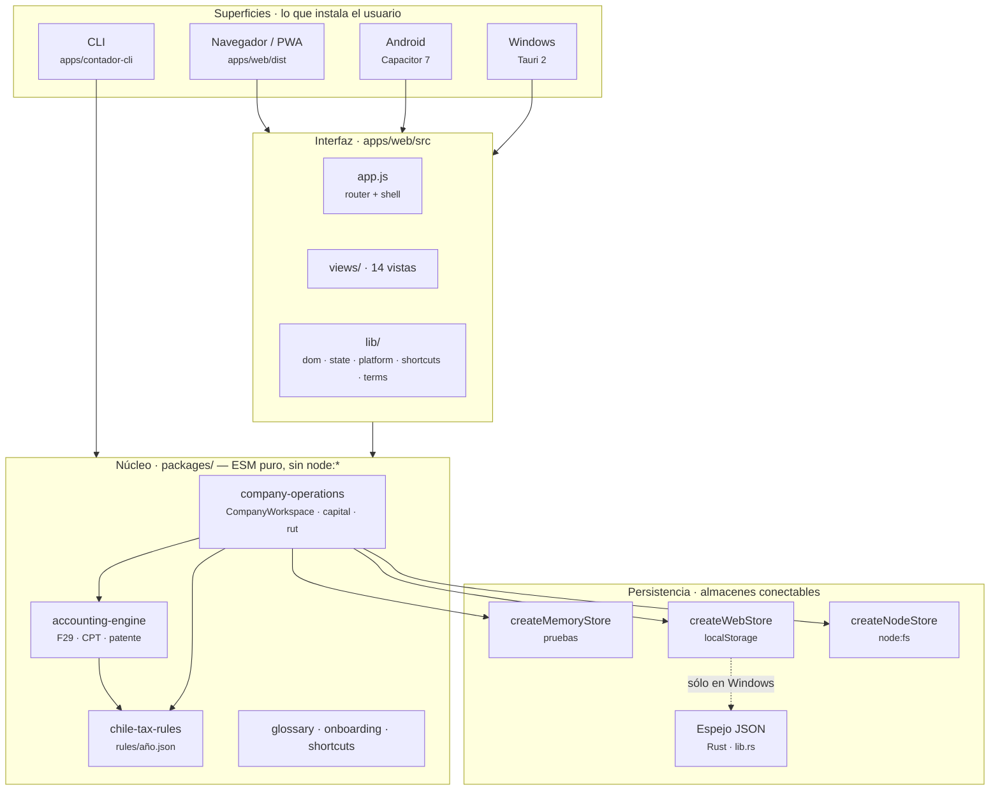
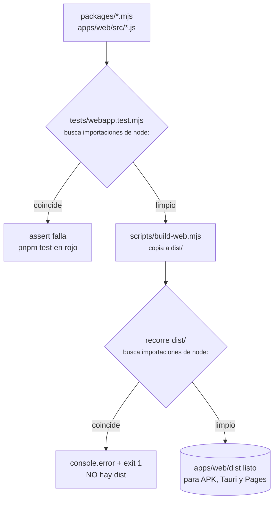
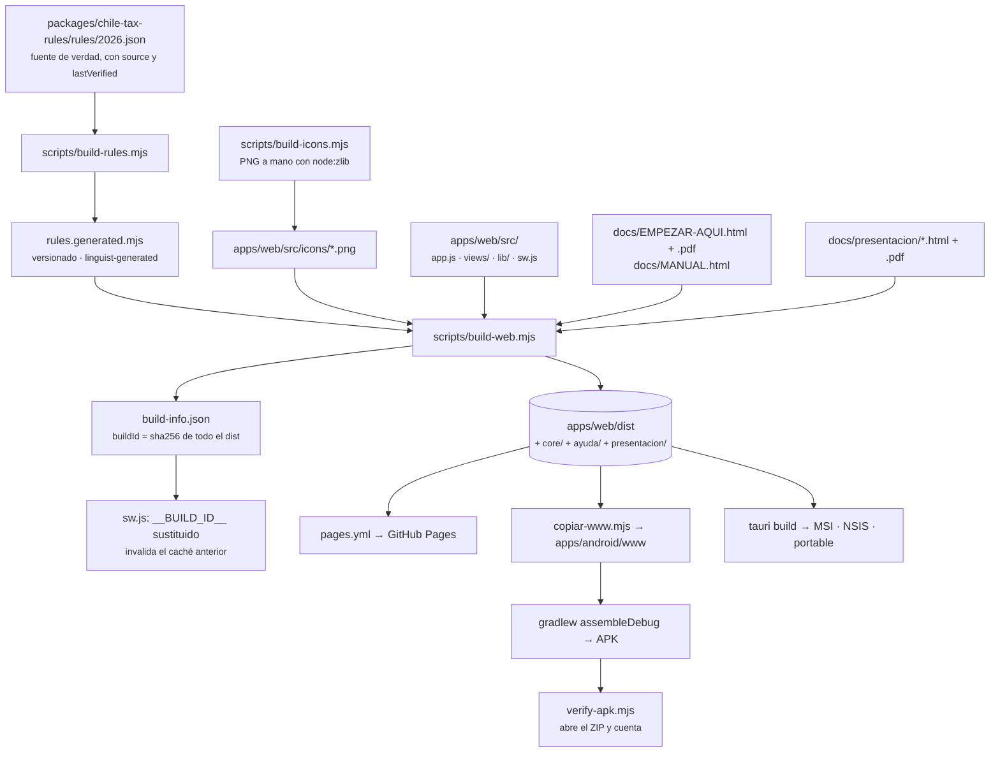
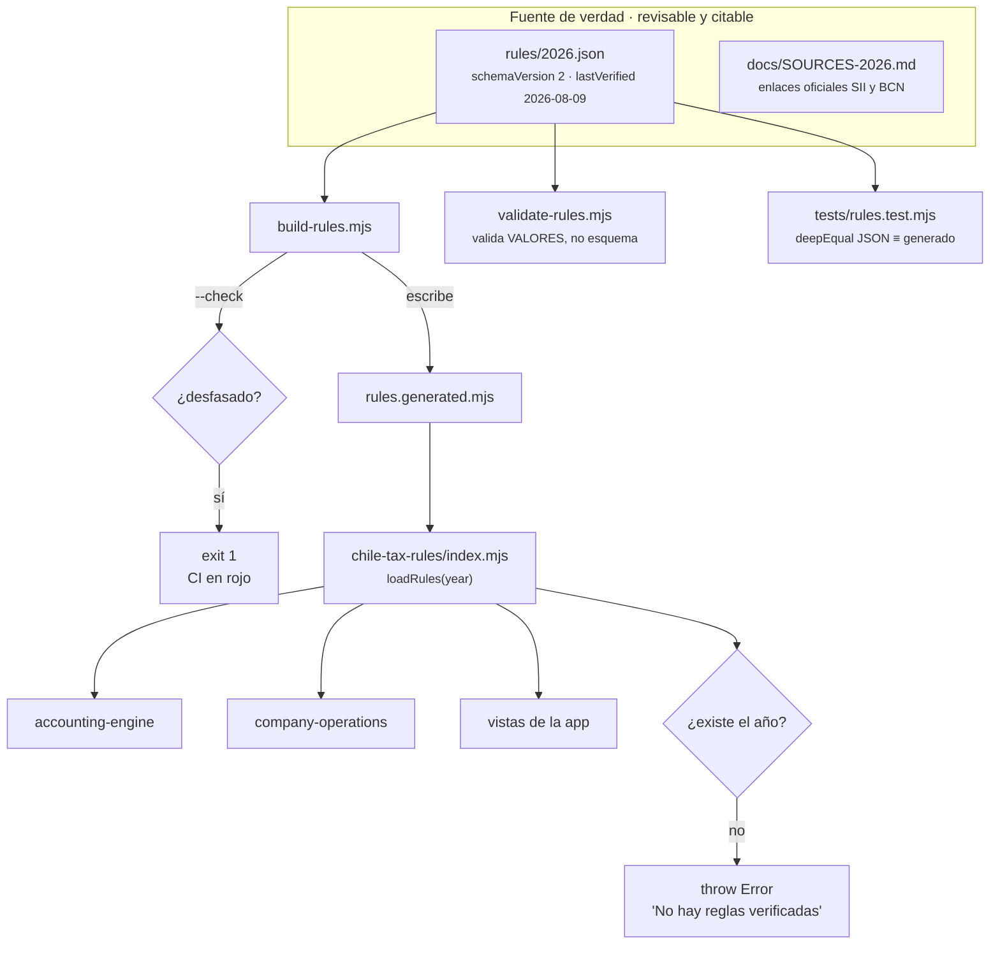
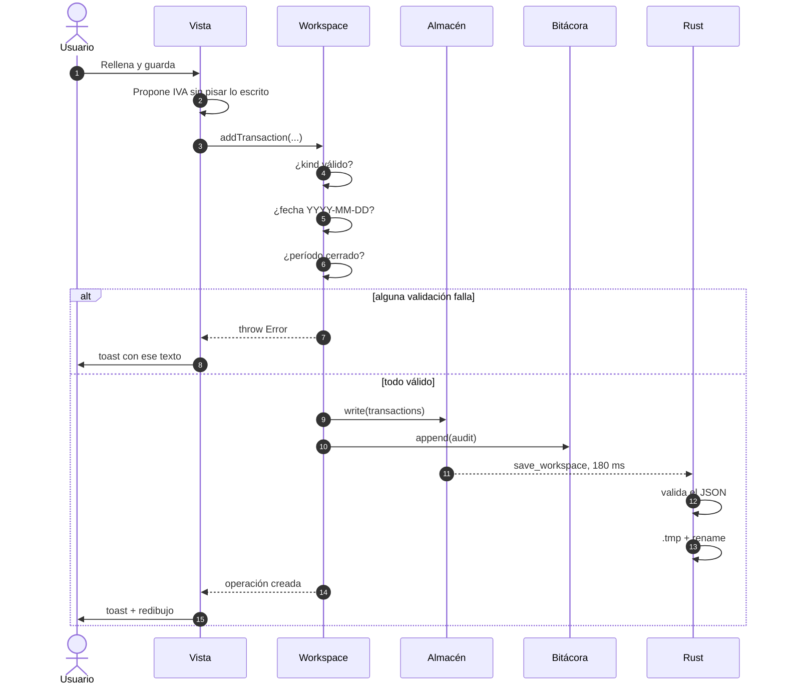
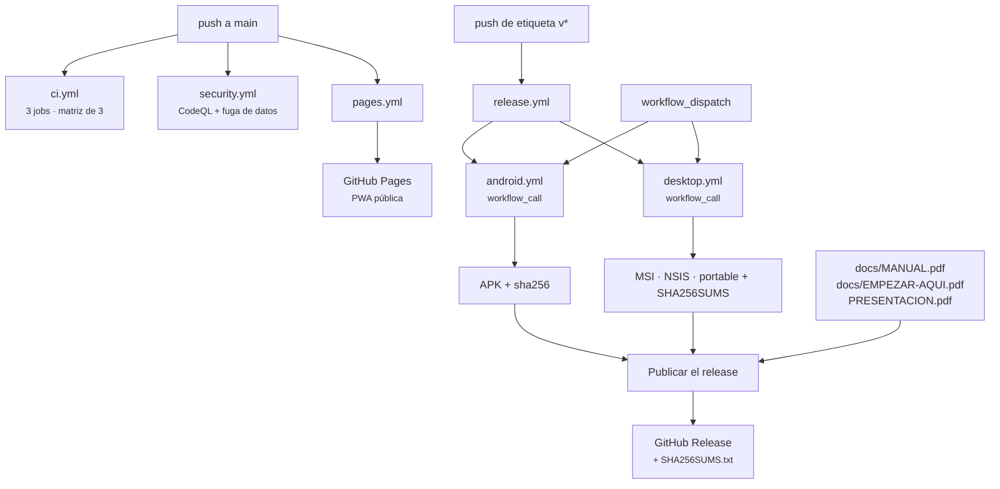

# 03 · Arquitectura

[⬅ Anterior: Instalación](02-installation-and-execution.md) · [Índice](README.md) · [Siguiente: Mapa del código ➡](04-code-map.md)

---

> **Fuente de verdad de las decisiones:** [`docs/ARCHITECTURE.md`](../ARCHITECTURE.md), que explica
> las siete decisiones de diseño con su problema, su decisión y su consecuencia. Este documento no
> las repite: añade los **diagramas**, el detalle de las capas y la verificación de cómo se hacen
> cumplir las reglas duras. Donde ambos hablen de lo mismo, manda `ARCHITECTURE.md` — con una
> excepción registrada en [15 · Riesgos](15-risks-and-technical-debt.md): su mapa de directorios
> declara «10 vistas» y «50 pruebas», cifras que hoy son 14 y 153.

---

## La conclusión, primero

La arquitectura entera se sostiene sobre una sola restricción: **un solo motor, tres plataformas**.
Todo lo demás —la ausencia de bundler, los almacenes conectables, el re-render completo, las reglas
como datos— es consecuencia de haber tomado esa decisión en serio y haberla convertido en un gate
que aborta el build.

El sistema es **síncrono y de un solo hilo**. `CompanyWorkspace` no tiene un solo método `async`, y
esa decisión propaga: `localStorage` es síncrono, el motor contable es síncrono, y por eso el espejo
de Windows es una copia posterior en vez de la fuente. Cambiar eso obligaría a rehacer las catorce
vistas.

---

## Vista de capas



**Qué muestra el diagrama y qué no.** Muestra la dirección única de las dependencias: las
superficies dependen de la interfaz, la interfaz del núcleo, el núcleo de la persistencia — y nunca
al revés. Muestra también que la CLI se salta la interfaz por completo. **No muestra** los scripts
de build, que son el mecanismo físico por el que el núcleo llega a cada superficie (eso está más
abajo, en «El pipeline de build»), ni el sentido temporal: el espejo de Windows se escribe *después*
de `localStorage`, con 180 ms de retardo, no en paralelo.

Una precisión importante que el diagrama simplifica: **`node-store.mjs` no viaja al navegador**. Es
el único módulo de `company-operations` que importa `node:fs`, y por eso vive en un archivo aparte,
al que sólo llega `index.mjs` (la entrada de Node). `apps/web` importa `workspace.mjs` y `store.mjs`
directamente, saltándose `index.mjs`.

---

## La regla dura: nada que viaje al dispositivo importa `node:*`

Es la regla más importante del repositorio y la única que se defiende en **tres** sitios distintos.

### Por qué existe

Un `import fs from 'node:fs'` dentro de un módulo que acaba en el APK no produce un error de
compilación. Produce una WebView que arranca, muestra una **pantalla en blanco** y deja todas las
señales del build en verde. Es exactamente el tipo de fallo que sólo se detecta cuando alguien
instala el APK.

### Cómo se hace cumplir

| Capa | Dónde | Qué comprueba | Cuándo actúa |
| --- | --- | --- | --- |
| 1 · Build | `scripts/build-web.mjs`, líneas finales | Recorre `apps/web/dist`, filtra `.mjs`/`.js` y busca `/from\s+['"]node:/`. Si encuentra algo, imprime los archivos y `process.exit(1)` | En **cada** build, local y en CI |
| 2 · Prueba | `tests/webapp.test.mjs`, test `ningún módulo que viaja al navegador importa node:*` | Mismo patrón sobre el **código fuente**: todos los `.js` de `apps/web/src` más los 13 módulos de `BROWSER_CORE` | En `pnpm test` y en CI |
| 3 · Documento | `CONTRIBUTING.md`, sección «Tocar el motor operativo» | Lo dice y explica por qué | Al leer |

La capa 1 mira el resultado; la capa 2 mira la fuente. Son complementarias: la 2 falla antes, la 1
atrapa cualquier módulo que se cuele al `dist` por una ruta que la 2 no conoce.



**Qué muestra el diagrama y qué no.** Muestra que hay dos puertas en serie y que ninguna de las dos
produce un artefacto si la comprobación falla. **No muestra** el límite de la comprobación, que es
real y está registrado en [15 · Riesgos](15-risks-and-technical-debt.md): el patrón
`/from\s+['"]node:/` sólo reconoce la forma `import … from 'node:x'`. Un `import 'node:fs';` de
efecto secundario, o un `await import('node:fs')` dinámico, **pasarían las dos puertas**.

### El otro lado de la regla

Lo que sí necesita `node:*` vive donde puede:

| Archivo | Importa | Quién lo carga |
| --- | --- | --- |
| `packages/company-operations/node-store.mjs` | `node:fs`, `node:path` | `index.mjs` (Node) — nunca el navegador |
| `packages/company-operations/index.mjs` | vía `node-store.mjs` | CLI, servidor, pruebas |
| `apps/empresa-operativa/server.mjs` | `node:http`, `node:fs`, `node:path`, `node:url` | Sólo el proceso servidor |
| `apps/contador-cli/src/index.mjs` | `node:fs`, `node:path` | Sólo la CLI |
| `scripts/**` | libremente | Sólo el build |

La lista de lo que **sí** viaja está declarada dos veces, y ésa es una duplicación real registrada
en [15 · Riesgos](15-risks-and-technical-debt.md): `CORE` en `scripts/build-web.mjs` y
`BROWSER_CORE` en `tests/webapp.test.mjs`. Hoy coinciden exactamente (13 módulos), pero nada
comprueba que sigan coincidiendo.

---

## El pipeline de build



**Qué muestra el diagrama y qué no.** Muestra que todo converge en `apps/web/dist` y que ese
directorio es literalmente lo que se publica en las tres plataformas: la demo pública nunca queda
desfasada respecto de lo que la gente instala. Muestra también que los manuales y la presentación
**viajan dentro del bundle** — es contenido pesado embarcado a propósito, porque un manual que
necesita internet no sirve justo cuando alguien lo necesita.

**No muestra** dos cosas. Primera: el `buildId` es un hash SHA-256 del contenido completo de `dist`,
truncado a 12 caracteres, y CI construye dos veces para comprobar que **no cambia** — si cambiara,
algo dependería del reloj o del orden del sistema de archivos, y el artefacto publicado no sería el
que se probó. Segunda: el PDF grande del manual (7,7 MB) se queda **fuera** del bundle a propósito;
sólo viajan `EMPEZAR-AQUI.html`, `EMPEZAR-AQUI.pdf` y `MANUAL.html`.

---

## Las reglas tributarias como datos versionados



**Qué muestra el diagrama y qué no.** Muestra el ciclo completo de una tasa: se escribe en el JSON
con su fuente, se embebe en un módulo ESM para que el navegador pueda leerla, y tres comprobaciones
independientes vigilan que las dos copias no se separen. Muestra también el comportamiento clave:
un año sin archivo **lanza**, no degrada.

**No muestra** la sutileza que hace que esto valga la pena: `validate-rules.mjs` no valida
estructura (eso lo hace `build-rules.mjs`), valida **valores concretos** —que el IVA siga siendo
19 %, que la retención siga siendo 15,25 %, que el tope de patente sean 8.000 UTM y no 4.000—. Es la
red que atrapa el error de dedo en un JSON que sigue siendo sintácticamente perfecto. El detalle
está en [07 · Persistencia](07-database.md).

---

## Almacenamiento conectable

`CompanyWorkspace` no sabe dónde escribe. Habla un contrato de seis métodos, documentado en la
cabecera de `packages/company-operations/store.mjs`:

```text
read(key, fallback)      → valor JSON o fallback
write(key, value)        → persiste el valor (atómico si puede)
append(key, row)         → agrega una fila a un log append-only
readAll(key)             → filas del log, en orden
saveSnapshot(name, data) → guarda un respaldo y devuelve su ubicación
listSnapshots()          → nombres de respaldos existentes
```

| Implementación | Archivo | Dónde escribe | Atomicidad |
| --- | --- | --- | --- |
| `createMemoryStore()` | `store.mjs` | `Map` en memoria, con clonado por JSON | N/A |
| `createWebStore({namespace})` | `store.mjs` | `localStorage`, prefijado por *namespace* | No |
| `createNodeStore({rootDir, mode})` | `node-store.mjs` | Archivos JSON + `audit.ndjson` | Sí: temporal + `rename` |
| `createPlatformStore(mode)` | `apps/web/src/lib/platform.js` | Envuelve `createWebStore` y añade el espejo Tauri | El espejo sí (Rust); `localStorage` no |

**Consecuencia arquitectónica que conviene nombrar:** no hay una sola rama `if (isBrowser)` dentro
de la lógica de negocio, las pruebas corren en memoria sin tocar disco, y la separación
EMPRESA REAL / SANDBOX se consigue **dando a cada modo su propio almacén** — no con una bandera que
alguien pueda olvidar de comprobar. `createWebStore` exige `namespace`, y `state.js` lo construye
como `empresa-operativa-chile:${mode}`.

---

## El ciclo de una operación, de principio a fin



**Qué muestra la secuencia y qué no.** Muestra dónde vive cada validación (todas en el motor, ninguna
sólo en la vista) y que el mensaje de error **es** la explicación de la regla: el motor lanza textos
escritos para una persona —«Un paso sólo puede marcarse como realizado si registras su evidencia»— y
`attempt()` en `lib/dom.js` los muestra tal cual en vez de un «Error» genérico.

**No muestra** que el espejo de Rust es *best effort*: si la escritura a disco falla, la aplicación
sigue funcionando con `localStorage` y sólo avisa por consola. Perder la sesión por un error de
escritura sería peor que perder el espejo. Tampoco muestra el caso de Android y navegador, donde los
pasos 12–14 simplemente no ocurren.

---

## Despliegue



**Qué muestra el diagrama y qué no.** Muestra que `release.yml` **reutiliza** los workflows de
Android y de Windows con `workflow_call` en vez de duplicar sus pasos: lo que se publica es
exactamente lo que esos workflows verificaron. Muestra también que la documentación viaja con el
release.

**No muestra** el detalle que hace que el release sea confiable: antes de publicar, `release.yml`
comprueba con `test -f` que los seis artefactos obligatorios existan, y aborta si falta uno. Un
release a medias es peor que un release que falla. Tampoco muestra que **etiquetar es una acción
humana**: nada dispara `release.yml` automáticamente.

---

## Decisiones que conviene entender antes de tocar nada

Resumidas desde `docs/ARCHITECTURE.md` y verificadas contra el código. El detalle del *porqué* está
allí; aquí queda el *qué pasa si lo cambias*.

| Decisión | Qué pasa si se revierte |
| --- | --- |
| Un motor, tres plataformas | El IVA de agosto podría dar distinto en el teléfono y en el escritorio |
| Almacenamiento conectable | Volverían los `if (isBrowser)` a la lógica de negocio; las pruebas necesitarían disco |
| Las reglas son datos | Una tasa vieja seguiría calculando con toda confianza el año en que deja de ser cierta |
| Sin bundler | El código depurado en producción dejaría de ser el del repositorio; entrarían dependencias |
| Re-render completo | Volvería la clase entera de errores de sincronización vista/datos |
| Se verifica el artefacto, no el build | Un APK vacío podría publicarse con todas las señales en verde |
| Integridad por encima de comodidad | «Cerrado» y «hecho» dejarían de significar algo |

Y una decisión que no está en `ARCHITECTURE.md` y merece nombrarse: **la documentación se genera
desde el código**. El glosario, la guía «Empezar aquí» y la tabla de atajos tienen una sola copia
—en `packages/`— y los documentos son proyecciones que CI compara con `--check`. Un glosario escrito
a mano en tres sitios se contradice en dos semanas; éste no puede.

---

[⬅ Anterior: Instalación](02-installation-and-execution.md) · [Índice](README.md) · [Siguiente: Mapa del código ➡](04-code-map.md)
