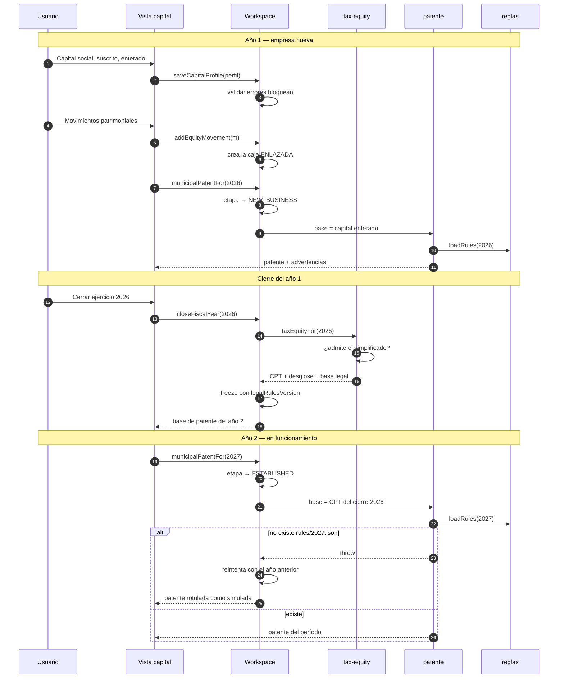
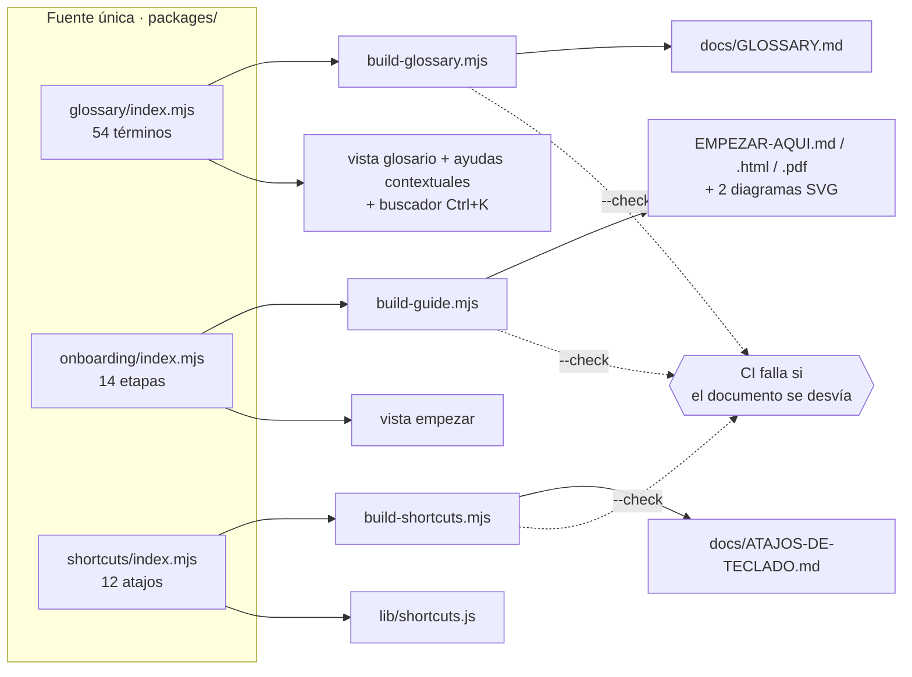

# 06 · Explicación profunda del código

[⬅ Anterior: Referencia técnica](05-technical-reference.md) · [Índice](README.md) · [Siguiente: Persistencia ➡](07-database.md)

---

Este documento recorre el sistema **flujo por flujo**, no archivo por archivo. La referencia
alfabética de funciones está en [05](05-technical-reference.md); aquí se explica **cómo se
encadenan** y qué decisión contiene cada eslabón.

Se explica línea a línea sólo donde la literalidad aporta —el arrastre del IVA, el piso del CPT, la
comprobación de escape de directorio— y por bloques donde no.

---

## Flujo 0 · El arranque

`apps/web/src/app.js`, función `boot()`, cuatro pasos en un orden que importa:

```js
setTheme(state.theme);        // 1. tema antes de pintar, para evitar el destello
await hydrateFromDisk();      // 2. sólo hace algo en Windows
ensureSandboxSeeded();        // 3. siembra el sandbox si está vacío
applyUrlState();              // 4. #vista, ?modo, ?tema, ?periodo
render();                     // 5. shell + vista
```

**El paso 2 es el único `await` de todo el arranque** y sólo hace algo bajo Tauri. En navegador y en
Android, `hydrateFromDisk()` devuelve `{ hydrated: false }` de inmediato. La razón de esperarlo es
que si el disco tiene datos que `localStorage` no tiene, hay que reponerlos **antes** de que
`ensureSandboxSeeded()` decida si el sandbox está vacío. Invertir 2 y 3 sembraría el sandbox sobre
datos que estaban a punto de llegar del disco.

**`applyUrlState()` — por qué existe.** Tres cosas dependen de ello y ninguna es obvia:

- `#impuestos` abre esa vista directamente, y eso es lo que hace funcionar los accesos directos del
  manifiesto PWA (mantener pulsado el icono en Android);
- permite enlazar a una pantalla concreta desde la documentación;
- `?modo=sandbox` y `?tema=claro` existen para que **las capturas del manual se generen de forma
  reproducible**, sin depender del estado guardado. `capture-screenshots.mjs` los usa.

Después, `installShortcuts()` registra **un solo** oyente en `document`. El comentario del archivo
explica el porqué: la app se redibuja entera en cada cambio, así que enganchar teclas por vista
dejaría oyentes huérfanos en cada render.

Y por último, el service worker se registra sólo si `location.protocol` empieza por `http`. Bajo
Tauri el protocolo es `tauri://`, así que no se intenta — y si falla, el `.catch()` vacío lo absorbe:
sin service worker la app sigue funcionando, sólo pierde el modo offline del navegador.

---

## Flujo 1 · Registrar una venta, de principio a fin

Es el flujo más recorrido del producto. Siete eslabones.

### 1. La vista propone el IVA sin pisar lo escrito

`views/operaciones.js` calcula `neto × tasa` mientras el usuario teclea, pero **no sobrescribe** el
campo si ya tiene un valor distinto. La razón está en el dominio: una factura exenta o una nota de
crédito tienen un IVA que no es el 19 % del neto, y recalcular sobre el neto le cobraría al usuario un
IVA que no debe.

### 2. `addTransaction()` valida en tres puertas

```js
if (!KIND_IDS.includes(tx.kind)) throw new Error(`kind no soportado: ${tx.kind}`);
const date = tx.date || new Date().toISOString().slice(0, 10);
if (!/^\d{4}-\d{2}-\d{2}$/.test(date)) throw new Error('date debe tener formato YYYY-MM-DD');
if (this.isPeriodClosed(date.slice(0, 7))) throw new Error(`El período ${date.slice(0, 7)} está cerrado`);
```

Las tres validaciones están **en el motor**, no en la vista. Consecuencia práctica: la CLI, las
pruebas y las tres plataformas obtienen exactamente la misma protección, y la vista no puede
saltársela por descuido.

### 3. Los valores por defecto que definen el comportamiento

```js
deductible: tx.deductible !== false,
vatCreditEligible: tx.vatCreditEligible !== false,
```

Escrito así —y no `tx.deductible ?? true`— para que `undefined`, `null` y omisión den `true`, y sólo
un `false` **explícito** dé `false`. Por omisión todo es deducible y todo da crédito; hay que marcar
lo contrario a mano. Es la elección correcta para el caso común y obliga a una decisión consciente
para el caso raro.

### 4. El enlace que impide el doble conteo

```js
equityMovementId: tx.equityMovementId || null,
```

Un campo de una línea con una consecuencia grande. Cuando `addEquityMovement()` crea una operación de
caja asociada, la deja enlazada por aquí. `effectiveEquityMovements()` **excluye** las transacciones
que tienen ese enlace, para no contar el mismo aporte dos veces al derivar el capital enterado. Y el
capital enterado alimenta el CPT, que alimenta la base de la patente del año siguiente.

### 5. Escritura y bitácora

```js
this.store.write(KEY.transactions, rows);
this.audit('transaction.added', { id, kind, total, period: date.slice(0, 7) });
```

Dos operaciones, no una transacción. `INFERENCIA`: si el proceso muere entre ambas, la operación
queda guardada sin línea en la bitácora. No hay mecanismo que lo detecte ni lo repare. Registrado en
[15 · Riesgos](15-risks-and-technical-debt.md).

### 6. El espejo de Windows, con retardo

`createPlatformStore()` intercepta `write`, `append` y `saveSnapshot`, y programa `mirror()` con un
`setTimeout` de 180 ms que se reinicia en cada escritura. Registrar cinco operaciones seguidas
produce **una** escritura a disco, no cinco.

El vuelco recorre `localStorage` entero y selecciona las claves del *namespace* del modo:

```js
for (let i = 0; i < localStorage.length; i++) {
  const key = localStorage.key(i);
  if (key.startsWith(`${NS(mode)}:`)) dump[key] = localStorage.getItem(key);
}
```

`INFERENCIA` sobre el coste: el vuelco es **completo**, no incremental. Con un historial grande, cada
escritura serializa todo el espacio de trabajo. A la escala del producto —decenas de operaciones por
mes— es irrelevante; con varios años de historia empezaría a notarse.

### 7. Rust escribe de forma atómica

```rust
serde_json::from_str::<serde_json::Value>(&payload)
    .map_err(|e| format!("payload inválido: {e}"))?;
let tmp = file.with_extension("json.tmp");
fs::write(&tmp, payload)?;
fs::rename(&tmp, &file)?;
```

Dos protecciones en cinco líneas. La validación **antes** de tocar el disco evita pisar un espejo
bueno con basura si la WebView manda algo corrupto. El `rename` hace la sustitución atómica: un corte
de luz a mitad deja el archivo anterior intacto en vez de un JSON truncado que no abre.

---

## Flujo 2 · El borrador del F29

### El arrastre del remanente

La función más importante del flujo tributario mensual, y la más fácil de romper sin darse cuenta:

```js
vatCarryForwardInto(period) {
  let carry = 0;
  for (const p of this.listPeriods()) {
    if (p >= period) break;
    const s = this.periodSummary(p);
    const available = s.creditVat + carry;
    carry = Math.max(0, available - s.debitVat);
  }
  return carry;
}
```

Línea a línea, porque aquí la literalidad sí aporta:

- `listPeriods()` devuelve los períodos **ordenados ascendentemente** (usa `.sort()` sobre cadenas
  `YYYY-MM`, que ordenan bien lexicográficamente). El recorrido va del más antiguo al más nuevo, y
  **eso es obligatorio**: el remanente se acumula hacia adelante.
- `if (p >= period) break;` corta antes del período pedido. Incluirlo devolvería el remanente
  *saliente*, no el *entrante*.
- `Math.max(0, ...)` impide un remanente negativo. Si el débito supera al crédito disponible, no hay
  remanente: hay IVA a pagar, que es otra cosa y la calcula `f29Basic`.
- El resultado **no se reajusta**. El art. 27 del D.L. 825 manda reajustar el remanente, y el sistema
  no lo hace. Está declarado como limitación en el propio comentario del método y en
  `docs/ARCHITECTURE.md`.

**Coste computacional.** `periodSummary(p)` recorre **todas** las transacciones filtrando por
prefijo, y esto lo llama una vez por período anterior: es O(períodos × transacciones). Con 12 meses y
200 operaciones son 2.400 comparaciones — irrelevante. Con 60 meses y 5.000 operaciones serían
300.000 en cada render del panel, que redibuja la vista entera. Registrado en
[15 · Riesgos](15-risks-and-technical-debt.md).

### Los dos modos de `f29Basic`

```js
const usesDeclaredVat = debitVat !== undefined || creditVat !== undefined;
const debit  = debitVat  === undefined ? derivedDebit  : clp(debitVat);
const credit = creditVat === undefined ? derivedCredit : clp(creditVat);
```

La comprobación es `!== undefined`, no *truthy*. Un `debitVat: 0` legítimo —un mes con ventas exentas
únicamente— se respeta como cero declarado en vez de caer al derivado. Es la clase de detalle que
parece trivial y produce una diferencia con el SII cuando se hace mal.

Y el resultado cambia la lista de advertencias, no sólo el número:

```js
if (!usesDeclaredVat) {
  limitations.push('IVA derivado de los netos con la tasa general: no refleja operaciones exentas, notas de crédito ni redondeos del emisor.');
}
```

La vista muestra esas `limitations` al usuario. El sistema no se limita a calcular distinto: **dice**
que calculó distinto.

### Los tres vencimientos

`f29DueDates()` construye las fechas en **UTC** (`Date.UTC`) y las serializa con
`toISOString().slice(0,10)`. Deliberado: usar la hora local haría que la fecha dependiera de la zona
horaria del equipo, y un usuario en otra zona vería un día distinto.

```js
while (d.getUTCDay() === 0 || d.getUTCDay() === 6) {
  d.setUTCDate(d.getUTCDate() + 1);
  shifted = true;
}
```

Un `while` y no un `if`, porque el día 12 puede caer sábado y hay que saltar dos días. `shifted`
viaja al resultado como `shiftedFromWeekend`, y la vista lo muestra: el usuario ve que la fecha se
movió y por qué.

`checkHolidays: true` viaja **siempre**. No es una opción: es la declaración de que los feriados
legales chilenos no están modelados.

---

## Flujo 3 · Capital, CPT y patente — la cadena de tres años

Es la lección central del producto y el flujo con más decisiones acumuladas.



**Qué muestra la secuencia y qué no.** Muestra la cadena completa: el capital enterado del año 1
alimenta la patente del año 1; el cierre del año 1 produce un CPT; ese CPT es la base de la patente
del año 2. Muestra también la degradación honesta cuando faltan las reglas del año pedido.

**No muestra** que `capitalPosition()` toma el **mayor** entre el capital enterado declarado y el que
suman los movimientos, ni que `effectiveEquityMovements()` combina dos orígenes sin duplicar. Ambas
cosas están explicadas abajo.

### 3.1 `capitalPosition()` — por qué el mayor de dos cifras

```js
const enteradoDeclarado = money(profile.capitalEnterado);
const enteradoMovimientos = summary.capitalEnteradoPorMovimientos - summary.disminucionesDeCapital;
const capitalEnterado = Math.max(enteradoDeclarado, Math.max(0, enteradoMovimientos));
```

El usuario rellenó la ficha una vez y después registró movimientos durante meses. La ficha se queda
corta, y **quedarse corto aquí subestima la patente**, que es un error caro y silencioso. Se toma el
mayor. Los dos valores originales siguen expuestos por separado
(`capitalEnteradoDeclarado`, `capitalEnteradoPorMovimientos`) para que la vista pueda explicar de
dónde salió la cifra.

### 3.2 `effectiveEquityMovements()` — unir sin duplicar

```js
const derived = this.listTransactions()
  .filter(t => legacyKinds[t.kind] && !t.equityMovementId)
  .map(t => ({ id: `tx:${t.id}`, kind: legacyKinds[t.kind], ..., derivedFromTransaction: t.id }));
```

Dos condiciones en el filtro y las dos son necesarias. `legacyKinds[t.kind]` selecciona los cuatro
tipos de caja que tienen efecto patrimonial. `!t.equityMovementId` excluye las que **ya** nacieron de
un movimiento del ledger. Sin la segunda, cada aporte registrado por la vía nueva se contaría dos
veces.

El id derivado lleva prefijo `tx:` para que no pueda colisionar con un id del ledger, y
`derivedFromTransaction` conserva la trazabilidad hacia la operación original.

### 3.3 `calculateTaxEquity()` — la elección de método

```js
const simplifiedAllowed = allowsSimplifiedTaxEquity(taxRegime);
const chosen = method ?? (simplifiedAllowed ? 'simplified14D3j' : 'article41');
```

El método se puede forzar con `method`, pero forzarlo **no calla la advertencia**:

```js
if (chosen === 'simplified14D3j' && !simplifiedAllowed) {
  warnings.push(`El régimen declarado (“${taxRegime || 'sin declarar'}”) no corresponde …`);
}
```

Y `allowsSimplifiedTaxEquity` corta primero por «transparente»:

```js
if (/transparente/i.test(value)) return false;
return SIMPLIFIED_REGIMES.some(re => re.test(value));
```

Sin ese corte, «Pro Pyme Transparente (14 D N.º 8)» coincidiría con `/pro\s*pyme\s*general/i`… no,
no coincidiría con «general», pero **sí** con el segundo patrón si alguien escribiera «14 D N.º 3»
por error en la ficha. El corte explícito es la defensa contra el texto libre de un campo de
formulario.

### 3.4 El piso en cero del CPT simplificado

```js
const bruto = capitalAportado + bases + participaciones + positive
            - disminuciones - perdidas - art21 - retiros - negative;
const calculated = Math.max(0, bruto);
if (bruto < 0) {
  warnings.push(`El cálculo dio ${bruto.toLocaleString('es-CL')}; la letra (j) manda considerar $0 …`);
}
```

Tres señales, no una: `calculatedCPT` con el cero legal, `rawCPT` con el negativo real, y
`flooredAtZero: true`. Perder cualquiera convertiría un dato en una afirmación falsa: un CPT de $0 sin
más contexto se lee como «esta empresa no tiene capital propio», cuando lo que ocurrió es que la ley
truncó una cifra negativa.

Hay una prueba dedicada a que un cero **exacto** no se marque como truncado.

### 3.5 `closeFiscalYear()` — la fotografía

```js
if (this.getAnnualClose(fiscalYear)) {
  throw new Error(`El ejercicio ${fiscalYear} ya está cerrado. Reábrelo indicando el motivo …`);
}
const rules = loadRulesVersion(fiscalYear);
const close = Object.freeze({ ..., legalRulesVersion: rules });
```

`loadRulesVersion()` no guarda una referencia al archivo de reglas: guarda una **copia** de los
valores relevantes —año, `lastVerified`, `schemaVersion`, el bloque completo de patente municipal y
el de CPT—. Dentro de tres años `rules/2026.json` puede haberse corregido, y el cierre tiene que
seguir explicando con qué normas se calculó ese día.

`Object.freeze()` protege el objeto devuelto en memoria. **No congela lo guardado**: `store.write()`
serializa a JSON y el JSON no tiene congelación. La inmutabilidad real la da que ningún método
sobrescriba un cierre existente y que `importAll()` en modo fusión no lo pise.

### 3.6 `capitalHistory()` — la simulación rotulada

```js
try {
  patent = this.municipalPatentFor(year);
} catch (error) {
  patentError = error.message;
  const fallback = availableYears().filter(y => y < year).at(-1);
  if (fallback) {
    try { patent = this.municipalPatentFor(year, { rulesYear: fallback }); simulatedWithRulesYear = fallback; }
    catch { /* queda sólo el error, que ya es informativo */ }
  }
}
```

El comentario del código dice exactamente qué se está negociando: *«Sin reglas del año no se calcula
la patente de ese año: eso no se negocia. Pero sí se puede mostrar qué saldría con las últimas reglas
verificadas, rotulado como simulación. Es la diferencia entre enseñar el mecanismo y fingir que la
cifra es la del período.»*

El `filter(y => y < year)` sólo mira años **anteriores**. Simular 2028 con reglas de 2026 es
razonable; hacerlo con reglas de 2030 no tendría sentido.

Y el `catch` vacío interior no es descuido: si tampoco se puede simular, queda `patentError`, que ya
es informativo.

---

## Flujo 4 · Cerrar un período, y por qué eso significa algo

```js
closePeriod(period, checklist = {}) {
  if (!/^\d{4}-\d{2}$/.test(String(period))) throw new Error('period debe tener formato YYYY-MM');
  if (this.isPeriodClosed(period)) throw new Error('El período ya está cerrado');
  const close = { id: uuid(), period, at: isoNow(), summary: this.periodSummary(period),
                  carryForwardIn: this.vatCarryForwardInto(period), checklist };
  ...
}
```

El cierre guarda **dos** listas: `periodCloses` con el detalle completo (resumen del período,
remanente entrante y la lista de control tal como se declaró) y `closedPeriods` con sólo los
identificadores. La segunda existe para que `isPeriodClosed()` sea una comprobación barata que se
llama en cada `addTransaction`.

**La lista de control se guarda tal cual, con las casillas que el usuario NO marcó.** La vista
`cierre.js` lo dice: la app deja cerrar aunque falten casillas —no es su trabajo bloquear a alguien
que sabe lo que hace— pero deja constancia exacta de qué se declaró revisado y qué no. Meses después,
esa constancia es la diferencia entre «creo que lo revisé» y saberlo.

La inmutabilidad se defiende en **tres** métodos, no en uno:

| Método | Comprobación |
| --- | --- |
| `addTransaction` | El período de la fecha nueva |
| `updateTransaction` | El período **de origen** y el **de destino** |
| `deleteTransaction` | El período de la operación existente |

Falta cualquiera de las cuatro comprobaciones y «cerrar el mes» deja de significar algo.

`reopenPeriod()` existe porque cerrar por error es inevitable, pero exige motivo escrito
(`if (!String(reason || '').trim())`) y deja la razón en la bitácora. La decisión explícita del
producto: **la trazabilidad importa más que la inmutabilidad absoluta**.

---

## Flujo 5 · El ciclo de vida de una regla tributaria

### `build-rules.mjs` — de JSON a módulo ESM

```js
const entries = years.map(year => {
  const parsed = JSON.parse(fs.readFileSync(path.join(rulesDir, `${year}.json`), 'utf8'));
  if (String(parsed.commercialYear) !== year) throw new Error(`${year}.json declara commercialYear=${parsed.commercialYear}`);
  if (!parsed.lastVerified) throw new Error(`${year}.json no declara lastVerified`);
  return `  ${year}: ${JSON.stringify(parsed, null, 2).split('\n').join('\n  ')}`;
});
```

Dos validaciones que atrapan el error más probable al añadir un año: copiar `2026.json` a
`2027.json` y **olvidar cambiar `commercialYear`**. El nombre del archivo y el contenido tienen que
coincidir, o el build para.

El `.split('\n').join('\n  ')` reindenta el JSON para que el módulo generado se lea como código y no
como un volcado. Detalle de presentación con una consecuencia real: hace que un `git diff` sobre
`rules.generated.mjs` sea legible.

### El modo `--check`

```js
if (process.argv.includes('--check')) {
  if (previous !== body) {
    console.error('rules.generated.mjs está desfasado respecto de rules/*.json.');
    process.exit(1);
  }
}
```

Comparación de **cadenas exactas**, no de objetos. Es más estricto de lo necesario —un cambio de
indentación fallaría— y eso es deliberado: el archivo se genera, así que cualquier diferencia
significa que alguien lo editó a mano o que el generador cambió.

El comentario del script dice para qué sirve: *«CI lo ejecuta en ese modo para que nadie pueda editar
un JSON y publicar una app que sigue calculando con la tasa anterior.»*

### `validate-rules.mjs` — la red que atrapa el error de dedo

Este script no valida esquema. Valida **valores**:

```js
if (r.iva.generalRate !== 0.19) errors.push('IVA 2026 esperado 19%');
if (r.honorarios.retentionRate !== 0.1525) errors.push('Retención honorarios 2026 esperada 15,25%');
if (p.maxUtm !== 8000) errors.push('Máximo legal de patente esperado 8.000 UTM (D.L. 3.063 art. 24)');
```

El comentario sobre el tope de 8.000 UTM registra un error real que existió en este repositorio:
*«el 4.000 que traía este repositorio era el texto anterior a esa reforma»* (Ley 20.280). Es
exactamente el fallo que este script existe para que no vuelva.

El bucle final es el más valioso:

```js
for (const [name, rule] of Object.entries(r)) {
  if (!rule || typeof rule !== 'object' || Array.isArray(rule)) continue;
  if (name === 'taxEquity') continue;
  if (!rule.source) errors.push(`La regla "${name}" no declara su fuente`);
  if (!rule.lastVerified) errors.push(`La regla "${name}" no declara su última verificación`);
}
```

Recorre **todas** las reglas objeto del año, no una lista fija. Una regla nueva que alguien añada
mañana queda obligada a citar fuente y fecha sin que nadie tenga que acordarse de actualizar el
validador. `taxEquity` se excluye porque su estructura es distinta —las fuentes viven dentro de
`methods`, no en el nivel superior— y sus referencias legales se comprueban en las líneas anteriores.

---

## Flujo 6 · El build de la web y el gate `node:*`

`scripts/build-web.mjs`, en orden:

1. **`fs.rmSync(distDir, { recursive: true, force: true })`** — borra `dist` entero. Un build
   incremental dejaría archivos de una versión anterior, y esos archivos acabarían dentro del APK.
2. **`copyDir(srcDir, distDir)`** — copia `apps/web/src` tal cual.
3. **Copia de los 13 módulos de `CORE`** a `dist/core/`, con `throw` si falta alguno.
4. **Manuales:** `EMPEZAR-AQUI.html`, `EMPEZAR-AQUI.pdf` y `MANUAL.html` a `dist/ayuda/`. Si falta
   uno, el error **dice qué comando lo genera**. El PDF grande del manual (7,7 MB) se queda fuera a
   propósito: engordar la instalación cuatro veces por un archivo que se descarga una vez no compensa.
5. **Presentación:** tres archivos a `dist/presentacion/`.
6. **El gate:**

```js
const offenders = walk(distDir)
  .filter(f => f.endsWith('.mjs') || f.endsWith('.js'))
  .filter(f => /from\s+['"]node:/.test(fs.readFileSync(f, 'utf8')));
if (offenders.length) { /* lista los archivos */ process.exit(1); }
```

Se comprueba **aquí, en el build**, y no sólo en un test que quizá nadie corra antes de publicar. El
comentario lo dice: *«si eso llega al APK, la pantalla queda en blanco sin un error visible»*.

**El límite del patrón, verificado:** `/from\s+['"]node:/` no reconoce `import 'node:fs';` ni
`await import('node:fs')`. Registrado en [15 · Riesgos](15-risks-and-technical-debt.md).

7. **El `buildId`:**

```js
const buildId = crypto.createHash('sha256')
  .update(walk(distDir).sort().map(f => fs.readFileSync(f)).reduce((a, b) => Buffer.concat([a, b]), Buffer.alloc(0)))
  .digest('hex').slice(0, 12);
```

El `.sort()` es lo que hace el hash **reproducible**: sin él dependería del orden que devuelva el
sistema de archivos, que varía entre plataformas. CI construye dos veces y compara `build-info.json`
precisamente para que esa propiedad no se pierda sin que nadie lo note.

8. **Sustitución en el service worker:** `__BUILD_ID__` → el hash. Publicar una versión nueva invalida
   el caché anterior en vez de dejar a la gente con una app vieja pegada en el navegador.

---

## Flujo 7 · La verificación del APK

`scripts/verify-apk.mjs` no comprueba que el build funcionara: comprueba que el resultado sirva.

### Leer el ZIP a mano

Un APK es un ZIP. El script lee el directorio central **sin `unzip` y sin librerías**, para correr
igual en Windows, Linux y macOS:

```js
const EOCD_SIG = 0x06054b50;
for (let i = buf.length - 22; i >= 0 && i > buf.length - 22 - 65535; i--) {
  if (buf.readUInt32LE(i) === EOCD_SIG) { eocd = i; break; }
}
```

La búsqueda va **hacia atrás** y con un límite de 65.535 bytes porque el «End of Central Directory»
está al final, después de un comentario de longitud variable cuyo máximo es precisamente ese.

Después maneja **ZIP64**: si los campos de 32 bits vienen al máximo (`0xffffffff` / `0xffff`), los
valores reales están en un registro aparte que hay que localizar por su propia firma. Sin esa rama,
un APK grande no se podría verificar.

### Las doce comprobaciones

No se comprueba que los archivos existan: se **cuentan**.

```js
[`El APK contiene las 10 vistas (encontradas: ${views})`, views >= 10],
[`El APK contiene el núcleo de cálculo (módulos: ${core})`, core >= 6],
[`Tamaño razonable (${sizeMb.toFixed(1)} MB)`, sizeMb > 1 && sizeMb < 120]
```

Y una última que va más allá del recuento: busca `core/chile-tax-rules/rules.generated.mjs` dentro
del ZIP, porque el motor de cálculo tiene que estar de verdad, no sólo los archivos de interfaz.

`REQUIERE VALIDACIÓN` — el script no se ejecutó en este análisis por no haber APK disponible. La
lógica se transcribe del código.

---

## Flujo 8 · Los documentos que se generan desde el código

Tres scripts comparten el mismo patrón, y entenderlo evita el error clásico de editar el documento
en vez de la fuente.



**Qué muestra el diagrama y qué no.** Muestra que cada módulo de contenido tiene **dos o tres**
consumidores —la aplicación y el documento— y que CI vigila que no se separen. **No muestra** una
asimetría importante: en `build-guide.mjs` sólo el `.md` se compara con `--check`. El `.html` y el
`.pdf` se regeneran con `pnpm docs` y **no** en `check`, porque necesitan Chrome y CI no lo tiene
garantizado. El propio script lo declara en su cabecera. Consecuencia real: es posible que
`EMPEZAR-AQUI.html` —que viaja **dentro** del APK— quede desfasado respecto de `EMPEZAR-AQUI.md` sin
que CI lo detecte. Registrado en [15 · Riesgos](15-risks-and-technical-debt.md).

El generador de glosario aborta antes de escribir si hay enlaces rotos:

```js
const dangling = danglingReferences();
if (dangling.length) { dangling.forEach(d => console.error(`  ${d}`)); process.exit(1); }
```

Un `notToConfuseWith` que apunta a un id inexistente produciría un ancla rota en el Markdown, y esa
ancla rota viajaría a la vista Glosario y a las ayudas contextuales.

---

## Flujo 9 · La verificación de la presentación

`check-presentation.mjs` es el gate más inusual del repositorio y vale la pena entenderlo, porque es
el patrón que esta documentación replicó para sus propios PDF.

Valida tres cosas distintas:

1. **La fuente.** Cuenta las secciones `## N · Título` de `docs/presentacion.md` y suma los minutos
   declarados en las citas `> **Pauta · N min.**`.
2. **El artefacto.** Abre los PDF y cuenta objetos `/Type /Page`:

```js
const total = (fs.readFileSync(full).toString('latin1').match(/\/Type\s*\/Page[^s]/g) ?? []).length;
```

El `[^s]` excluye `/Type /Pages`, que es el nodo del árbol y no una página. Si el PDF no declara
ninguna, la generación falló y el archivo quedó inservible — que un archivo exista y pese no prueba
nada.

3. **Lo que se anuncia fuera.** Recorre **cinco** archivos (`README.md`, `docs/README.md`,
   `docs/presentacion.md`, `apps/web/src/views/ayuda.js`, `.github/workflows/release.yml`) buscando
   `N diapositivas` y `≈N min`, y falla si alguna cifra no coincide con la realidad.

Ese tercer bloque es el que más enseña: *«Nada sujeta las cifras que aparecen en el README, en el
índice de docs y en las notas del release salvo esta comprobación: se escriben a mano y envejecen en
cuanto alguien añade una lámina.»*

**Y ahí está el hallazgo.** Ese gate existe para la presentación, y **no existe para el manual, ni
para el número de vistas, ni para el número de pruebas**. Es exactamente donde el repositorio tiene
hoy cifras desincronizadas. El detalle, con las cinco cifras concretas, está en
[15 · Riesgos](15-risks-and-technical-debt.md).

---

## Flujo 10 · La interfaz — por qué se redibuja todo

```js
export function render(keepScroll = false) {
  const app = document.querySelector('#app');
  app.innerHTML = shell();          // el shell entero
  // ... reenganchar oyentes ...
  renderView(keepScroll);           // la vista entera
}
```

Se reconstruye el DOM completo en cada cambio, y **se vuelven a enganchar todos los oyentes**. A esta
escala —decenas de filas por período, no miles— es instantáneo y elimina una clase entera de errores
de sincronización entre vista y datos.

Los dos sitios donde sí molesta son los campos de búsqueda, y se resuelven a mano:

```js
input?.addEventListener('input', e => {
  filters.query = e.target.value;
  const caret = e.target.selectionStart;
  rerender();
  const next = document.querySelector('[data-q]');
  next?.focus();
  next?.setSelectionRange(caret, caret);
});
```

Guardar la posición del cursor, redibujar, recuperar el foco y restaurar el cursor. Sin esas cuatro
líneas, escribir en el buscador de la bitácora perdería el foco en cada tecla.

El otro detalle: `render(true)` conserva `globalThis.scrollY`, para que guardar una fila a mitad de
tabla no salte al principio de la página.

### El escapado por defecto

```js
export const html = (strings, ...values) =>
  strings.reduce((out, chunk, i) => {
    ...
    else if (v && v.__raw !== undefined) rendered = v.__raw;
    else rendered = esc(v);
    return out + rendered + chunk;
  });
```

**Toda** interpolación se escapa salvo que venga envuelta en `raw()`. Es la decisión correcta para
esta aplicación: los datos los escribe el usuario —descripciones de gastos, RUT de proveedores,
motivos de reapertura— y después se muestran en tablas y en la bitácora. Una descripción con `<`
rompería la vista, o algo peor.

El `raw()` explícito convierte cada excepción en una decisión visible en el código. Hay 169 usos de
`raw(` en `apps/web/src`, y prácticamente todos envuelven marcado construido por la propia
aplicación, no texto del usuario.

---

## Flujo 11 · El servidor local

```js
function resolveSafe(urlPath) {
  const decoded = decodeURIComponent(urlPath.split('?')[0]);
  const rel = decoded === '/' ? '/index.html' : decoded;
  const full = path.resolve(distDir, `.${path.posix.normalize(rel)}`);
  if (full !== distDir && !full.startsWith(distDir + path.sep)) return null;
  return full;
}
```

Cuatro pasos, y cada uno cierra un vector:

1. `decodeURIComponent` — sin esto, `%2e%2e%2f` llegaría sin decodificar y `normalize` no lo vería
   como `../`.
2. `path.posix.normalize` — resuelve los `..` **antes** de tocar el sistema de archivos.
3. El `.` inicial en `` `.${rel}` `` fuerza que la ruta se interprete como relativa a `distDir`
   aunque empiece por `/`.
4. `full.startsWith(distDir + path.sep)` — **con el separador**. El comentario del código explica por
   qué: sin él, un directorio hermano llamado `dist-privado` pasaría el filtro.

Las cabeceras de respuesta son igual de deliberadas. `frame-ancestors 'self'` y no `'none'`, porque
la aplicación muestra la guía ilustrada dentro de un marco del **mismo** origen; sigue impidiendo que
cualquier sitio externo enmarque la app, que es de lo que protege esa directiva.

Y el detalle de `charset`: sólo los formatos textuales lo llevan. Declarar `charset=utf-8` en un PNG
o un PDF es ruido.

---

## Lo que no tiene explicación en el repositorio

Honestidad sobre los límites de este documento:

| Elemento | Estado |
| --- | --- |
| `apps/web/src/app.css` (785 líneas) | `NO DOCUMENTADO EN EL REPOSITORIO` — sin comentarios de sección. Es una hoja de estilos, y su ausencia de documentación no oculta ninguna decisión de negocio |
| `scripts/build-icons.mjs`, algoritmo de rasterizado | Documentado en la cabecera del archivo (por qué a mano y no con `sharp`), pero el supermuestreo y la construcción de los *chunks* PNG no tienen comentarios internos |
| `docs/assets/diagramas/anatomia.svg`, `casos-de-uso.svg`, `seis-estados.svg` | `NO IDENTIFICADO` qué los genera. Dos de los cinco SVG los produce `lib/diagrams.mjs`; el origen de los otros tres no consta en el repositorio |
| Umbrales `views >= 10` y `core >= 6` repetidos en `copiar-www.mjs`, `verify-apk.mjs`, `desktop.yml`, `pages.yml` y `webapp.test.mjs` | Existen y funcionan; **no consta por escrito por qué esos números** y no el recuento exacto. `INFERENCIA`: son cotas inferiores tolerantes, para que añadir una vista no rompa cinco sitios |

---

[⬅ Anterior: Referencia técnica](05-technical-reference.md) · [Índice](README.md) · [Siguiente: Persistencia ➡](07-database.md)
