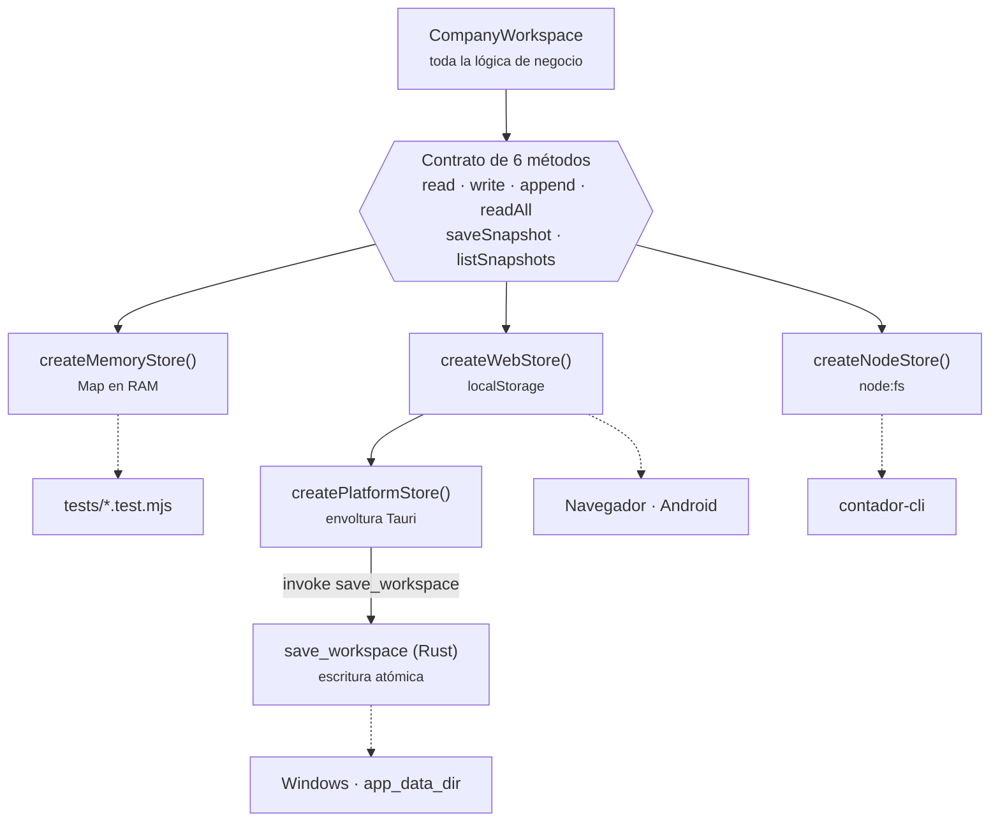
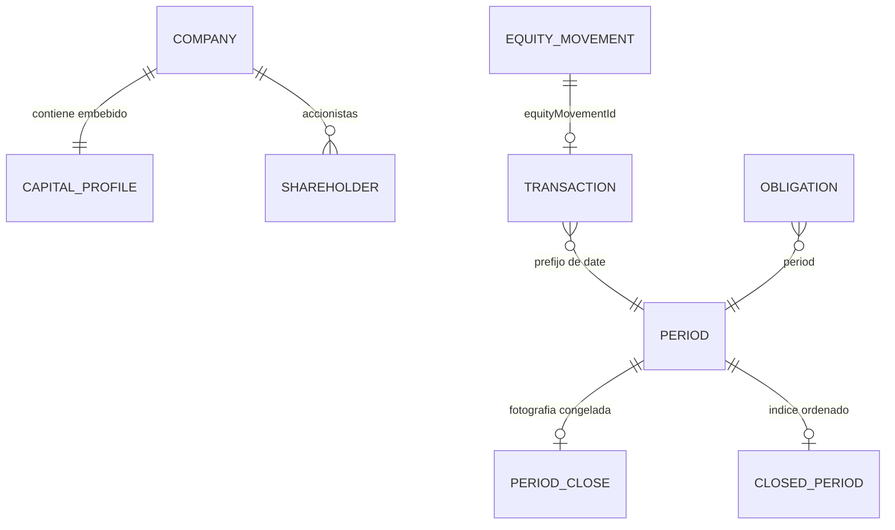
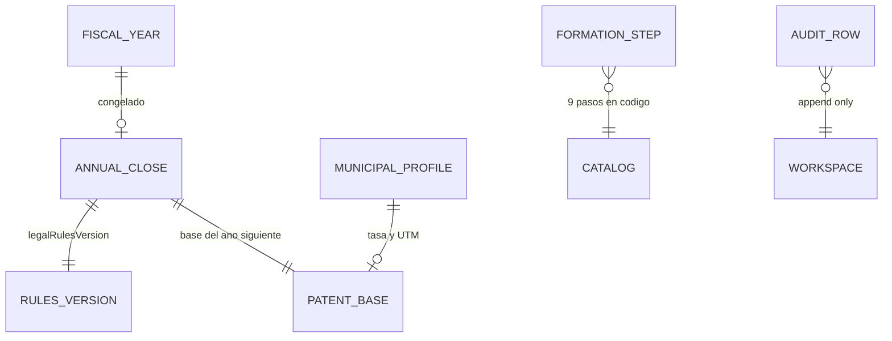
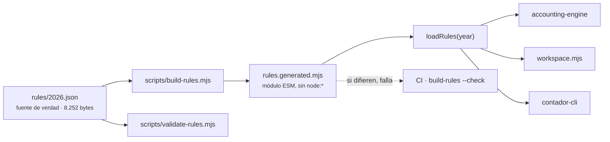

# 07 · Persistencia

[⬅ Anterior: Explicación profunda](06-deep-code-explanation.md) · [Índice](README.md) · [Siguiente: Flujo de datos ➡](08-data-flow.md)

---

## La conclusión, primero

**No hay base de datos.** No hay motor, no hay servidor de datos, no hay ORM, no hay migraciones
SQL, no hay cadena de conexión y no hay credencial que proteger. Se buscó: ni un `.sql`, ni un
esquema, ni un driver, ni una dependencia de base de datos en ningún `package.json` del repositorio.

Lo que sí hay es un **contrato de almacén de seis métodos** (`packages/company-operations/store.mjs`)
con tres implementaciones. `CompanyWorkspace` —las 1.142 líneas donde vive toda la lógica de
negocio— sólo habla ese contrato y no sabe sobre qué está escribiendo.

Este documento cumple lo que se le pide a un capítulo de base de datos: el diccionario de datos está
completo, con tipos, claves, relaciones e integridad, aunque la tecnología subyacente sea
`localStorage` y archivos JSON en vez de tablas.

---

## Las tres implementaciones del almacén

| Implementación | Archivo | `kind` | Dónde escribe | Quién la usa |
| --- | --- | --- | --- | --- |
| **Memoria** | `store.mjs` · `createMemoryStore()` | `memory` | Tres `Map` en RAM | Las 13 suites de prueba y las simulaciones desechables |
| **Web** | `store.mjs` · `createWebStore()` | `web` | `localStorage` del navegador | Navegador, WebView de Android, WebView de Windows |
| **Disco** | `node-store.mjs` · `createNodeStore()` | `node` | Archivos JSON y NDJSON | La CLI y cualquier proceso Node |

Y una cuarta, que es una **envoltura** y no una implementación: `createPlatformStore(mode)` en
`apps/web/src/lib/platform.js`. Devuelve el almacén web tal cual en navegador y en Android; bajo
Tauri lo envuelve para copiar a disco después de cada escritura.



**Qué muestra:** que hay un solo punto de bifurcación entre plataformas y está en el almacén, no
repartido por la lógica. **Qué no muestra:** que `createNodeStore` y `createPlatformStore` nunca
coexisten — son caminos excluyentes, no capas apiladas.

### El contrato, método a método

| Método | Firma | Semántica | Qué NO garantiza |
| --- | --- | --- | --- |
| `read` | `(key, fallback = null)` | Documento JSON completo, o `fallback` | No distingue «no existe» de «está corrupto»: ambos devuelven `fallback` |
| `write` | `(key, value)` | Reemplaza el documento entero | Atómico sólo en `node` y bajo Tauri; en `localStorage` no hay transacción |
| `append` | `(key, row)` | Agrega una fila a un log | En `web` **lee, empuja y reescribe el arreglo completo** — no es un append real |
| `readAll` | `(key)` | Filas del log, en orden de inserción | No pagina ni filtra: devuelve todo |
| `saveSnapshot` | `(name, data)` | Guarda un respaldo, devuelve su ubicación | El formato de la ubicación cambia por implementación |
| `listSnapshots` | `()` | Nombres ordenados | No dice cuánto ocupan ni si se pueden leer |

> **La asimetría del `append` importa.** En `node-store` un append es una línea nueva en un NDJSON
> (`fs.appendFileSync`), y el comentario del código explica por qué: reescribir el archivo completo
> sería la forma más fácil de perder o alterar historial. En `createWebStore` el mismo `append`
> hace leer, empujar y volver a escribir, es decir **reescribe todo el arreglo en cada línea de
> bitácora**. El comportamiento observable es igual; el coste y las propiedades de durabilidad, no.
> Se recoge como hallazgo en [15 · Riesgos](15-risks-and-technical-debt.md).

---

## Dónde acaban los datos, en cada plataforma

| Plataforma | Ubicación real | Formato | Sobrevive a… |
| --- | --- | --- | --- |
| Navegador / PWA | `localStorage` del origen | Un `string` JSON por clave | Cerrar el navegador. **No** sobrevive a «borrar datos del sitio» |
| Android (APK) | `localStorage` de la WebView, dentro del sandbox de la app | Igual | Cerrar la app. **No** sobrevive a desinstalar ni a «borrar datos» |
| Windows (Tauri) | `localStorage` **+** `app_data_dir()/real.json` y `sandbox.json` | Igual + espejo JSON | Reinstalar la app, si no se borra el directorio de datos |
| CLI / Node | `<rootDir>/<mode>/*.json` + `audit.ndjson` | Un archivo por entidad | Todo, salvo borrar la carpeta |

`app_data_dir()` lo resuelve Tauri a partir del `identifier` de `tauri.conf.json`
(`cl.vladimiracuna.empresaoperativa`). La ruta exacta la muestra la propia aplicación en la pestaña
**Datos**, a través del comando `app_info`. `REQUIERE VALIDACIÓN`: no se ejecutó la app de escritorio
en la máquina de análisis, así que la ruta se declara como la que Tauri resuelve, no como una
observada.

### Cómo se llaman las claves

**En `localStorage`** cada clave lleva prefijo de aplicación y de modo:

```text
empresa-operativa-chile:real:transactions
empresa-operativa-chile:sandbox:transactions
empresa-operativa-chile:real:__snapshots
empresa-operativa-chile:real:snapshot:2026-08-27T12-00-00-000Z
```

El prefijo se arma en `platform.js` y el almacén web antepone `namespace:` a cada clave. **Ese
prefijo es toda la separación entre EMPRESA REAL y SANDBOX**: no hay ninguna otra barrera, porque
ambos modos comparten origen. Una prueba lo fija (`tests/workspace.test.mjs`, «el almacén web aísla
real de sandbox en el mismo origen»).

**En disco (`node-store`)** cada clave es un archivo, según el mapa `FILES`:

| Clave lógica | Archivo | Formato |
| --- | --- | --- |
| `company` | `company.json` | Objeto |
| `formation` | `formation.json` | Arreglo |
| `transactions` | `transactions.json` | Arreglo |
| `obligations` | `obligations.json` | Arreglo |
| `closed-periods` | `closed-periods.json` | Arreglo de `YYYY-MM` |
| `period-closes` | `period-closes.json` | Arreglo |
| `audit` | `audit.ndjson` | **NDJSON**, una línea por hecho |
| *cualquier otra* | `<clave>.json` | Objeto o arreglo |

Junto al directorio del modo, `createNodeStore` crea siempre `evidence/` y `backups/`.

> **Hallazgo.** `FILES` no incluye `equity-movements`, `annual-closes` ni `municipal-profile`, que
> son las tres entidades incorporadas en la versión 1.4.0. No se pierden —caen en la rama por
> defecto y acaban en `equity-movements.json`, `annual-closes.json` y `municipal-profile.json`— pero
> **`saveSnapshot` sólo copia como archivo suelto lo que está en `FILES`**, así que un respaldo hecho
> con el almacén de disco no incluye esos tres archivos copiados. El `snapshot.json` interior sí
> lleva los datos, porque sale de `exportAll()`. Ver [15 · Riesgos](15-risks-and-technical-debt.md).

---

## Diccionario de datos

Diez entidades. Los nombres de campo se citan **en su forma original** para que buscarlos en el
repositorio encuentre exactamente esto. Todos los importes son enteros en pesos chilenos:
`money(n) = Math.round(Number(n || 0))`, en `workspace.mjs:27`.

### `company` — ficha de la empresa

Documento único. Lo escribe `saveCompany()`; lo lee casi todo el sistema.

| Campo | Tipo | Obligatorio | Notas |
| --- | --- | --- | --- |
| `legalName` | `string` | No (pero `healthCheck` lo reclama) | Razón social |
| `rut` | `string` | No (idem) | Validado por `packages/company-operations/rut.mjs` |
| `commune` | `string` | No | Semilla de la ficha municipal |
| `taxRegime` | `string` | No | Decide si se admite el CPT simplificado |
| `capital` | `number` | No | **Campo heredado.** Se mantiene sincronizado con `capitalProfile.capitalEnterado` |
| `capitalProfile` | `object` | No | Ver tabla siguiente |
| `mode` | `real` o `sandbox` | Lo pone el motor | Se reescribe en cada `saveCompany` |
| `createdAt` / `updatedAt` | ISO-8601 | Los pone el motor | `createdAt` sólo se fija la primera vez |

### `company.capitalProfile` — las magnitudes del capital

No es una entidad aparte: vive **dentro** de `company`. Se normaliza en cada lectura con
`normalizeCapitalProfile()` (`capital.mjs:196`), lo que significa que **leer no escribe**: si nadie
guarda, el dato original permanece intacto en el almacén.

| Campo | Tipo | Valor ausente | Por qué importa |
| --- | --- | --- | --- |
| `capitalSocial` | `number` o `null` | `null` | El del estatuto |
| `capitalSuscrito` | `number` o `null` | `null` | Lo que el accionista se comprometió a pagar |
| `capitalEnterado` | `number` | `0` | Lo efectivamente pagado. **Es lo único que es patrimonio** |
| `numeroAcciones` | `number` o `null` | `null` | |
| `valorNominal` | `number` o `null` | `null` | |
| `accionistas` | `array` | `[]` | `name`, `rut`, `sharePercent`, `acciones`, `capitalSuscrito`, `capitalEnterado` |
| `fechaConstitucion` | `YYYY-MM-DD` o `null` | `null` | |
| `fechaInicioActividades` | `YYYY-MM-DD` o `null` | `null` | |
| `pendingConfirmation` | `string[]` | `[]` | Los campos que la app **sabe que no sabe** |
| `migratedFromLegacyCapital` | `boolean` | `false` | Marca de la migración del campo `capital` |

**`null` no es `0`, y esa distinción es la regla de negocio del documento.** `capitalPendingToPay()`
devuelve `null` —y no cero— cuando `capitalSuscrito` es desconocido, porque cero significaría «no
falta nada», y eso es una afirmación que con ese dato ausente nadie puede hacer.

### `equity-movements` — ledger patrimonial

Arreglo. Lo escriben `addEquityMovement()` y `deleteEquityMovement()`; lo normaliza
`normalizeEquityMovement()` (`capital.mjs:310`), que **lanza** si falta la fecha, si el monto no es
mayor que cero, o si un aporte en bienes no describe el bien y a su aportante.

| Campo | Tipo | Validación | Notas |
| --- | --- | --- | --- |
| `id` | `string` | — | `crypto.randomUUID()`, o `id-<base36>` sin WebCrypto |
| `kind` | enum | Debe estar en `EQUITY_MOVEMENT_KINDS` | Cada tipo trae `equityEffect` y `liabilityEffect` |
| `date` | `YYYY-MM-DD` | Formato exacto, obligatorio | |
| `amount` | `number` | Mayor que cero | |
| `description` | `string` | — | |
| `contributedBy` | `string` o `null` | Obligatorio si el tipo exige bien aportado | |
| `assetType` / `assetDescription` | `string` o `null` | `assetDescription` obligatorio en aportes en bienes | |
| `bookValue` / `taxValue` | `number` o `null` | — | Valor contable y tributario del bien |
| `evidenceRef` | `string` | — | |
| `status` | enum `DATA_STATUS` | Cae a `DECLARADO` | Distingue lo declarado de lo confirmado |
| `origin` | enum `DATA_ORIGIN` | Cae a `usuario` | |
| `createdAt` | ISO-8601 | — | |

**Un aporte y un préstamo del accionista entran por el mismo banco y son opuestos aquí.** Por eso son
tipos distintos y la aplicación obliga a elegir al registrar, en vez de adivinar meses después.

### `transactions` — operaciones de caja

Arreglo. La entidad más escrita del sistema. `addTransaction()` (`workspace.mjs:688`) la valida en
tres puertas: tipo soportado, fecha `YYYY-MM-DD`, y **período no cerrado**.

| Campo | Tipo | Valor por defecto | Regla de negocio |
| --- | --- | --- | --- |
| `id` | `string` | UUID | |
| `date` | `YYYY-MM-DD` | Hoy | Su prefijo `YYYY-MM` **es** la clave de período |
| `kind` | enum de 9 valores | — | Un valor fuera de `TRANSACTION_KINDS` lanza |
| `description` | `string` | vacío | |
| `net` / `vat` / `total` | `number` | `total = net + vat` | Enteros |
| `documentType` / `documentNumber` | `string` o `null` | `null` | Su ausencia alimenta `withoutEvidence` |
| `counterpartyRut` | `string` o `null` | `null` | Dato personal de un tercero |
| `paid` | `boolean` | `false` | |
| `deductible` | `boolean` | **`true`** | Sólo un `false` explícito lo desactiva |
| `vatCreditEligible` | `boolean` | **`true`** | Si es `false`, su IVA va a `rejectedVat` |
| `source` | `string` | `manual` | |
| `evidence` | `array` | `[]` | |
| `equityMovementId` | `string` o `null` | `null` | **Enlace que impide el doble conteo del capital** |
| `createdAt` / `updatedAt` | ISO-8601 | — | |

Los nueve `kind`, con su efecto sobre el IVA:

| `id` | Etiqueta | `flow` | `affectsVat` |
| --- | --- | --- | --- |
| `sale` | Venta | `in` | `debit` |
| `purchase` | Compra del giro | `out` | `credit` |
| `expense` | Gasto | `out` | `credit` |
| `honorarium` | Honorario pagado | `out` | `none` |
| `capital` | Aporte de capital | `in` | `none` |
| `shareholder_loan` | Préstamo del accionista | `in` | `none` |
| `shareholder_loan_repayment` | Devolución de préstamo | `out` | `none` |
| `owner_withdrawal` | Retiro del accionista | `out` | `none` |
| `tax_payment` | Pago de impuesto | `out` | `none` |

### `formation` — pasos de constitución

Arreglo, pero **híbrido**: el catálogo de los 9 pasos vive en el código (`FORMATION_STEPS`, congelado
con `Object.freeze`) y en el almacén sólo se guarda el estado. `listFormationSteps()` fusiona ambos
en cada lectura, dejando ganar lo guardado sobre los valores por defecto.

**Consecuencia de diseño, no accidente:** cuando se agrega un trámite nuevo al catálogo, las empresas
ya creadas lo ven aparecer, en vez de quedarse con una lista congelada del día en que se instalaron.
Una prueba lo fija: «el catálogo de pasos se amplía sin perder lo ya registrado».

| Campo | Origen | Notas |
| --- | --- | --- |
| `id`, `title`, `authority`, `evidenceHint`, `url` | Código | Los 9: `design`, `res`, `rut`, `start`, `activities`, `address`, `dte`, `patent`, `bank` |
| `status` | Almacén | `pending` · `in_progress` · `done` · `blocked` |
| `evidenceRef` | Almacén | **`done` sin `evidenceRef` lanza** |
| `updatedAt` | Almacén | |

### `obligations` — obligaciones con vencimiento

| Campo | Tipo | Notas |
| --- | --- | --- |
| `type` | `string` | Obligatorio; `upsertObligation` lanza sin él |
| `period` | `string` | `YYYY-MM` o `YYYY`, según el tipo |
| `dueDate` | `YYYY-MM-DD` | Vencida y sin comprobante ⇒ `healthCheck` nivel `error` |
| `status` | enum | Marcarla `done` **exige comprobante** |
| `evidenceRef` | `string` | |

### `closed-periods` y `period-closes` — el cierre mensual

Dos claves para el mismo hecho, y la separación es deliberada:

- **`closed-periods`**: arreglo de `YYYY-MM` **ordenado**. Es el índice barato que consulta
  `isPeriodClosed()`, y lo consultan `addTransaction`, `updateTransaction` y `deleteTransaction` en
  cada llamada.
- **`period-closes`**: arreglo de fotografías completas — `id`, `period`, `at`, `summary`,
  `carryForwardIn` y `checklist`—, donde `summary` es el `periodSummary(period)` congelado el día del
  cierre.

Reabrir borra el período de `closed-periods` **pero no toca `period-closes`**: la fotografía se queda.
Y `reopenPeriod(period, reason)` lanza si el motivo viene vacío.

### `annual-closes` — el cierre del ejercicio

Arreglo de objetos **congelados con `Object.freeze`** en el momento de crearse. La entidad más rica
del sistema y la que sostiene el argumento del producto.

| Campo | Tipo | Por qué está |
| --- | --- | --- |
| `id`, `fiscalYear`, `closingDate`, `createdAt` | — | `closingDate` siempre `<año>-12-31` |
| `taxRegime` | `string` o `null` | Copiado de la ficha ese día |
| `assets`, `liabilities`, `accountingEquity` | `number` | |
| `balanceOrigin` | texto | `estimado por la aplicación` o `declarado por el usuario`. **Nunca se presenta una estimación como un dato declarado** |
| `taxEquity`, `CPT`, `CPTMethod` | objeto / `number` / `string` | Resultado y método usado |
| `taxAdjustments` | objeto | |
| `capital`, `capitalMovements` | objeto / arreglo | Movimientos hasta el 31-12 |
| `yearSummary` | objeto | Agregado del año |
| `municipalPatentBaseForNextPeriod` | objeto | **El puente entre un ejercicio y el siguiente** |
| `evidence`, `notes` | arreglo / `string` | |
| `legalRulesVersion` | objeto | Ver abajo |

**`legalRulesVersion` es la decisión de diseño más importante de la persistencia.** No se guarda una
referencia al archivo de reglas: se guarda una **huella del contenido** —tasas, referencias legales y
fechas de verificación— dentro del propio cierre. El comentario del código lo dice sin rodeos: dentro
de tres años `rules/2026.json` puede haberse corregido, y el cierre tiene que seguir explicando con
qué normas se calculó ese día.

`closeFiscalYear()` **no sobrescribe nunca**: si el ejercicio ya está cerrado, lanza. Rehacerlo exige
`reopenFiscalYear(year, reason)` con motivo, y eso queda en la bitácora junto al CPT anterior.

### `municipal-profile` — ficha municipal

| Campo | Tipo | Notas |
| --- | --- | --- |
| `commune` | `string` | Se siembra desde `company.commune` |
| `rate`, `status` | `number` / enum | La tasa de la comuna **no está en el repositorio**: la fija cada municipalidad por ordenanza |
| `initialOwnCapital` | `number` o `null` | `null` no es `0`, otra vez |
| `deductibleInvestments` | `number` | Inversiones en otros negocios con patente |
| `allocatedCapital` | `number` o `null` | Prorrateo entre sucursales |
| `utmPeriod` | `YYYY-MM` o `null` | La UTM cambia todos los meses |
| `notes`, `updatedAt` | | |

### `audit` — bitácora append-only

La única entidad que usa `append` y `readAll` en vez de `read` y `write`.

| Campo | Tipo | Notas |
| --- | --- | --- |
| `id` | `string` | UUID |
| `at` | ISO-8601 | |
| `mode` | `real` o `sandbox` | |
| `action` | `string` | `transaction.added`, `period.closed`, `fiscal-year.reopened`, … |
| `detail` | objeto | Depende de la acción |

**No existe ninguna operación de borrado de la bitácora en toda la clase.** No es un olvido: el
comentario del código lo declara — si un registro pudiera borrarse sin dejar huella, la bitácora no
serviría como evidencia de nada. Una prueba lo fija: «toda mutación queda en la bitácora
append-only».

---

## Relaciones e integridad

**El día a día** — la empresa, su capital y el mes:



**El año y la evidencia** — lo que se congela y lo que se registra:



**Por qué son dos y no uno:** en un solo diagrama las trece relaciones salen en una fila de 2.328
píxeles, que impresa en A4 se reduce al 30 % y deja el texto ilegible. El propio generador lo detecta
y avisa; partirlo por dominio —el mes por un lado, el ejercicio por otro— es la respuesta a ese
aviso.

**Qué muestran:** que las relaciones existen aunque no haya claves foráneas. **Qué no muestran:** que
ninguna de estas relaciones la hace cumplir un motor — todas son código en `workspace.mjs`, y por eso
están listadas abajo una por una.

| # | Regla de integridad | Dónde se hace cumplir | Qué pasa si se viola |
| --- | --- | --- | --- |
| 1 | Un período cerrado no admite alta, edición ni baja | `addTransaction`, `updateTransaction`, `deleteTransaction` | `Error` |
| 2 | Una operación no puede *moverse* a un período cerrado | `updateTransaction`, segunda comprobación sobre la fecha ya fusionada | `Error` |
| 3 | Un paso `done` exige `evidenceRef` no vacío | `updateFormationStep` | `Error` |
| 4 | Una obligación `done` exige comprobante | `upsertObligation` | `Error` |
| 5 | Reabrir período o ejercicio exige motivo | `reopenPeriod`, `reopenFiscalYear` | `Error` |
| 6 | Un ejercicio ya cerrado no se cierra dos veces | `closeFiscalYear` | `Error` |
| 7 | Un ejercicio cerrado no se pisa al importar en modo fusión | `importAll` | Se ignora la fila entrante |
| 8 | Un aporte enlazado no se cuenta dos veces | `equityMovementId` + `effectiveEquityMovements()` | El capital enterado se duplicaría |
| 9 | El sandbox no se siembra sobre datos reales | `seedSandboxWorkspace` | `Error` |
| 10 | El sandbox no se resiembra si ya tiene operaciones | `seedSandboxWorkspace` | Retorno temprano |
| 11 | Un archivo ajeno no se importa | `importAll`, comprobación de `format` | `Error` |
| 12 | `mode` sólo puede ser `real` o `sandbox` | Constructor de `CompanyWorkspace` **y** `safe_mode()` en Rust | `Error` |

**Lo que ningún mecanismo garantiza:** no hay transacciones multi-documento. Cerrar un período
escribe `period-closes` y después `closed-periods` en dos operaciones separadas. Si el proceso muere
entre ambas —o `localStorage` se llena— queda una fotografía sin su índice. No se observó ocurrir; se
declara como límite estructural en [15 · Riesgos](15-risks-and-technical-debt.md).

---

## Las reglas tributarias como datos versionados

Es el otro mecanismo de persistencia del sistema, y funciona al revés que el anterior: **de sólo
lectura, versionado en Git y compilado durante el build**.



**Por qué existe el paso de compilación.** Un navegador no puede importar un `.json` de forma
portátil, y leerlo con `node:fs` está prohibido por la regla dura de la arquitectura. La salida es un
módulo ESM que embebe el objeto, y así el mismo archivo viaja al APK y al ejecutable de Windows.

**Por qué un año faltante falla.** `loadRules(1999)` lanza `No hay reglas verificadas para el año
comercial 1999. Disponibles: 2026`. No degrada al año más cercano. `CONTRIBUTING.md` lo prohíbe por
escrito y `tests/rules.test.mjs` lo fija con una prueba. Es la regla de negocio más importante del
sistema: un cálculo con la tasa del año equivocado no falla — devuelve un número plausible que
aparece meses después como una diferencia con el SII.

### Estructura de `rules/<año>.json`

| Bloque | Contenido | Campos de procedencia |
| --- | --- | --- |
| *(raíz)* | `schemaVersion: 2`, `country`, `commercialYear`, `lastVerified`, `profile`, `status` | |
| `iva` | `generalRate: 0.19` | `source`, `lastVerified`, `note` |
| `honorarios` | `retentionRate: 0.1525` | idem |
| `ppmProPyme` | `initialYearRate`, `upTo50000UfRate`, `above50000UfRate` | idem |
| `idpcProPyme` | `rate: 0.125` | idem |
| `utm` | `2026-08: 71649` | idem |
| `municipalPatent` | `minUtm`, `maxUtm`, `minRate`, `maxRate`, más `capitalBasis`, `deductions`, `branchAllocation` e `informationFlow` | `source`, `legalReference`, `effectiveFrom`, `lastVerified`, `verificationNote` |
| `taxEquity` | `methods.article41`, `methods.simplified14D3j`, `eligibility`, `initialTaxEquity`, `warnings` | `legalReference`, `source`, `lastVerified` por método |
| `f29` | `generalDueDay: 12`, `internetPaidEligibleDueDay: 20`, `internetNoPaymentDueDay: 28` | idem |
| `warnings` | 6 advertencias de alcance | |

**Cada tasa lleva su fuente oficial y la fecha en que se verificó.** No es decoración:
`ruleProvenance(year, ruleName)` la expone a la interfaz, de modo que la aplicación puede decir de
dónde salió cada número.

> El propio archivo declara su límite más incómodo, y conviene leerlo entero: el `verificationNote`
> de `municipalPatent` registra que **BCN/LeyChile no respondió el 16-08-2026** y pide reverificar el
> enlace antes de usar la cifra en una declaración real. Un archivo de reglas que admite lo que no
> pudo comprobar es exactamente lo que esta documentación pide de sí misma.

### Lo que el mecanismo **no** cubre

- Hay **un solo año**: `availableYears()` devuelve `[2026]`. El sistema no ha vivido todavía un
  cambio de año, así que la política «un archivo por año» está diseñada y probada, pero **no
  ejercitada con dos archivos**. `INFERENCIA`: el primer `rules/2027.json` es donde se sabrá si el
  esquema aguanta.
- `utm` tiene **un solo mes** (`2026-08`). Calcular una patente con la UTM de otro mes exige
  agregarlo.
- La **tasa de una comuna concreta** no está, y no debe estar: el archivo guarda el rango legal.

---

## Datos sensibles

| Dato | Dónde vive | Cifrado | Observación |
| --- | --- | --- | --- |
| RUT de la empresa | `company.rut` | **No** | |
| RUT de terceros | `transactions[].counterpartyRut` | **No** | Dato personal de un tercero |
| Nombres y RUT de accionistas | `capitalProfile.accionistas` | **No** | |
| Montos, folios y descripciones | `transactions` | **No** | Revela relaciones comerciales |
| Bitácora completa | `audit` | **No** | Reconstruye la actividad de la empresa |
| Respaldos exportados | Archivo JSON elegido por el usuario | **No** | Legible con cualquier editor |

**Nada de esto está cifrado en reposo**, ni en `localStorage`, ni en el espejo de Windows, ni en los
respaldos. `SECURITY.md` lo declara con la misma claridad y lo sitúa en el roadmap. La contrapartida
es que tampoco sale del dispositivo: ver [11 · Seguridad](11-security.md).

`.gitignore` cubre `.local-data/`, `private-data/`, `real-company-data/`, los `*.sqlite*` y los
`empresa-operativa-real-*.json` y `.csv`; el workflow `security.yml` busca en cada push respaldos con
la firma `empresa-operativa-chile/backup`, certificados y claves privadas.

---

## Respaldo, restauración y migración

**Respaldo.** `backup()` nombra el snapshot con la marca de tiempo ISO saneada, guarda `exportAll()`
y deja constancia en la bitácora.

**Formato portátil.** `exportAll()` produce un JSON con `format: empresa-operativa-chile/backup` y
`formatVersion: 2`. El mismo archivo se exporta desde Android y se importa en Windows.

**Restauración.** `importAll(payload, { replace = true })`:

- rechaza cualquier archivo cuyo `format` no sea el propio — prueba: «importar un archivo ajeno se
  rechaza»;
- acepta `formatVersion` **1 y 2**. Los respaldos v1 no traen `equityMovements`, `annualCloses` ni
  `municipalProfile`, y esos campos quedan vacíos. Romper los respaldos que la gente ya tiene
  guardados sería peor que limpiar el formato;
- con `replace: false` fusiona por `id` y **respeta los ejercicios ya cerrados**.

**Las dos migraciones del sistema**, ambas en lectura y sin tocar el almacén:

| Migración | Dónde | Comportamiento |
| --- | --- | --- |
| Campo `capital` → `capitalProfile` | `normalizeCapitalProfile()` | El valor pasa a `capitalEnterado`; `capitalSocial` y `capitalSuscrito` quedan en `pendingConfirmation`. **No se inventan** |
| Catálogo de trámites | `listFormationSteps()` | Los pasos nuevos aparecen sobre el estado guardado |

Que las migraciones ocurran **en lectura** tiene una consecuencia que conviene entender: instalar esta
versión sobre datos antiguos **no puede corromperlos**, porque hasta que el usuario no guarde, el
almacén conserva el dato original.

---

## Lo que no existe, dicho explícitamente

`NO IDENTIFICADO` — se buscó y no hay evidencia en ningún sentido:

- Motor de base de datos, esquema SQL, migraciones versionadas, procedimientos almacenados,
  funciones, disparadores, vistas e índices.
- Pool de conexiones, cadena de conexión, credenciales de base de datos.
- Caché de datos: `localStorage` **es** el almacén, no una caché sobre otra cosa. El único caché del
  sistema es el del service worker, y sólo guarda los archivos de la aplicación.
- Política de respaldo automática o programada: el respaldo lo dispara el usuario.
- Retención, purga o archivado de la bitácora. Crece sin techo.

---

[⬅ Anterior: Explicación profunda](06-deep-code-explanation.md) · [Índice](README.md) · [Siguiente: Flujo de datos ➡](08-data-flow.md)
