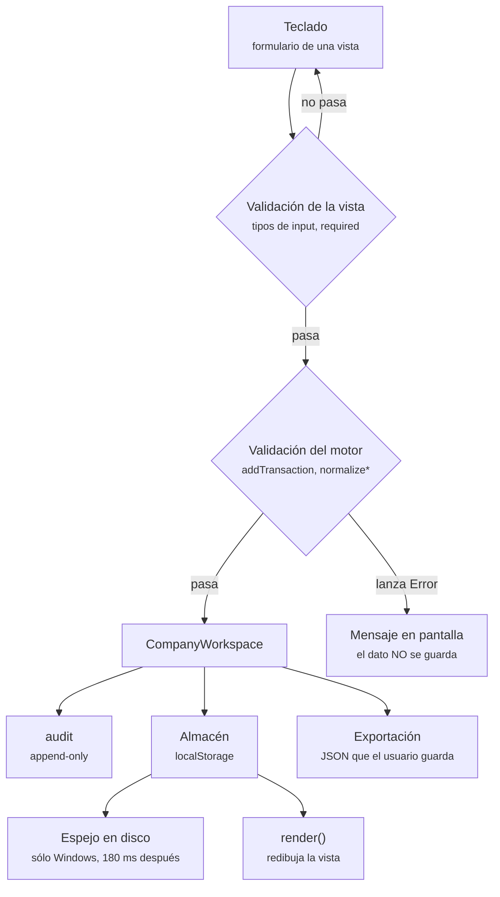
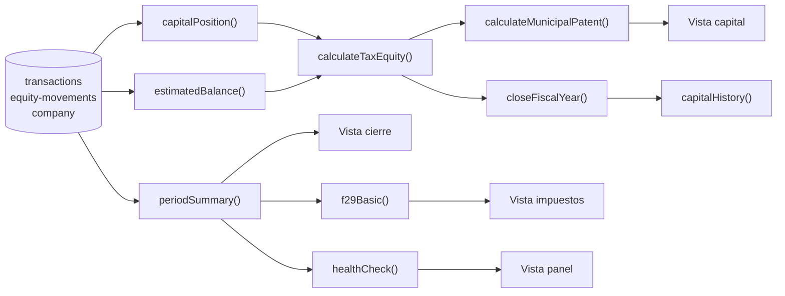
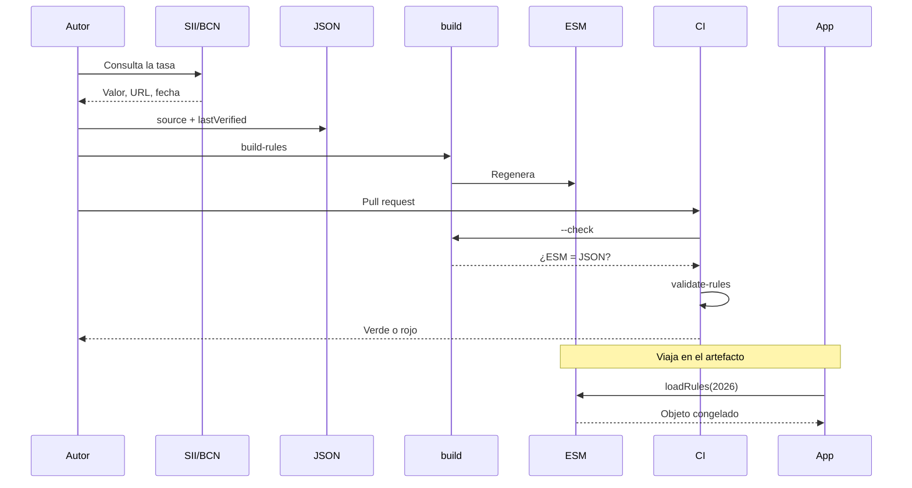

# 08 · Flujo de datos

[⬅ Anterior: Persistencia](07-database.md) · [Índice](README.md) · [Siguiente: APIs e integraciones ➡](09-apis-and-integrations.md)

---

## La conclusión, primero

Hay **dos flujos de datos en este sistema y no se tocan**:

1. **Los datos del usuario** entran por el teclado, se validan, se guardan en el dispositivo y sólo
   salen si la persona exporta un archivo a propósito. Nunca cruzan la red.
2. **Las reglas tributarias** entran por un *pull request*, se verifican contra una fuente oficial,
   se compilan al build y viajan **de sólo lectura** dentro del artefacto. Nunca las escribe la app.

El primero es privado y mutable; el segundo es público e inmutable. Que estén separados es lo que
permite decir a la vez «tus datos son tuyos» y «las tasas son auditables».

---

## Flujo 1 · Los datos del usuario

**Qué muestra:** que hay dos capas de validación y que la segunda es la que manda. **Qué no
muestra:** que `render()` vuelve a leer del almacén — la vista nunca pinta desde una variable en
memoria, siempre relee.

### 1. De dónde vienen los datos

| Origen | Qué aporta | Dónde entra |
| --- | --- | --- |
| Formularios de las 14 vistas | Todo lo que el usuario escribe | `apps/web/src/views/*.js` |
| Semilla del sandbox | 1 empresa, 5 movimientos patrimoniales, 18 operaciones, 4 obligaciones | `seedSandboxWorkspace()` |
| Respaldo importado | Un espacio de trabajo completo | `importAll()` |
| Escenario JSON de la CLI | Un caso de simulación | `data/scenarios/` |
| Espejo del disco (Windows) | Lo que falte en `localStorage` al arrancar | `hydrateFromDisk()` |
| Reglas del año | Tasas, plazos, referencias legales | `loadRules(year)` |
| Reloj del sistema | `createdAt`, `updatedAt`, `at` de la bitácora, período por defecto | `isoNow()` |

**No hay ninguna otra fuente.** No hay importación de RCV, ni de cartola bancaria, ni de DTE, ni
lectura de la propuesta del SII. Se declara aquí porque es la pregunta que hace todo el mundo:
`NO IDENTIFICADO` — no existe en el repositorio.

### 2. Cómo se validan

La regla es que **la vista ayuda y el motor decide**. Un formulario puede marcar un campo como
requerido, pero la garantía real está en el motor, porque la CLI y las pruebas entran por ahí sin
pasar por ninguna vista.

| Validación | Dónde | Qué rechaza |
| --- | --- | --- |
| Tipo de operación | `addTransaction` | Un `kind` fuera de los nueve |
| Formato de fecha | `addTransaction`, `normalizeEquityMovement` | Cualquier cosa que no sea `YYYY-MM-DD` |
| Período cerrado | `addTransaction`, `updateTransaction`, `deleteTransaction` | Alta, edición o baja en un mes cerrado |
| Monto | `normalizeEquityMovement` | Montos nulos, negativos o no numéricos |
| Bien aportado | `normalizeEquityMovement` | Un aporte en bienes sin descripción ni aportante |
| Coherencia del capital | `validateCapitalProfile` | Combinaciones imposibles entre social, suscrito y enterado |
| Evidencia | `updateFormationStep`, `upsertObligation` | Dar por hecho algo sin comprobante |
| Motivo | `reopenPeriod`, `reopenFiscalYear` | Reabrir sin explicar por qué |
| Formato de respaldo | `importAll` | Un JSON que no es de esta aplicación |
| RUT | `packages/company-operations/rut.mjs` | Dígito verificador incorrecto |
| Modo | Constructor, y otra vez en Rust | Cualquier cosa que no sea `real` o `sandbox` |

**Todas fallan lanzando `Error`, no devolviendo `false`.** La consecuencia es que un dato inválido
**no llega nunca al almacén**: no hay estado intermedio a medio guardar.

### 3. Cómo se transforman

| Transformación | Función | Qué hace y por qué |
| --- | --- | --- |
| Redondeo monetario | `money()` | Todo importe se guarda como entero de pesos. Sin decimales no hay derivas de centavos al sumar meses |
| Normalización del capital | `normalizeCapitalProfile()` | Migra el campo antiguo y marca lo que no se sabe como `pendingConfirmation` |
| Normalización del movimiento | `normalizeEquityMovement()` | Recorta cadenas, fija `status` y `origin` por defecto |
| Derivación del período | `date.slice(0, 7)` | El período **no se guarda**: se deriva de la fecha. Una fuente, no dos |
| Agregación mensual | `periodSummary()` | 18 cifras derivadas de las operaciones del mes |
| Arrastre del IVA | `vatCarryForwardInto()` | Recorre la historia desde el principio acumulando remanente |
| Unión sin duplicar | `effectiveEquityMovements()` | Fusiona ledger y operaciones de caja usando `equityMovementId` |
| Congelado del cierre | `closeFiscalYear()` | `Object.freeze` sobre el resultado, con la huella de las reglas dentro |

**Nada de esto se guarda calculado.** `periodSummary`, `capitalPosition`, `estimatedBalance`,
`yearSummary` y `healthCheck` se recalculan en cada lectura desde `transactions` y
`equity-movements`. La única excepción es deliberada: **lo que queda dentro de un cierre**, mensual o
anual, se congela para siempre.

> Es el criterio que separa una cifra viva de una cifra histórica. Una vista muestra lo que las
> operaciones dicen hoy; un cierre muestra lo que decían el día que se cerró. Si todo se
> recalculara, un cierre no probaría nada.

### 4. Dónde se almacenan

El detalle completo está en [07 · Persistencia](07-database.md). En una línea: `localStorage` con
prefijo por modo, más un espejo en JSON bajo Windows, más archivos por entidad cuando el consumidor
es Node.

**El espejo de Windows llega tarde a propósito.** `createPlatformStore` no escribe a disco en cada
`write`: agenda un volcado a los **180 ms** y cancela el anterior. Diez escrituras seguidas producen
un volcado, no diez. Y si el disco falla, **la aplicación sigue funcionando** con `localStorage` y
sólo avisa por consola: perder la sesión por un error de escritura sería peor que perder el espejo.

### 5. Qué componentes los consumen

**Qué muestra:** que casi todo el sistema depende de dos colecciones, y que el CPT es el cuello por
el que pasa la cadena capital → cierre → patente. **Qué no muestra:** las 14 vistas completas; sólo
las que consumen datos derivados.

### 6. Qué se muestra al usuario

Lo que la interfaz pinta **nunca es el dato crudo**: es el resultado de las derivaciones anteriores.
Y hay tres decisiones de presentación que son reglas de negocio disfrazadas:

- **`balanceOrigin`** viaja hasta la pantalla: la aplicación dice si el balance lo estimó ella o lo
  declaró el usuario. No presenta una estimación como un dato.
- **`pendingConfirmation`** se muestra: la app señala qué campos **sabe que no sabe**, en vez de
  rellenarlos con cero.
- **`healthCheck`** deliberadamente **no dice «todo en orden»** cuando faltan evidencias. El objetivo
  es detectar el hueco, no tranquilizar.

### 7. Qué sale del dispositivo

**Nada, salvo que el usuario lo pida.** Tres salidas, todas iniciadas por una acción explícita:

| Salida | Mecanismo | Destino |
| --- | --- | --- |
| Respaldo / exportación | `saveTextFile()` | En Windows, `Documentos/Empresa Operativa Chile`; en web y Android, la descarga del navegador |
| Enlace a un portal oficial | `openExternal()` | El navegador del sistema, o el plugin `Browser` de Capacitor en Android |
| Nada más | — | — |

`openExternal` merece una nota: abre el sitio del SII o del Registro de Empresas **fuera** de la
aplicación, y con `noopener,noreferrer`. La app no enmarca portales oficiales ni les pasa datos: sólo
lleva a la persona hasta la puerta.

**No hay telemetría, ni analítica, ni informe de errores, ni comprobación de actualizaciones, ni
fuentes o iconos remotos.** La comprobación está en [09](09-apis-and-integrations.md) y en
[11](11-security.md).

### 8. Dónde puede perderse o corromperse un dato

Esta sección existe porque el prompt la pide y porque las respuestas honestas son incómodas.

| Punto | Qué puede pasar | Mitigación presente | Mitigación ausente |
| --- | --- | --- | --- |
| «Borrar datos del sitio» en el navegador | **Pérdida total** | Ninguna | La app no puede impedirlo |
| Desinstalar el APK | **Pérdida total** | Ninguna | Idem |
| Cuota de `localStorage` agotada | `setItem` lanza y la escritura se pierde | Ninguna: **no se captura** `QuotaExceededError` | Ver [15 · Riesgos](15-risks-and-technical-debt.md) |
| Corte durante el espejo de Windows | Espejo a medias | **Escritura atómica**: temporal + `rename` en Rust | — |
| JSON corrupto en `localStorage` | `read` devuelve el `fallback` | El `try/catch` evita el fallo | **Silencioso**: no distingue vacío de corrupto |
| Línea corrupta en `audit.ndjson` | Se devuelve `{ corrupt: true, line }` | La fila mala no rompe la lectura | Nadie muestra ese marcador |
| Cierre a medias | Fotografía sin índice | Ninguna: son dos escrituras | No hay transacción |
| Dos pestañas del navegador a la vez | La última escritura gana | Ninguna | No hay bloqueo ni fusión |
| Reloj del sistema mal puesto | Fechas y bitácora incoherentes | Ninguna | No hay fuente de tiempo alternativa |

De todos, el único que la aplicación puede resolver por sí sola es el respaldo: `SECURITY.md` insiste
en exportar al cerrar cada período, y ese consejo es la contrapartida real de no tener servidor.

### 9. Qué datos personales se procesan

RUT de la empresa y de terceros, nombres y RUT de accionistas, montos, folios, descripciones de
operaciones y comuna. Todos **en claro**, todos **sólo en el dispositivo**, ninguno enviado a nadie.
El detalle y sus implicaciones están en [07](07-database.md#datos-sensibles) y
[11](11-security.md).

---

## Flujo 2 · El ciclo de vida de una regla tributaria

El otro flujo, el que no toca el usuario.

**Las tres puertas que protegen este flujo**, y qué atrapa cada una:

| Puerta | Comando | Qué impide |
| --- | --- | --- |
| Sincronía | `build-rules.mjs --check` | Que alguien edite el `.json` y olvide regenerar, o que edite el generado a mano |
| Cordura | `validate-rules.mjs` | Un error de dedo: un 19 donde iba 0.19, una tasa fuera de rango |
| Existencia | `loadRules(year)` | Calcular con las tasas del año equivocado |

**Y la garantía que no está en el flujo, sino en el dato:** cada tasa lleva `source` y
`lastVerified`. La aplicación no sólo sabe cuánto es el IVA — sabe **de dónde lo sacó y cuándo lo
comprobó alguien**. Un cierre anual se lleva esa huella dentro (`legalRulesVersion`), de modo que la
trazabilidad sobrevive a que el archivo de reglas cambie después.

**Lo que este flujo no tiene:** ninguna comprobación automática contra la fuente. Nadie despierta un
lunes a preguntarle al SII si la tasa cambió; `lastVerified` es una afirmación humana. `REQUIERE
VALIDACIÓN` permanente: las tasas de 2026 hay que reverificarlas antes de la Operación Renta 2027, y
el propio archivo lo dice.

---

## Flujo 3 · Los datos que generan la documentación

Un tercer flujo, menor pero real: parte de la documentación del repositorio **no se escribe, se
deriva del código**.

| Fuente | Script | Salida | Gate en CI |
| --- | --- | --- | --- |
| `packages/glossary/` | `build-glossary.mjs` | `docs/GLOSSARY.md` | `--check` |
| `packages/onboarding/` | `build-guide.mjs` | `docs/EMPEZAR-AQUI.md/.html/.pdf` | `--check` |
| `packages/shortcuts/` | `build-shortcuts.mjs` | `docs/ATAJOS-DE-TECLADO.md` | `--check` |
| `docs/presentacion.md` | `build-presentation.mjs` | Diapositivas HTML y PDF | `--check` + `check-presentation.mjs` |
| `docs/MANUAL.md` + capturas | `build-manual.mjs` | `docs/MANUAL.html/.pdf` | — |

**Por qué importa para el flujo de datos:** si alguien edita `docs/GLOSSARY.md` a mano, CI falla. El
documento no es la fuente; el paquete lo es. Es el mismo principio que las reglas tributarias
aplicado a las palabras: un texto editado en dos sitios acaba diciendo dos cosas.

---

## Un ejemplo completo, de principio a fin

Registrar una venta de $100.000 netos el 18 de julio de 2026, en Windows:

| # | Qué ocurre | Dónde | Dato |
| --- | --- | --- | --- |
| 1 | La vista propone el IVA al escribir el neto | `views/operaciones.js` | `19000` |
| 2 | Se envía el formulario | `views/operaciones.js` | `{ kind: 'sale', date: '2026-07-18', net: 100000, vat: 19000 }` |
| 3 | Tipo válido, fecha con formato, período `2026-07` no cerrado | `addTransaction` | pasa |
| 4 | Se completan los valores por defecto | `addTransaction` | `deductible: true`, `vatCreditEligible: true`, `total: 119000`, `id`, `createdAt` |
| 5 | Se escribe la colección completa | `createWebStore.write` | `empresa-operativa-chile:real:transactions` |
| 6 | Se agrega la línea de bitácora | `audit()` | `transaction.added` con id, kind, total y período |
| 7 | Se agenda el espejo | `createPlatformStore` | a los 180 ms |
| 8 | Rust valida el JSON y escribe atómicamente | `save_workspace` | `real.json.tmp` → `real.json` |
| 9 | La vista se redibuja leyendo del almacén | `render()` | la operación aparece en la lista |
| 10 | El mes cambia sin que nadie lo recalcule | `periodSummary('2026-07')` | `salesNet: 100000`, `debitVat: 19000` |
| 11 | El borrador del F29 cambia con él | `f29Basic()` | débito fiscal `19000`, menos el crédito del mes y el remanente que llegue |

**Once pasos, cero llamadas de red y dos archivos escritos.** Ese es el sistema entero.

---

[⬅ Anterior: Persistencia](07-database.md) · [Índice](README.md) · [Siguiente: APIs e integraciones ➡](09-apis-and-integrations.md)
