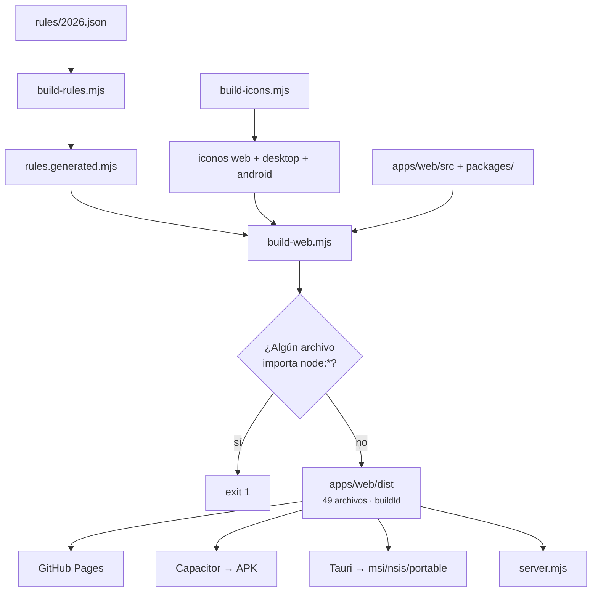
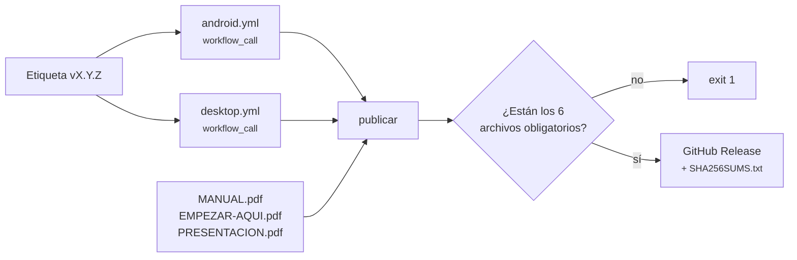

# 13 · Despliegue y operación

[⬅ Anterior: Pruebas y calidad](12-testing-and-quality.md) · [Índice](README.md) · [Siguiente: Troubleshooting ➡](14-troubleshooting.md)

---

## La conclusión, primero

**Un solo `apps/web/dist` alimenta las cuatro superficies.** GitHub Pages lo publica tal cual,
Capacitor lo empaqueta en un APK y Tauri lo embebe en el ejecutable de Windows. No hay tres builds
que puedan divergir: hay uno, y tres formas de envolverlo.

Y la regla de operación que gobierna todo lo demás: **un build en verde no prueba que el artefacto
sirva.** Un APK vacío compila perfectamente. Por eso cada camino de publicación tiene un paso que
**abre el resultado y cuenta lo que hay dentro** antes de dejarlo salir.

---

## Entornos

| Entorno | Qué es | Cómo se llega |
| --- | --- | --- |
| **Local** | `node scripts/build-all.mjs` + servidor en `127.0.0.1:4180` | `pnpm start` |
| **GitHub Pages** | La misma app, pública, instalable como PWA | `push` a `main` → `pages.yml` |
| **Artefacto Android** | APK de depuración, retenido 14 días | `android.yml` a mano, o dentro de un release |
| **Artefacto Windows** | `.msi`, `-setup.exe` y portable, retenidos 14 días | `desktop.yml` a mano, o dentro de un release |
| **Release** | Todo lo anterior + 3 PDF + `SHA256SUMS.txt` | Etiqueta `vX.Y.Z` |

**No hay staging y no hay entorno de pruebas desplegado.** No hay servidor que desplegar: lo que se
publica son archivos estáticos y binarios.

---

## El proceso de construcción



**El orden importa y está comentado en `build-all.mjs`:** la web embebe las reglas y los iconos, así
que generar la web con reglas viejas produciría un APK que calcula con la tasa del año pasado **sin
que nada se ponga en rojo**.

**El gate `node:*` está en el build, no en un test**, y la razón está escrita al lado: si eso llega
al APK, la pantalla queda en blanco sin un error visible, y un test es algo que quizá nadie corra
antes de publicar. El build **aborta** con `exit 1` y nombra los archivos culpables.

**El `buildId`** es el SHA-256 de todos los archivos del `dist`, truncado a 12 caracteres. Se
sustituye en `sw.js` (`__BUILD_ID__`) para invalidar el caché del service worker: publicar una
versión nueva deja de dejar a la gente con una app vieja pegada en el navegador.

Salida real de esta revisión:

```text
apps/web/dist listo — 49 archivos, 7256 KB, build 630ed69fe514
```

---

## Publicación en GitHub Pages

`pages.yml`, disparado por cada push a `main`.

| Paso | Qué hace |
| --- | --- |
| Build | `node scripts/build-all.mjs` |
| **Verificación** | Al menos 10 vistas; `index.html` contiene el nombre del producto |
| `.nojekyll` | Sin ese marcador, Jekyll se comería cualquier ruta que empiece por guion bajo |
| `configure-pages` → `upload-pages-artifact` → `deploy-pages` | Publicación |

Permisos elevados sólo en este trabajo: `pages: write` e `id-token: write`. La concurrencia usa
`cancel-in-progress: false` — a diferencia del resto — porque cancelar un despliegue a medias es
peor que esperar.

**URL:** `https://vladimiracunadev-create.github.io/empresa-operativa-chile/`.
`REQUIERE VALIDACIÓN`: no se consultó el estado del despliegue en esta revisión.

Recordatorio de [11 · Seguridad](11-security.md): **esta superficie es la única sin CSP**, porque
Pages no admite cabeceras propias y el `index.html` no lleva `meta http-equiv`.

---

## Empaquetado de Android

`android.yml`. No hay código de app propio: la app **es** la aplicación web.

| Paso | Detalle |
| --- | --- |
| Herramientas | pnpm 11.2.2, Node 22, Temurin JDK 21 |
| Build web | `node scripts/build-all.mjs` |
| Capacitor | `pnpm install --frozen-lockfile` → `copiar-www.mjs` → `cap add android` → **`copiar-www.mjs` otra vez** → `cap sync android` |
| Compilación | `./gradlew assembleDebug --no-daemon` |
| **Verificación** | `verify-apk.mjs` sobre el APK generado |
| Artefacto | APK + su `.sha256`, retenidos 14 días |

**La segunda pasada de `copiar-www.mjs` no es un error de copiar y pegar**, y está comentada: `cap
add` acaba de crear `android/`, y es entonces cuando se pueden aplicar los iconos propios sobre sus
recursos.

### `verify-apk.mjs` — 12 comprobaciones abriendo el ZIP

Lee el directorio central del ZIP **a mano**, sin `unzip` ni librerías, para correr igual en Windows,
Linux y macOS.

| # | Comprobación | Umbral |
| --- | --- | --- |
| 1–4 | `index.html`, `app.js`, `app.css` y el manifiesto PWA están dentro | Presencia |
| 5 | Las vistas viajan | **≥ 10** |
| 6 | El núcleo de cálculo viaja | **≥ 6** módulos `.mjs` |
| 7 | Los iconos viajan | **≥ 3** |
| 8–10 | `AndroidManifest.xml`, `resources.arsc`, `classes.dex` | Presencia |
| 11 | Tamaño razonable | **> 1 MB y < 120 MB** |
| 12 | **Las reglas tributarias viajan dentro** | `core/chile-tax-rules/rules.generated.mjs` |

Si alguna falla: `este APK NO debe publicarse` y `exit 1`.

> El comentario del propio script explica por qué existe, y vale la pena leerlo: no comprueba que el
> build funcionara, comprueba **que el resultado sirva**. Un APK vacío arranca la WebView, muestra
> una pantalla en blanco y deja todas las señales del build en verde.

**El APK es de depuración**, firmado con la clave de debug de Android. Sirve para instalar y usar, no
para publicar en Google Play. Está declarado en el resumen del propio workflow y en las notas de cada
release.

---

## Empaquetado de Windows

`desktop.yml`, sobre `windows-latest`, hasta 45 minutos.

| Paso | Detalle |
| --- | --- |
| Herramientas | pnpm 11.2.2, Node 22, Rust `stable`, caché de Rust (`Swatinem/rust-cache`) |
| Build web | `node scripts/build-all.mjs` |
| **Verificación previa** | ≥ 10 vistas, ≥ 6 módulos del núcleo, el nombre en `index.html`, `f29Basic` en el motor |
| Pruebas de Rust | `cargo test --release` |
| Compilación | `pnpm install --frozen-lockfile` → `pnpm build` |
| Recogida | `.msi`, `-setup.exe` y el portable; falla si falta cualquiera |
| **Umbral de tamaño** | Falla si un artefacto pesa menos de 1 MB |
| `SHA256SUMS.txt` | Calculado en PowerShell |
| **Prueba de arranque** | Lanza el portable, espera 12 s y falla si el proceso murió |

**La verificación va antes de empaquetar, y está comentado por qué:** Tauri embebe y comprime los
recursos dentro del binario, así que después ya no se pueden contar leyendo el `.exe`. El momento de
comprobar que la app está entera es justo antes de sellarla.

**Dos detalles de PowerShell que el workflow documenta** y que conviene no deshacer:

- La lista de archivos se materializa **antes** de escribir `SHA256SUMS.txt`: encadenar
  `Get-ChildItem | ... | Out-File` en el mismo directorio hace que `Out-File` abra el archivo
  mientras la enumeración sigue viva, y `Get-FileHash` acaba leyendo el archivo que se está
  escribiendo.
- No se le puede pedir a una app de ventana que responda por HTTP, pero sí comprobar que el proceso
  levanta y sigue vivo: eso descarta los fallos de arranque por DLL o recursos ausentes.

Los tres formatos existen porque resuelven situaciones distintas: `.msi` para despliegue corporativo
o instalación desatendida, `-setup.exe` (NSIS) para una persona, y el portable para un pendrive o un
equipo ajeno.

**Los instaladores no están firmados** con certificado de código: SmartScreen avisará la primera vez.
Declarado en el resumen del workflow.

---

## Release

`release.yml`, disparado por una etiqueta `v*`.



**Reutiliza los workflows en vez de duplicar sus pasos:** lo que se publica es exactamente lo que
esos workflows verificaron.

**La documentación viaja con el release** —manual, guía «Empezar aquí» y presentación en PDF— porque
quien descarga un instalador debería poder llevarse las instrucciones sin volver al repositorio.

**Un release incompleto no se publica:** hay seis `test -f` que fallan el trabajo si falta el APK,
cualquiera de los tres instaladores, el manual o la guía.

Las notas se redactan en el propio workflow e incluyen, además de las descargas, una sección de
**advertencias honestas**: binarios sin firmar, APK de depuración, la app no presenta ni paga nada
ante el SII, y el borrador F29 es una ayuda de control y no una declaración.

### Publicar una versión

```bash
git tag v1.4.1
git push origin v1.4.1
```

Antes conviene haber actualizado `CHANGELOG.md`, la `version` de `package.json` **y la de
`tauri.conf.json`** — nada comprueba que las dos coincidan (ver
[10 · Configuración](10-configuration.md#la-versión-y-el-único-punto-donde-se-puede-desincronizar)).

---

## Generación de los PDF de esta documentación

`scripts/build-system-docs.mjs`, escrito para esta serie.

```bash
node scripts/build-system-docs.mjs               # todos + el consolidado
node scripts/build-system-docs.mjs --only 03     # sólo el 03, para iterar rápido
node scripts/build-system-docs.mjs --no-diagrams # sin rasterizar Mermaid
```

**Cómo funciona:**

1. Lee cada `.md` de `docs/system-documentation/` en orden, con el `README.md` primero.
2. Quita las barras de navegación entre documentos: son útiles en GitHub y ruido en papel.
3. **Rasteriza cada bloque Mermaid a SVG** con `mmdc`, cacheado por hash del contenido en
   `assets/diagramas/`. Regenerar sin tocar un diagrama no vuelve a invocar el rasterizador, que es
   con diferencia el paso más lento.
4. Convierte a HTML con el mismo `scripts/lib/markdown.mjs` que usan el manual y la guía, embebiendo
   cada imagen como data URI.
5. Compone una portada con **datos que no se escriben a mano**: la versión sale de `package.json`, el
   commit de `git rev-parse --short HEAD` y la fecha de análisis del propio `README.md`.
6. Imprime a PDF con `scripts/lib/chrome.mjs` y la hoja `PRINT_CSS` compartida.
7. Genera además `documentacion-completa.pdf` con la serie entera.

**Tres decisiones que conviene conocer antes de tocarlo:**

- **Si `mmdc` no está instalado, no falla.** Deja los diagramas como bloques de código y lo avisa por
  consola. Un PDF con un diagrama en texto es peor que uno con el diagrama dibujado, y mucho mejor
  que ningún PDF.
- **Avisa cuando un diagrama sale ilegible.** Calcula el ancho útil de una A4 (688 px con los
  márgenes de `PRINT_CSS`) y, si el diagrama se reduce por debajo del 45 %, lo dice con nombre y
  factor. Es lo que detectó que el diagrama entidad-relación de [07](07-database.md) medía 2.328 px y
  se imprimía al 30 %; por eso ese diagrama está partido en dos.
- **Pide las imágenes en carga inmediata.** `markdownToHtml` marca las imágenes como
  `loading="lazy"`, que es correcto para el HTML del manual y un riesgo al imprimir: un diagrama que
  el navegador considere fuera de vista puede no haberse decodificado al dispararse la impresión, y
  sale un hueco.

**Requisito:** Chrome o Edge (autodetectado, o `CHROME_PATH`). Para los diagramas,
`@mermaid-js/mermaid-cli` global:

```bash
pnpm add -g @mermaid-js/mermaid-cli
```

**No está integrado en `pnpm check` ni en CI**, a diferencia de los generadores del glosario y la
guía. `INFERENCIA`: integrarlo exigiría Chrome y `mmdc` en el runner, y ninguno de los dos está hoy
en los workflows. La consecuencia es que **los PDF de esta serie hay que regenerarlos a mano cuando
cambie el Markdown**; se recoge en [15 · Riesgos](15-risks-and-technical-debt.md).

---

## Otros documentos que se generan

| Comando | Qué produce |
| --- | --- |
| `pnpm docs` | Capturas + guía + manual + presentación |
| `pnpm manual` | `docs/MANUAL.html` y `.pdf` |
| `pnpm guia` | `docs/EMPEZAR-AQUI.md`, `.html` y `.pdf` |
| `pnpm presentacion` | Diapositivas y pauta, y las verifica |
| `pnpm capturas` | Capturas desde la app servida en `CAPTURE_URL` |

Los cinco `--check` correspondientes corren en CI: si alguien edita el documento generado a mano, el
build falla.

---

## Operación

### Logs, métricas, monitoreo y alertas

`NO IDENTIFICADO`, y es coherente con el diseño: **no hay servidor que observar**.

| Aspecto | Estado |
| --- | --- |
| Logs de servidor | El servidor local imprime su URL al arrancar y nada más. No escribe archivo de log |
| Logs de la aplicación | `console.warn` cuando falla el espejo de disco o la hidratación. Nada más |
| Métricas | Ninguna. No hay telemetría, por decisión de producto |
| Monitoreo | Ninguno |
| Alertas | Las de GitHub: fallo de workflow y hallazgos de CodeQL |
| Trazas | Ninguna |

**Lo más parecido a observabilidad que tiene el producto es la bitácora de auditoría**, y sirve para
que el usuario entienda su propia empresa, no para que nadie observe el sistema.

### Respaldo y recuperación

**El respaldo es del usuario**, y es la contrapartida directa de no tener servidor.

| Escenario | Recuperación |
| --- | --- |
| Se borran los datos del navegador | Importar el último respaldo exportado. **Sin respaldo, no hay recuperación** |
| Se desinstala el APK | Igual |
| Se corrompe el espejo de Windows | `localStorage` sigue siendo la fuente; el espejo se reescribe en la siguiente escritura |
| Se corrompe `localStorage` en Windows | Al arrancar, `hydrateFromDisk()` repone lo que falte desde el espejo |
| Se pierde el dispositivo | Sólo el respaldo exportado fuera de él |

`SECURITY.md` da la regla operativa: **exportar desde la pestaña Datos cada vez que se cierra un
período**, y guardar el archivo fuera del dispositivo.

### Rollback

| Qué | Cómo |
| --- | --- |
| GitHub Pages | Revertir el commit y empujar: `pages.yml` republica |
| Release | Instalar el artefacto de la versión anterior desde su release |
| Datos | Importar un respaldo anterior. **Un ejercicio ya cerrado no se pisa** al importar en modo fusión |
| Reglas tributarias | Revertir el `.json` **y regenerar**, o CI falla en `--check` |

**No hay migración de datos que revertir**, porque no hay migraciones destructivas: las dos que
existen ocurren en lectura y no tocan el almacén.

### Mantenimiento periódico

| Cadencia | Tarea |
| --- | --- |
| **Anual, antes de que empiece el año comercial** | Crear `rules/<año>.json`, verificar **cada tasa contra su fuente oficial**, regenerar y publicar |
| **Mensual** | Actualizar la UTM del mes en el archivo de reglas si se van a calcular patentes |
| Semanal | Revisar los hallazgos de CodeQL (el workflow corre los lunes a las 06:00 UTC) |
| Por release | `CHANGELOG.md`, las dos `version`, regenerar documentación |
| Cuando cambie el Markdown de esta serie | `node scripts/build-system-docs.mjs` |

**La tarea anual es la que sostiene el producto.** Todo lo demás es higiene; esa es la que evita que
la aplicación calcule con la tasa del año pasado. `CONTRIBUTING.md` la formaliza: una tasa que se
toca exige su fuente oficial y su fecha de verificación.

---

## Lo que no pudo verificarse

| Aspecto | Por qué |
| --- | --- |
| Compilación real del APK y del instalador | Faltan JDK/SDK/Gradle y toolchain de Rust en la máquina de análisis |
| `verify-apk.mjs` sobre un APK real | No hay APK que verificar |
| Estado del último despliegue en Pages | No se consultó el repositorio remoto |
| Que el artefacto publicado coincida con el verificado | `sha256sum` del archivo descargado contra el `SHA256SUMS.txt` del release |
| Comportamiento del instalador NSIS y del MSI | No se ejecutaron |

---

[⬅ Anterior: Pruebas y calidad](12-testing-and-quality.md) · [Índice](README.md) · [Siguiente: Troubleshooting ➡](14-troubleshooting.md)
